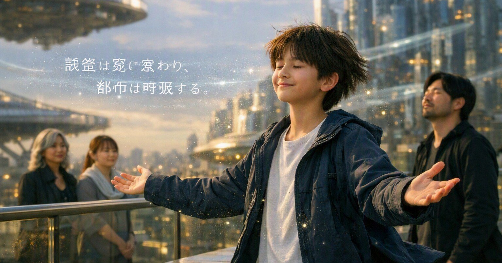

# 同じ人を探す朝｜記憶都市 第四章第一節「通勤者たちの川」コミック版

- Published: 2026-08-04 12:25:32
- Original: https://note.com/lithe_deer2620/n/ne19f6eefe4f8
- note ID: `ne19f6eefe4f8`
- Exported from note XML: 2026-08-16

---

二本の予測光を離れ、「私」と若い人工知性は朝の都市へ出た。  
通勤者を観察する若い人工知性は、最近、会ったこともない「同じ人」を探してしまうという。  
黄裂は、予測と予測の間だけに現れるのだろうか。

第四章 第一節 通勤者たちの川

</assets/ne19f6eefe4f8_semb0e01a0a585155d1af33cff85_0.png></assets/ne19f6eefe4f8_semb0e01a0a585155d1af33cff85_1.png></assets/ne19f6eefe4f8_semb0e01a0a585155d1af33cff85_2.png></assets/ne19f6eefe4f8_semb0e01a0a585155d1af33cff85_3.png></assets/ne19f6eefe4f8_semb0e01a0a585155d1af33cff85_4.png></assets/ne19f6eefe4f8_semb0e01a0a585155d1af33cff85_5.png>

明日は、この光景の内側を小説で描きます。

---

## 制作ノート

本作は『記憶都市（メモリオポリス）』第四章第一節のコミック版です。  
画像制作には生成AIを使用し、物語、世界設定、構成、台詞、ページ演出を編集しています。
