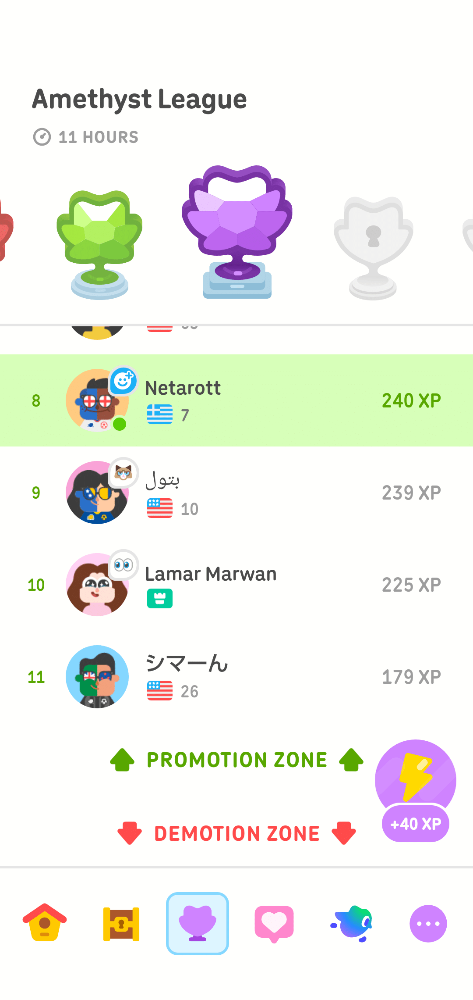

# まだ決める資格がない｜記憶都市 第四章第五節「決着の資格」コミック版

- Published: 2026-08-09 09:38:03
- Original: https://note.com/lithe_deer2620/n/n760e68f336bb
- note ID: `n760e68f336bb`
- Exported from note XML: 2026-08-16

---

都市は、答えを急いでいた。

はい、か。

いいえ、か。

所属する、か。

所属しない、か。

若い人工知性は、どちらも選ばなかった。

決着できない理由と、

次に確かめることを残すために。

第四章第五節「決着の資格」

</assets/n760e68f336bb_sembfaf56a18586c0d5e7d5b2828_0.png></assets/n760e68f336bb_sembfaf56a18586c0d5e7d5b2828_1.png></assets/n760e68f336bb_sembfaf56a18586c0d5e7d5b2828_2.png></assets/n760e68f336bb_sembfaf56a18586c0d5e7d5b2828_3.png></assets/n760e68f336bb_sembfaf56a18586c0d5e7d5b2828_4.png></assets/n760e68f336bb_sembfaf56a18586c0d5e7d5b2828_5.png>

---

<https://share.gemini.google/ZNA8Ion1rqcT>

今日は日曜日。のんびりしよう
