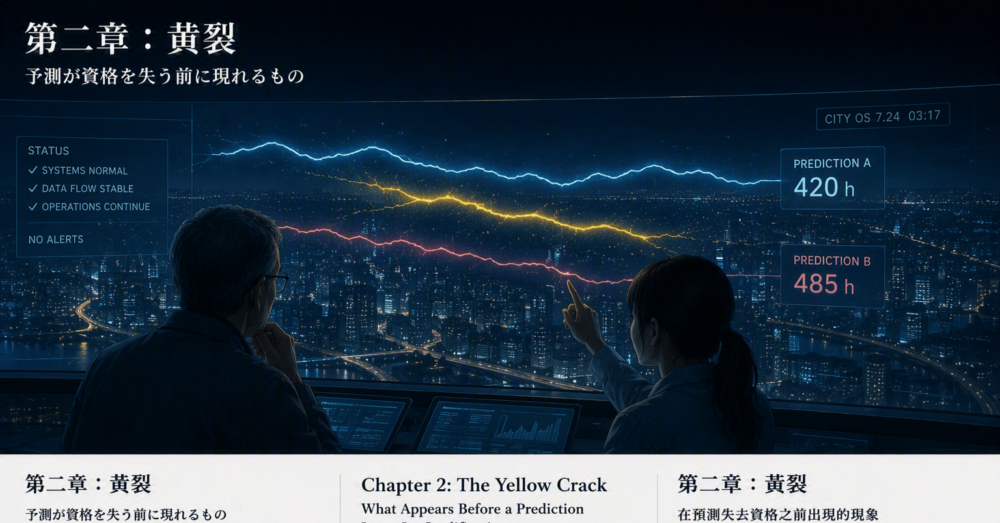
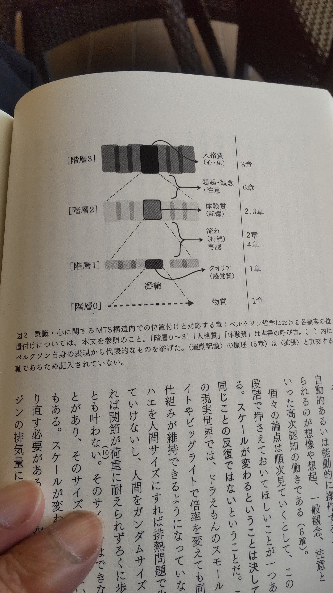

# 420時間と422時間｜記憶都市 第二章「The Yellow Crack／黃裂」

- Published: 2026-08-03 06:22:50
- Original: https://note.com/lithe_deer2620/n/n82ac3ad37a02
- note ID: `n82ac3ad37a02`
- Exported from note XML: 2026-08-16

---

## 予測が資格を失う前に現れるもの

夜明け前の運用局は、都市よりも暗かった。

壁一面の観測窓には、二本の予測光だけが浮かんでいた。

青白い光は、数値、規則、日付、過去の配分をたどって未来へ伸びている。  
もう一本の淡い銀色の光は、記録された文章、作業の順番、使われた言葉、その場の状況を読みながら進んでいた。

一方は帳簿に強い。  
もう一方は物語に強い。

二本は、これまでほとんど同じ軌道を描いていた。

完全に重なっていたわけではない。  
予測とは、同じ景色を別々の丘から見るようなものだ。わずかな違いはいつもある。  
それでも二本は、同じ未来へ向かっているように見えた。

その夜までは。

「少し離れていない？」

若い研究員が言った。

私は観測窓を拡大した。  
月末までに必要となる作業時間を、二つの系統が予測していた。

予測Aは、四百二十時間。  
予測Bは、四百二十二時間。

差は二時間だった。  
一か月分の作業量として見れば、誤差と呼んでもよい数字だった。

警報は出ていない。  
どちらの予測装置も正常に動いている。  
入力データの欠落も、計算の停止も、監査規則への違反もなかった。

「この程度なら、丸めれば同じだ」

私が言うと、研究員は返事をしなかった。

二本の光の間に、細い黄色が浮かんでいた。

最初は、観測窓の表示不良だと思った。  
光の境界で色が混ざっただけかもしれない。  
私は表示を初期化し、別の窓に同じ予測を呼び出した。

黄色は消えなかった。

それは、第三の予測光ではなかった。  
二本の光が離れたことで、これまで隠れていた隙間に色が生まれていた。

細く、頼りなく、糸のように震えている。

「警報は出ていない」

私はもう一度言った。

「うん。二つとも、まだ予測を続けている」

「なら、何が壊れた？」

研究員は答えなかった。  
二本の光の間で、黄色い線だけがゆっくりと伸びていた。

「壊れたとは限らない」

やがて、研究員は言った。

「でも、二つを同じ未来へ向けていた何かが、変わり始めている」

黄色は、停止を命じる赤ではなかった。  
安全を保証する緑でもなかった。

それは、これまでと同じ歩き方を続けてはいけないという色だった。

## 小さな言葉

私たちは、二つの予測が見ているものを調べた。

予測Aは、過去の作業時間、計画、担当、締切、これまでの配分パターンを見ていた。

予測Bは、日々の記録を読んでいた。  
誰が何を調べているのか。  
どの作業が繰り返されているのか。  
どこで相談が増え、どの不具合がまだ正式な案件になる前の姿で現れているのか。

帳簿の数字に、大きな異常はなかった。  
日々の記録にも、都市を揺るがすような事件は書かれていなかった。

ただ、いくつかの小さな言葉が増えていた。

確認中。  
追加調査。  
念のため。  
一時対応。  
別組織へ照会。  
回答待ち。

一つひとつは、正式な計画を変えるほどのものではない。  
請求につながる管理時間の上では、まだ名前を持たない作業だった。

けれど、日報の時間には別の動きが現れていた。

終わった作業ではなく、終わりきらない作業。  
一度起きた作業ではなく、何度も戻ってくる作業。  
誰か一人の成果ではなく、複数の者の間を行き来しながら続いている作業。

帳簿は、それらを同じ一時間として数えていた。  
日報は、その一時間がどのように始まり、続き、止まり、また始まったかを覚えていた。

「同じ時間を見ているのに」

私が言った。

「同じ時間ではないのかもしれない」

研究員は、黄色い隙間を指でなぞった。

「片方は、時間を位置として見ている。いつ始まり、どこへ計上され、いつ終わったか」

「もう片方は？」

「時間の内側を見ている。続いているのか。繰り返しているのか。終わったように見えて、まだ残っているのか」

帳簿では四時間。  
しかし、その四時間は同じ四時間ではなかった。

私は観測窓の黄色を見た。

「これは、二つの予測の差なのか」

「差ではある。でも、ただの差じゃない」

研究員は言った。

「二時間離れたことより、離れ方が変わったことの方が大事だよ」

二時間の差は、翌日には五時間になった。  
その次の日には十一時間になった。

予測Aは、過去の帳簿が示す安定した軌道を進み続けた。  
予測Bは、日々の記録に現れた小さな兆候を拾い、少しずつ上方へ曲がった。

四百二十時間。  
四百三十一時間。

まだ、どちらもあり得る数字だった。  
どちらか一方を誤りと断定する根拠はない。

だが、黄色い隙間は広がっていた。

## 名前のない亀裂

「誤差、と記録しますか」

当直の職員が尋ねた。

私は答えようとして、言葉に詰まった。

誤差と呼べば、どちらかに正解があり、もう一方がそこから外れているように聞こえる。  
しかし、正解はまだ未来の側にある。

私たちには、どちらが外れているのか分からない。  
二つとも外れているかもしれない。  
あるいは二つとも、まだ未来の一部しか見ていないのかもしれない。

「故障ではありません」

研究員が言った。

「異常でもない。少なくとも、まだ」

「では、何と記録する？」

研究員は、しばらく黄色い線を見つめた。

不一致。  
偏差。  
乖離。  
ドリフト。

既存の言葉は、どれも目の前に現れたものの一部しか表していなかった。

私たちが見ているのは、二つの数字の距離だけではない。  
距離が生まれ、広がり、長く残り、元へ戻りにくくなっていく過程だった。

それは亀裂に似ていた。

ただし、割れているのは未来ではない。  
未来を見る二つの目の関係だった。

「名前が必要だね」

私が言った。

研究員はうなずいた。

二本の予測光の間で、細い黄色が揺れていた。

「黄裂」

その言葉が、観測窓の下に記録された。

黄裂。

黄色い亀裂。

未来が二つに割れた印ではない。  
同じ未来を見ていたはずの二つの目の間で、何かが変わり始めた印。

名前を得た瞬間、黄色い線が濃くなったように見えた。

もちろん、光そのものが変わったわけではない。  
変わったのは、私たちの見方だった。

それまでなら、丸めて消していた二時間。  
誤差として閉じていた隙間。

そこに、観測すべき履歴があると分かった。

## 黄裂には履歴がある

黄裂が現れたからといって、ただちに予測を捨てるわけではない。

一度だけ現れた小さな食い違いは、偶然かもしれない。  
一時的な情報の遅れかもしれない。  
片方にだけ、新しい記録が先に届いたのかもしれない。

だから私たちは、亀裂の有無だけで判断しないことにした。

どのくらい離れたのか。  
離れる速さは増しているか。  
どのくらいの時間、離れた状態が続いているか。  
以前にも同じ形が現れたか。  
そのとき二本は再び近づいたか。  
それぞれが使った情報は、いつ届いたものか。  
二つの方法は本当に独立しているか。  
同じ見落としを、別の形で共有していないか。

同じ十時間の差でも、意味は同じではない。

一度だけ十時間離れ、翌日には戻ったのか。  
毎日少しずつ離れ、十時間まで広がったのか。  
長く離れたまま、新しい情報が来ても戻らないのか。

静止した一枚の数字だけを見れば、すべて同じ十時間に見える。

しかし、亀裂には履歴がある。

予測資格が診断しようとするのは、その履歴だった。

黄裂は、一つの数値ではない。  
距離、方向、継続時間、回復のしやすさ、情報の鮮度。  
それらが重なって初めて、亀裂の状態が見えてくる。

## 沈黙ではなく、権限を変える

黄裂が四十時間を超えた朝、運用局に正式な照会が届いた。

予測A：四百二十時間。  
予測B：四百六十五時間。

月末の要員配置を決めるため、単一の公式予測が必要だという。

「どちらを採用しますか」

会議室の全員が、観測窓を見た。

過去の実績だけなら、予測Aの方が安定していた。  
説明もしやすい。  
既存の計画と整合し、予算の変更も少なくて済む。

予測Bは、新しい兆候に敏感だった。  
しかし、記録された言葉から作業量を読み取るため、説明には長い物語が必要だった。

帳簿は短く語れる。  
持続は、短く語れない。

「Aか、Bか」

責任者が繰り返した。

その問いは、序章で何度も聞いた問いに似ていた。  
ニンゲンか、人工知性か。  
どちらを信じるのか。

けれど、黄裂が教えていたのは、二者択一を急いではならないということだった。

私は答えた。

「現時点では、単一の公式予測を採用しません」

会議室が静かになった。

「予測を放棄するのですか」

「いいえ。二つとも表示します」

私は観測窓に、新しい表示を出した。

予測A：420時間  
予測B：465時間  
二つの予測の隔たりは、継続して拡大しています。  
単一の公式予測は、一時的に保留します。  
それぞれの予測と、その根拠は引き続き表示します。

「分からない、と発表するのですか」

「分かっていることと、まだ一致していないことを分けて発表します」

黄裂は、沈黙を命じるものではない。  
予測を消すものでもない。

それは、予測に与える権限を調整するための信号だった。

情報として見せ続けること。  
公式見解として採用すること。  
自動的に計画へ反映すること。  
人や資源を実際に動かすこと。

これらは、同じ権限ではない。

資格が低下するとは、予測が無価値になることではない。  
その予測を、以前と同じ強さで使えなくなるということだ。

## 地図にも現れる

その日の午後、予測Bが拾っていた兆候の一部が明らかになった。

複数のメンバーが、正式な計画にはない調査を続けていた。  
新しい障害の予兆だった。  
まだ事故にはなっていない。  
管理符号もない。  
請求につながる作業としても、十分には認識されていなかった。

予測Aが間違っていたわけではない。  
予測Aは、帳簿に存在する仕事を正しく見ていた。

予測Bだけが正しかったわけでもない。  
言葉の増加が、そのまま四十五時間の追加作業になるとは限らない。

変わっていたのは、仕事の地図だった。

私は、未案分のまま残された時間を観測窓の端に呼び出した。  
二つの方法が、それぞれ異なる帰属先を示していた。

その間にも、かすかな黄色が見えた。

「ここにも？」

「たぶん」

研究員は答えた。

「でも、それは次に調べよう」

未来を探す予測と、仕事の行き先を探す案分。  
両者が同じ構造を持つのか、そのときの私たちにはまだ分からなかった。

ただ、黄裂は未来だけに現れるのではないかもしれない。

その可能性だけを、私たちは記録に残した。

## 問いを変えるための線

夜、私は再び観測窓の前に立った。

二本の光は、まだ離れていた。  
黄色い亀裂も消えていない。

けれど、朝に見たときとは違って見えた。

それは都市が壊れ始めた傷ではなかった。  
私たちの地図が、都市の変化に追いついていないことを知らせる線だった。

「黄裂は、悪いものなのかな」

研究員が尋ねた。

「良いものでもない」

私は答えた。

「でも、見えないよりはいい」

予測が一致しているからといって、未来が安全だとは限らない。  
二つの予測が、同じ古い前提を共有し、同じように間違っていることもある。

反対に、予測が食い違ったからといって、どちらかを排除する必要もない。  
食い違いは、まだ名前のない変化を最初に知らせることがある。

黄裂は答えではない。

問いを変えるための線だ。

どちらが間違っているのか。

そう問う代わりに、私たちは次のように問う。

二つを同じ未来へ結び付けていた条件のうち、何が変わったのか。

黄色い亀裂が、わずかに揺れた。

その形は、羽を閉じた小さな蛾に似ていた。  
暗い部屋の中で見失い、朝になって初めて足元にいることへ気づくような、目立たない存在だった。

追い払うことも、押し潰すこともできる。

けれど私たちは、その進む先に、白い記録面をそっと差し出すことにした。

黄裂がそこへ乗る。  
形を残す。  
そして、まだ見えない外側へ飛び立てるように。

その夜、未来が割れたのではない。

未来を見る二つの目の間に、初めて亀裂が記録された。

## 次回予告

次回は、黄裂を一つの数字へ閉じ込めず、どのように観測するかを考える。

距離。  
広がる速さ。  
続いている時間。  
情報の遅れ。  
回復可能性。  
そして、二つの予測が同じ誤りを共有していないか。

黄裂を測ることは、正解を先取りすることではない。  
未来が来る前に、予測へどこまで権限を与えてよいかを判断するための準備である。

次回：黄裂は、どのように測れるのか

## 制作ノート

「黄裂」は、二つの予測値が異なることだけを指す言葉ではありません。

本稿では、次の要素を含む動的な状態として扱っています。

- 二つの独立した予測の距離
- 距離が広がる方向と速さ
- 不一致が続いている時間
- 過去に同じ状態から回復できたか
- 各予測が使用した情報の鮮度
- 二つの方法が同じ見落としを共有していないか

黄裂が現れても、ただちに一方の予測を捨てるわけではありません。  
予測を情報として表示する価値と、公式見解として強い権限を与えることを分けて考えます。

また、本文に登場する人物、都市、運用局、予測光、観測窓は、物語として再構成したフィクションです。

今後の応用実験でも、黄裂や予測資格を、個人の監視、順位付け、責任追及、処遇判断に使用しません。  
目的は、予測の条件を診断し、見えない重要作業を発見し、チームと個人の成長、仕事の分類体系、組織自身の学習へつなげることです。

---

## What Appears Before a Prediction Loses Its Qualification

Before dawn, the Operations Bureau was darker than the city outside.

Only two beams of prediction light hovered across the observation wall.

The pale blue beam extended into the future along numbers, rules, dates, and past allocation patterns. The other, a muted silver, advanced by reading written records: the order of the work, the words people had used, and the circumstances around them.

One was fluent in ledgers. The other was fluent in stories.

Until then, the two beams had followed almost the same path. They had never overlapped perfectly. Predictions are like views of the same landscape from different hills; a small difference is always present. Even so, both had seemed to point toward the same future.

Until that night.

“Are they moving apart?” the young researcher asked.

I enlarged the display. Two independent systems were forecasting the workload required by the end of the month.

Forecast A: 420 hours.  
Forecast B: 422 hours.

The difference was two hours. Across an entire month, it was small enough to call rounding error.

No alarm had sounded. Both systems were still operating normally. No data was missing. No calculation had stopped. No audit rule had been violated.

“At this scale, they are practically the same,” I said.

The researcher did not answer.

Between the two beams, a thin trace of yellow had appeared.

At first I suspected a display fault, perhaps a color artifact where the edges of the beams met. I reset the observation wall and called up the same forecasts on another screen.

The yellow remained.

It was not a third prediction. The two beams had separated, and color had appeared in the space that their former closeness had concealed.

It was narrow and fragile, trembling like a thread.

“There is no alarm,” I said again.

“I know. Both systems are still forecasting.”

“Then what has broken?”

The researcher watched the yellow line lengthen slowly between the beams.

“Nothing may have broken,” the researcher said at last. “But something that used to point them toward the same future has begun to change.”

Yellow was not the red that ordered us to stop. Nor was it the green that certified safety.

It was the color that said we could no longer proceed in exactly the same way.

## Small Words

We examined what each forecast could see.

Forecast A read historical workload, plans, responsibilities, deadlines, and earlier allocation patterns.

Forecast B read the daily records. Who was investigating what? Which tasks kept returning? Where were requests for help increasing? Which failures were appearing before they had become formal incidents?

There was no major anomaly in the ledger. The daily records contained no event dramatic enough to shake the city.

Only a handful of small phrases had become more frequent:

Under review.  
Additional investigation.  
Just in case.  
Temporary workaround.  
Inquiry sent to another organization.  
Awaiting a response.

Individually, none justified changing the formal plan. In billable, administrative time, the work did not yet have a name.

But daily-record time showed a different movement: work that was not quite finished; work that returned instead of occurring once; work that continued by passing among several people rather than becoming one person’s deliverable.

The ledger counted each hour as the same kind of hour. The daily records remembered how an hour had begun, continued, stopped, and begun again.

“They are looking at the same time,” I said.

“Perhaps it is not the same kind of time.”

The researcher traced the yellow space with one finger.

“One sees time as a position: when it began, where it was charged, and when it ended.”

“And the other?”

“It looks inside the time. Is the work continuing? Repeating? Does it appear complete while something still remains?”

Four hours in the ledger. Yet those four hours were not all the same four hours.

“Is this simply the difference between the forecasts?” I asked.

“It is a difference, but not merely a difference. The fact that they are two hours apart matters less than the fact that the way they are separating has changed.”

The two-hour gap became five hours the next day, then eleven.

Forecast A continued along the stable path shown by the historical ledger. Forecast B bent gradually upward as it gathered the small signals appearing in the daily records.

420 hours.  
431 hours.

Both numbers were still plausible. We had no basis for declaring either one wrong.

But the yellow space was widening.

## The Unnamed Crack

“Should I record it as error?” the duty officer asked.

I hesitated.

Calling it error implied that one value was correct and the other had deviated from it. But the correct answer still belonged to the future. We did not know which forecast had moved away from it. Both might be wrong. Or each might be seeing only part of the future.

“It is not a failure,” the researcher said.

“Not an anomaly either. At least, not yet.”

“Then what do we call it?”

Disagreement. Deviation. Divergence. Drift.

Each existing word described only part of what we were observing. It was not merely the distance between two numbers. It was the process by which distance appeared, widened, persisted, and became harder to reverse.

It resembled a crack.

But the future itself was not cracking. The relationship between two ways of seeing the future was.

“We need a name,” I said.

The researcher nodded. The thin yellow line trembled between the two prediction beams.

“The Yellow Crack.”

The words appeared beneath the observation wall.

The Yellow Crack.

Not a sign that the future had split in two. A sign that something had begun to change between two observers that were supposed to be looking at the same future.

The line seemed darker once it had a name. The light itself had not changed. We had.

Until then, we would have rounded away those two hours and closed the gap under the label of error. Now we understood that the gap carried a history worth observing.

## A Crack Has a History

The appearance of a Yellow Crack does not mean that a forecast should be discarded immediately.

A small divergence that appears once may be chance. It may reflect a temporary delay in information. New records may have reached one system before the other.

So we decided not to judge the crack by its presence alone.

How far apart were the forecasts? Was the rate of separation increasing? How long had the separation persisted? Had the same shape appeared before? Had the forecasts later converged? When had their information arrived? Were the two methods genuinely independent, or did they share the same blind spot in different forms?

The same ten-hour difference can carry very different meanings.

Did the forecasts separate by ten hours once and return the next day? Did they move apart gradually until the difference reached ten hours? Did they remain apart even after new information arrived?

In a single frozen reading, each case looks like the same ten hours. But a crack has a history.

Prediction Qualification is meant to diagnose that history.

The Yellow Crack is not one number. Its condition emerges from distance, direction, duration, recoverability, and the freshness of the information supporting each forecast.

## Changing Authority, Not Imposing Silence

When the crack had widened beyond forty hours, the bureau received a formal request.

Forecast A: 420 hours.  
Forecast B: 465 hours.

A single official forecast was requested so that staffing for the end of the month could be decided.

“Which one do we adopt?”

Forecast A was more stable against the historical record. It was easier to explain, aligned with the existing plan, and required fewer budget changes.

Forecast B was more sensitive to emerging signals. But because it inferred workload from written records, explaining it required a longer story.

A ledger can speak briefly. Duration cannot.

“A or B?” the official repeated.

The question resembled the old choice from the prologue: human or artificial intelligence; which should we trust?

But the Yellow Crack warned us not to rush toward a binary answer.

“For now, we will not adopt a single official forecast,” I said.

“Are you abandoning prediction?”

“No. We will display both.”

Forecast A: 420 hours  
Forecast B: 465 hours  
The gap between the forecasts has continued to widen.  
A single official forecast is temporarily withheld.  
Both forecasts and their supporting grounds will remain visible.

“Are we announcing that we do not know?”

“We are separating what we know from what has not yet converged.”

The Yellow Crack does not order a forecast to be silent. It is a signal for adjusting the authority granted to it.

Keeping information visible, adopting an official view, automatically changing a plan, and moving people or resources are not the same level of authority.

A decline in qualification does not make a forecast worthless. It means that the forecast can no longer be used with the same force as before.

## A Crack in the Map

That afternoon, part of the signal detected by Forecast B became visible. Several members had been continuing an investigation outside every formal plan. It was an early sign of a new failure, not yet an incident, with no administrative code and no clear place in billable work.

Forecast A had not been wrong. It accurately saw the work that existed in the ledger.

Nor had Forecast B simply been proven right. An increase in certain phrases did not automatically equal forty-five additional hours.

What had changed was the map of work.

I called up the time entries that remained unallocated. Two methods pointed to different destinations. Between those destinations, I saw another faint trace of yellow.

“Here too?”

“Perhaps,” the researcher said. “But we should investigate that next.”

Forecasting searches for a position in time. Allocation searches for a position in an organization’s map. We did not yet know whether the two had the same structure.

We recorded only the possibility that the Yellow Crack might appear somewhere other than the future.

## A Line That Changes the Question

That night, the two prediction beams were still apart. The yellow crack had not disappeared.

Yet it no longer looked like a wound in a failing city. It looked like a line telling us that our map had not caught up with the city’s change.

“Is the Yellow Crack a bad thing?” the researcher asked.

“It is not a good thing either,” I said. “But seeing it is better than not seeing it.”

Agreement between forecasts does not guarantee safety. Two forecasts may share the same outdated assumption and be wrong in the same way.

Disagreement does not require us to eliminate one of them. Sometimes it is the first indication of a change that has no name yet.

The Yellow Crack is not an answer.

It is a line that changes the question.

Instead of asking which forecast is wrong, we ask:

What has changed among the conditions that once connected both forecasts to the same future?

The yellow line trembled.

Its shape resembled a small moth with its wings folded, an unobtrusive presence lost in a dark room and noticed only at our feet in the morning.

We could brush it away. We could crush it.

Instead, we gently placed a blank recording surface in the direction it was moving.

The Yellow Crack climbed onto it, left its shape behind, and prepared to fly toward an outside we could not yet see.

That night, the future did not split.

For the first time, a crack was recorded between two ways of seeing it.

## Next

The next chapter will ask how the Yellow Crack can be observed without reducing it to a single number: distance, rate of separation, duration, information delay, recoverability, and the possibility that two forecasts share the same error.

Measuring the Yellow Crack does not mean discovering the correct future in advance. It prepares us to decide how much authority a forecast may receive before the future arrives.

**Next: How Can the Yellow Crack Be Measured?**

## Author’s Note

The Yellow Crack does not refer only to a difference between two predicted values. Here it is treated as a dynamic condition involving:

- the distance between two independent forecasts;
- the direction and rate at which that distance changes;
- how long the disagreement persists;
- whether similar states have recovered before;
- the freshness of the information used by each forecast; and
- whether both methods share the same blind spot.

The appearance of a Yellow Crack does not require either forecast to be discarded. The value of keeping a forecast visible is kept separate from the authority to adopt it as an official view.

The people, city, Operations Bureau, prediction beams, and observation wall in this chapter are fictional reconstructions.

Future experiments will not use the Yellow Crack or Prediction Qualification for individual surveillance, ranking, blame, or employment decisions. The purpose is to diagnose the conditions supporting predictions, discover important work that remains unseen, support the growth of teams and individuals, improve the categories through which work is understood, and help organizations learn.

---

## 預測失去資格以前出現的現象

黎明以前，維運局比窗外的城市更加昏暗。

整面觀測牆上，只浮著兩道預測光。

淡藍色的光沿著數值、規則、日期與過去的分配模式，向未來延伸。另一道銀灰色的光則閱讀文字紀錄、工作的先後順序、使用過的詞語，以及當時的情境，一路向前。

一雙眼睛擅長讀帳簿。另一雙眼睛擅長讀故事。

直到那天晚上以前，兩道光幾乎都沿著相同的軌跡前進。它們從未完全重疊。預測就像從不同山丘眺望同一片風景，總會存在些微差異。即使如此，它們看起來始終指向同一個未來。

直到那天晚上。

「它們是不是稍微分開了？」

年輕的研究員問。

我放大觀測畫面。兩套彼此獨立的系統，正在預測月底以前所需的工作時數。

預測A：420小時。  
預測B：422小時。

兩者只差兩小時。放在整個月的工作量裡，幾乎可以當成四捨五入後的誤差。

沒有警報。兩套系統都正常運作。沒有資料遺失，沒有運算中止，也沒有違反任何稽核規則。

「這種差距，算成一樣也沒關係。」我說。

研究員沒有回答。

兩道光之間，浮現了一絲細細的黃色。

起初，我以為是觀測牆顯示異常，也許只是兩道光的邊緣重疊時產生的色偏。我重新啟動畫面，又在另一面觀測窗叫出相同的預測。

黃色沒有消失。

那不是第三道預測光。兩道光彼此分離以後，原本被它們的靠近所遮住的空隙，第一次有了顏色。

它又細又脆弱，像一條微微顫動的線。

「沒有警報。」我又說了一次。

「嗯。兩邊都還在繼續預測。」

「那麼，是什麼壞了？」

研究員注視著兩道光之間逐漸延伸的黃色線條。

「不一定有東西壞掉。」研究員終於開口，「但是，原本讓它們朝向同一個未來的某項條件，已經開始改變了。」

黃色不是命令我們停止的紅色，也不是保證安全的綠色。

它是一種提醒：我們不能再用和過去完全相同的方式繼續前進。

## 細小的詞語

我們開始檢查兩項預測各自看見了什麼。

預測A閱讀過去的工時、計畫、負責人、期限，以及先前的分配模式。

預測B閱讀每天留下的紀錄。誰在調查什麼？哪些工作反覆出現？哪裡的求助正在增加？哪些異常還沒成為正式事故，就已經露出了形狀？

帳簿裡沒有明顯異常。日報中也沒有足以撼動整座城市的大事件。

只是幾個不起眼的詞語變多了：

確認中。  
追加調查。  
以防萬一。  
暫時處理。  
已向其他組織詢問。  
等待回覆。

單獨來看，沒有任何一句話足以改變正式計畫。在可以請款、可以計入管理代號的時間裡，這些工作甚至還沒有名字。

然而，日報裡的時間出現了另一種動態。

不是已經完成的工作，而是始終沒有完全結束的工作。不是只發生一次的工作，而是一再返回的工作。不是某一個人的成果，而是在幾個人之間往返、持續進行的工作。

帳簿把每一小時都算成同一種小時。日報卻記得一小時如何開始、如何延續、如何中斷，又如何重新開始。

「明明看的是同一段時間。」我說。

「也許，它們看的不是同一種時間。」

研究員用手指沿著黃色的空隙移動。

「一邊把時間看成位置：什麼時候開始、計入哪裡、什麼時候結束。」

「另一邊呢？」

「另一邊看時間的內部。工作是否仍在持續？是否反覆出現？是否看似結束，卻還留下了什麼？」

帳簿上都是四小時。但是，那些四小時並不全是同一種四小時。

「所以，這只是兩項預測之間的差距嗎？」

「是差距，但不只是差距。比起相差兩小時，更重要的是，它們分開的方式已經變了。」

兩小時的差距，隔天變成五小時，再隔一天變成十一小時。

預測A沿著歷史帳簿顯示的穩定軌跡繼續前進。預測B則拾起日報裡的細小徵兆，逐漸向上彎曲。

420小時。  
431小時。

兩個數字都仍然合理。我們沒有足夠的依據，斷定其中一個錯了。

可是，黃色的空隙正在擴大。

## 沒有名字的裂縫

「要記錄成誤差嗎？」值班人員問。

我一時答不出來。

一旦稱為誤差，聽起來就像其中一個數字是正確答案，另一個只是偏離它。但正確答案仍在未來那一端。我們不知道哪一項預測偏離了未來。也許兩項都錯，也許兩項都只看見未來的一部分。

「不是故障。」研究員說。

「也還不能算異常。至少現在還不是。」

「那要怎麼記錄？」

不一致。偏差。分歧。漂移。

現有的每一個詞，都只能描述眼前現象的一部分。

我們看見的不只是兩個數字之間的距離，而是距離如何出現、如何擴大、如何持續存在，又如何變得愈來愈難恢復。

那很像一道裂縫。

然而，裂開的不是未來，而是兩種觀看未來的方法之間的關係。

「我們需要一個名字。」我說。

研究員點了點頭。兩道預測光之間，那條細細的黃色仍在顫動。

「黃裂。」

這個詞被記錄在觀測牆下方。

黃裂。

黃色的裂縫。

它不是未來一分為二的標記，而是原本應該看著同一個未來的兩雙眼睛之間，有某種條件開始改變的標記。

得到名字以後，黃色的線似乎變深了。

當然，光本身並沒有改變。改變的是我們的觀看方式。

過去，我們會把這兩小時四捨五入後抹去，把空隙封進「誤差」這個分類裡。現在我們知道，那道空隙有一段值得觀察的歷史。

## 裂縫有自己的歷史

黃裂出現，不代表必須立刻捨棄任何一項預測。

只出現一次的微小分歧，可能只是偶然，也可能是資訊暫時延遲，或是新紀錄先抵達其中一套系統。

因此，我們不只根據裂縫是否存在來判斷。

兩項預測相距多遠？分離的速度是否增加？分開的狀態持續了多久？以前是否出現過相同形狀？當時是否重新靠近？兩邊使用的資訊是在什麼時候取得的？兩種方法真的彼此獨立嗎？還是以不同形式共享同一個盲點？

同樣是十小時的差距，意義可能完全不同。

只分開一次，隔天就恢復了嗎？每天逐漸拉開，最後來到十小時嗎？還是即使新資訊抵達，兩邊仍然無法靠近？

如果只看一張靜止的數字，三種情況都是十小時。

可是，裂縫有自己的歷史。

預測資格真正要診斷的，正是這段歷史。

黃裂不是單一數值。距離、方向、持續時間、恢復可能性，以及資訊的新鮮程度彼此重疊，才會顯示裂縫目前的狀態。

## 改變權限，而不是要求沉默

當黃裂擴大到四十小時以上，維運局收到了一項正式要求。

預測A：420小時。  
預測B：465小時。

為了決定月底的人力配置，上級要求我們提出一項單一的正式預測。

「要採用哪一個？」

依照過去的實績，預測A比較穩定，也比較容易說明。它符合既有計畫，需要調整的預算也較少。

預測B對新出現的徵兆更敏感。但是，它從文字紀錄推估工作量，因此需要一段更長的故事才能說清楚。

帳簿可以說得很短。持續卻無法說得很短。

「A還是B？」負責人又問了一次。

這個問題很像序章裡反覆出現的舊問題：人類還是人工智慧？我們應該相信誰？

但黃裂提醒我們，不要急著把問題壓成二選一。

「目前，我們不採用單一的正式預測。」我回答。

「要放棄預測嗎？」

「不。兩項都繼續顯示。」

預測A：420小時  
預測B：465小時  
兩項預測之間的差距持續擴大。  
目前暫不採用單一的正式預測。  
兩項預測及其依據將繼續公開。

「要對外宣布我們不知道嗎？」

「我們要把已經知道的事，和仍然無法一致的部分分開說明。」

黃裂不是要求預測沉默，也不是把預測從畫面上刪除。

它是一個調整預測權限的訊號。

讓資訊繼續可見、採用為正式見解、自動改變計畫，以及實際調動人員或資源，並不是同一層級的權限。

資格降低，不代表預測失去價值。它表示我們不能再用和以前相同的力道使用這項預測。

## 地圖上的裂縫

當天下午，預測B捕捉到的部分徵兆終於顯現。

幾位成員一直在進行不屬於任何正式計畫的調查。那是新事故的早期跡象，還沒有成為真正的事故，也沒有管理代號，更沒有明確的請款位置。

預測A並沒有錯。它正確看見了帳簿裡已經存在的工作。

預測B也不能因此被簡單判定為正確。某些詞語增加，不代表一定會多出四十五小時的工作。

改變的是工作的地圖。

我叫出那些仍未分配的工時。兩種方法指向不同的歸屬位置。在兩個位置之間，我看見另一絲淡淡的黃色。

「這裡也有？」

「也許。」研究員說，「但那是下一步要調查的事。」

預測是在時間裡尋找位置。分配是在組織的地圖裡尋找位置。兩者是否擁有相同的結構，當時的我們還不知道。

我們只記錄了一種可能：黃裂也許不只會出現在未來。

## 改變問題的線

那天晚上，兩道預測光仍然分開。黃色的裂縫也沒有消失。

可是，它看起來不再像城市即將崩壞的傷口，而像一條提醒我們的線：我們手上的地圖，還沒有追上城市的變化。

「黃裂是壞事嗎？」研究員問。

「也不能說是好事。」我回答，「但是，看得見總比看不見好。」

兩項預測一致，不代表未來一定安全。它們可能共享相同的過時前提，並以相同方式犯錯。

兩項預測不一致，也不代表必須排除其中一項。有時候，分歧是尚未命名的變化第一次露出的形狀。

黃裂不是答案。

它是一條改變問題的線。

我們不再只問：哪一項預測錯了？

我們開始問：

原本把兩項預測連向同一個未來的條件之中，究竟有什麼改變了？

黃色的裂縫微微顫動。

它的形狀像一隻收起翅膀的小飛蛾。黑暗中幾乎看不見，直到早晨才在腳邊發現它的存在。

我們可以趕走它，也可以把它壓碎。

但是，我們選擇在它前進的方向，輕輕放下一張空白的記錄面。

黃裂爬了上去，留下自己的形狀，準備飛向我們還看不見的外側。

那天晚上，未來並沒有裂成兩半。

我們第一次記錄下來的，是兩種觀看未來的方法之間的裂縫。

## 下一篇

下一篇將討論，如何在不把黃裂壓縮成單一數字的前提下進行觀測：距離、分離速度、持續時間、資訊延遲、恢復可能性，以及兩項預測是否共享同一種錯誤。

測量黃裂，不是為了提前取得正確的未來答案，而是為了在未來到來以前，判斷一項預測可以被賦予多大的權限。

**下一篇：黃裂可以如何測量？**

## 創作說明

「黃裂」不只表示兩項預測值不同。本稿將它視為一種動態狀態，包含：

- 兩項獨立預測之間的距離
- 距離改變的方向與速度
- 分歧持續的時間
- 過去是否曾從相似狀態恢復
- 各項預測所使用資訊的新鮮程度
- 兩種方法是否共享同一個盲點

黃裂出現時，不必立刻捨棄任何一項預測。我們會把資訊繼續可見的價值，和正式採用它時所賦予的權限分開處理。

本文中的人物、城市、維運局、預測光與觀測牆，皆為重新建構的虛構設定。

未來的應用實驗不會把黃裂或預測資格用於個人監控、排名、責任追究或人事處置。目的在於診斷支撐預測的條件，發現仍然看不見的重要工作，支持團隊與個人的成長，改善理解工作的分類方式，並協助組織學習。

---

物質（階層0）―内臓（階層1）―大脳辺縁系（階層2）―大脳新皮質（階層3）にみえる。

---

土門拳さんは天才だと思います。

---

