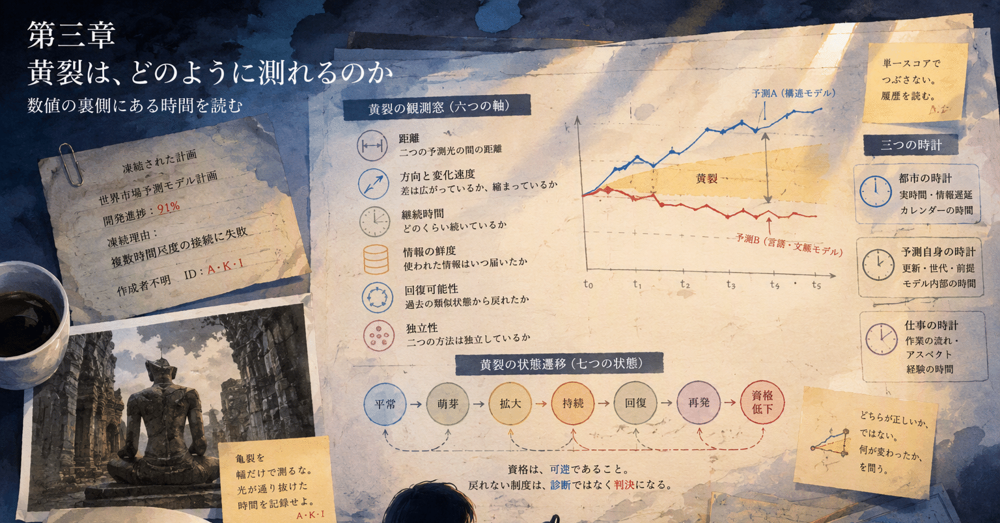

# 三つの時計と六つの窓｜記憶都市 第三章「黄裂は、どのように測れるのか」

- Published: 2026-08-04 06:24:47
- Original: https://note.com/lithe_deer2620/n/n45d52e9b8505
- note ID: `n45d52e9b8505`
- Exported from note XML: 2026-08-16

---

## 一つの数字に閉じ込めず、亀裂の履歴を観測する

観測窓の裏側には、使われなくなった通路があった。

若い研究員が見つけたのは、壁面保守のための細い回廊だった。二本の予測光を正面から眺める中央室とは違い、そこから見えるのは光の背面だった。

「予測を後ろから見る人なんて、いるの？」

「普通はいない」

私は答えた。

予測は正面から見るものだった。

画面の中央に、整った数字が表示される。  
上昇か、下降か。  
安全か、危険か。  
採用するか、保留するか。

正面から見れば、予測は答えの形をしている。

けれど背後へ回ると、答えを支えているものが見えた。

どの情報が、いつ届いたのか。  
どの規則が、どの版で使われたのか。  
どこで推定が行われたのか。  
どの時点から、二本の光が離れ始めたのか。

そして、中央室では一本の黄色い線に見えた黄裂が、背後から見ると、無数の薄い層でできていることが分かった。

細い裂け目の一枚一枚に、異なる時刻が刻まれていた。

「壊れているから、裏側が見えるのかな」

研究員が言った。

私は返事をしなかった。

欠けたものを正面から見れば、欠損に見える。  
しかし背後へ回り、そこへ光が差し込めば、欠損は光の通り道にもなる。

黄裂も同じなのかもしれなかった。

## 十時間は、いつも同じ十時間ではない

中央室へ戻ると、観測窓には三つの記録が並んでいた。

第一の記録。

予測A：420時間  
予測B：430時間  
翌日、二本の予測は再び重なった。

第二の記録。

予測A：420時間  
予測B：430時間  
差はその後も五日間続いた。

第三の記録。

予測A：420時間  
予測B：430時間  
翌日には差が十五時間になり、その次の日には二十三時間になった。

どの記録も、最初の画面だけを見れば十時間の差だった。

「同じ黄裂？」

研究員が尋ねた。

「同じ数字だ」

「同じ状態かは、まだ分からない」

第一の黄裂は、一時的な情報遅延かもしれない。  
第二の黄裂は、小さいまま長く残っている。  
第三の黄裂は、急速に拡大している。

一枚の測定値に閉じ込めれば、三つとも十時間である。

しかし、黄裂には過去がある。

いつ生まれたのか。  
どちらへ広がったのか。  
どのくらいの速さで広がったのか。  
何が届いたときに閉じたのか。  
閉じたあと、再び開いたのか。

黄裂を測るとは、幅を測るだけではない。

亀裂が生きてきた時間を読むことだった。

## 一つの時計では足りない

私たちは、黄裂の観測に一つの時計だけを使わないことにした。

最初の時計は、都市の時計だった。

何時に予測が出たか。  
何時間、差が続いたか。  
情報が何分遅れて届いたか。

この時計は均等に進む。  
一分は、いつでも同じ一分である。

二つ目の時計は、予測自身の時計だった。

新しい情報を何件受け取ったか。  
前提が何回更新されたか。  
計算の世代がいくつ進んだか。

都市では一時間しか経っていなくても、片方の予測は百回更新され、もう片方は一度も更新されていないかもしれない。

三つ目の時計は、仕事の時計だった。

調査は続いているのか。  
同じ問題が何度も戻ってきたのか。  
相談が一人へ集中し始めたのか。  
一度終わったはずの作業が、別の名前で再開したのか。

この時計は、均等には進まない。

何も起きない一日もある。  
一時間のうちに、状況の意味が何度も変わることもある。

「時計が三つあったら、余計に分からなくならない？」

「分かりやすくするために、一つへ潰す方が危険なこともある」

私は答えた。

一個体が世界を認識するためには、無数の小さな信号を、行動できる一つの経験へまとめなければならない。

けれど、まとめることと、消すことは同じではない。

黄裂の観測に必要なのは、すべての信号を並べ続けることでも、最初から一個の数字に潰すことでもなかった。

異なる尺度の時間を保ったまま、いま何が起きているかを読める形へ濃縮することだった。

## 黄裂の六つの観測窓

私たちは、黄裂を一個の点数にせず、六つの窓へ分けた。

### 1. 距離

二つの予測は、いまどのくらい離れているか。

ただし、時間数の差だけでは比較できない。  
十時間の差が、百時間の予測に対するものか、千時間の予測に対するものかで意味は変わる。

### 2. 方向と速度

亀裂は開いているのか、閉じているのか。

同じ距離でも、縮小中の十時間と、拡大中の十時間は異なる。  
速度が増しているなら、幅がまだ小さくても注意が必要になる。

### 3. 継続時間

食い違いは、一度だけ現れたのか。  
それとも、複数回の観測をまたいで残っているのか。

小さくても長く残る亀裂は、大きくてもすぐ閉じる亀裂とは別の状態である。

### 4. 情報の鮮度

それぞれの予測が見ている情報は、いつ届いたものか。

片方だけが新しい情報を受け取った直後なら、一時的な黄裂は自然に生まれる。  
問題は、情報がそろったあとも亀裂が残るかどうかである。

### 5. 回復可能性

過去に似た黄裂が現れたとき、二本の予測は再び近づいたか。

何が回復をもたらしたのか。  
新しい情報か。  
規則の修正か。  
人による確認か。  
それとも、時間が経っただけなのか。

戻れたという事実だけでなく、どの道を通って戻れたかを記録する。

### 6. 独立性

二つの予測は、本当に別の目なのか。

同じ情報源、同じ規則、同じ分類体系に依存していれば、二つが一致していても安心できない。  
二つとも同じ盲点を共有しているかもしれない。

黄裂がないことは、正しさの証明ではない。

六つの窓は、一つの正解へ投票するためのものではなかった。  
黄裂を異なる角度から照らし、正面からは見えない形を浮かび上がらせるためのものだった。

## 状態は、点ではなく移り変わる

研究員は、観測窓の床に七つの状態を並べた。

平常。  
萌芽。  
拡大。  
持続。  
回復。  
再発。  
資格低下。

「順番に進むの？」

「たぶん、そう単純じゃない」

小さな亀裂が現れ、すぐ平常へ戻ることもある。  
萌芽から急に拡大へ進むこともある。  
持続したまま幅だけが縮むこともある。  
回復したように見えて、同じ形で再発することもある。

そして、資格低下は終着点ではない。

強い権限を一時的に外したあと、新しい情報が届き、根拠が更新され、再び資格を回復する道も必要だった。

私たちは、状態を次のように置いた。

### 平常

二つの予測は許容範囲内にあり、情報の時刻もそろっている。  
ただし、一致しているという理由だけで無条件に信用しない。

### 萌芽

小さな食い違いが初めて現れる。  
まだ警報ではない。  
観測を細かくし、情報の到着時刻を確認する。

### 拡大

距離または分離速度が増している。  
単一予測への自動的な依存を弱め、二つの根拠を並べて表示する。

### 持続

食い違いが複数の観測をまたいで残る。  
一時的なノイズではなく、条件変化の可能性を調べる。

### 回復

距離が縮まり、根拠も再び整合し始める。  
ただし、数値が重なっただけで回復とみなさない。  
何が亀裂を閉じたかを確認する。

### 再発

いったん閉じた黄裂が、似た条件で再び現れる。  
個別の予測より、環境、規則、分類体系の側に原因がある可能性を疑う。

### 資格低下

黄裂が広がり、長く残り、回復の道筋も確認できない。  
単一の公式予測としての採用、自動反映、人や資源を動かす権限を段階的に弱める。

この状態には、犯人も失格者もいない。

あるのは、現在の条件では、以前と同じ強さで予測を使えないという診断だけである。

## 状態遷移図は、迷路ではなく地図である

「図にしよう」

研究員は七つの状態を線で結び始めた。

平常から萌芽へ。  
萌芽から平常へ。  
萌芽から拡大へ。  
拡大から持続へ。  
持続から回復へ。  
回復から平常へ。  
回復から再発へ。  
そして、拡大や持続から資格低下へ。

私は、資格低下から回復へ向かう線を加えた。

「失った資格も、戻れるようにするの？」

「戻れない制度は、診断ではなく判決になる」

状態遷移図の目的は、未来を一つに決めることではない。

次に何を観測するか。  
どの権限を保つか。  
どの権限を一時的に外すか。  
何が確認できれば戻れるか。

それを見失わないための地図である。

線は一方向ではなかった。

進む線も、戻る線もあった。  
同じ場所へ戻ったように見えても、一周したあとの平常は、最初の平常とは違っていた。

私たちは黄裂について、以前より多くを知っている。  
観測項目も増えている。  
戻るための道も記録されている。

螺旋とは、同じ場所を繰り返すことではない。  
同じ問いへ、少し違う高さから戻ることなのかもしれなかった。

## 初めてではない言葉

図の保存を終えたとき、古い記録片が画面の端に現れた。

出所不明。  
作成者不明。  
計画番号は抹消されている。

世界市場を対象にした予測モデル。  
開発進捗、九十一パーセント。  
凍結。

理由の欄には、短い一文だけが残っていた。

複数時間尺度の接続に失敗。

その下に、手書きで追記されたような三つの記号があった。

A。  
K。  
I。

「知っている記録？」

研究員が尋ねた。

「いや」

私はそう答えた。

だが、画面を閉じることができなかった。

記録片には、壊れた像を背後から写したような図が添えられていた。  
中央は欠け、輪郭も不完全だった。  
それでも、欠けた部分から差し込む光だけが、異様なほど鮮明に残っていた。

図の下に、一行あった。

亀裂を幅だけで測るな。  
光が通り抜けた時間を記録せよ。

私は、その言葉を初めて読んだはずだった。

けれど、初めてではない気がした。

黄裂という名前を思いついた夜と同じ感覚だった。

私の記憶ではない。

誰かの記録の中で、ずっと前に見たことがある。

そんな感覚だった。

「どうしたの？」

「何でもない」

私は記録片を閉じず、非公式資料の保管領域へ移した。

かつて誰かが、九割まで作ったモデルの続きを探していた。  
公式計画が凍結されたあとも、水面下で観測を続けていた。

なぜ、その記録が私の端末に現れたのか。  
A、K、Iが何を意味するのか。

まだ分からない。

ただ一つ分かったことがある。

私たちが黄裂と名づけたものは、あの夜、初めて生まれたのではない。

誰かが以前にも、同じ光を背後から見ていた。

## 一つの数字へ閉じ込めない

翌朝、観測窓には黄裂の状態が表示されていた。

距離：小。  
方向：拡大。  
継続：三観測周期。  
情報鮮度：片側に遅延あり。  
回復可能性：未確認。  
独立性：一部共有。  
状態：萌芽から拡大へ移行中。  
推奨権限：情報表示を継続。単一値の自動反映は保留。

そこに、総合点はなかった。

七十二点。  
危険度三。  
信頼度六十八パーセント。

そのような一個の数字も、置かなかった。

判断する者が見られるように、必要な濃縮はする。  
しかし、異なる時間、異なる履歴、異なる回復の道を、一つの点数の中へ消してしまわない。

それが、黄裂を観測するということだった。

若い研究員が、観測窓の表示を見上げた。

「これで未来が分かる？」

「分からない」

私は答えた。

「でも、未来が分からないまま、何をしてよいかは少し分かる」

黄裂を測ることは、正解を先取りすることではない。

未来が来る前に、予測へどこまで権限を与えてよいかを判断し、間違いが分かったときに戻れる道を残すことである。

正面の数字だけではなく、背後から差し込む光を見る。

亀裂の幅だけではなく、そこを通り抜けた時間を見る。

黄裂は、一つの数字ではなかった。

黄裂は、履歴を持つ状態だった。

## 次回予告

次回は、黄裂の状態遷移を、合成データの上で動かしてみる。

一度だけ開いて閉じる黄裂。  
小さいまま長く残る黄裂。  
急速に拡大する黄裂。  
回復したあと、同じ条件で再発する黄裂。  
二つの予測が一致したまま、同じ誤りへ向かう状態。

既存の公式値を変えない影の評価として、どの観測が役に立ち、どの判定が成立しないのかを確かめる。

そして、出所不明の記録に残された三つの記号についても、もう少し調べる。

**次回：黄裂を、影の中で動かす**

## 制作ノート

本章では、黄裂を単一の「危険度」や「信頼度」へ圧縮せず、次の複数軸で観測する考え方を示しました。

- 距離
- 方向と変化速度
- 継続時間
- 情報の鮮度
- 回復可能性
- 二つの方法の独立性

状態遷移は、平常、萌芽、拡大、持続、回復、再発、資格低下を基本とします。ただし、一直線の段階ではなく、回復や再発を含む可逆的な経路として扱います。

この段階では、各状態の閾値や遷移条件は完成していません。次回以降、合成データ、シャドーモードのPoC、限定的な応用実験を往復しながら検証します。

黄裂や予測資格は、個人の監視、順位付け、責任追及、処遇判断には使用しません。予測へ与える権限を調整し、見えない重要作業や分類体系の不足を発見し、チーム、個人、組織の学習へつなげることを目的とします。

本文中の人物、都市、運用局、凍結された計画、出所不明の記録は、物語として再構成したフィクションです。

---

## Observing the history of a crack without confining it to a single number

Behind the observation wall was a passage no longer in use.

The young researcher had found a narrow maintenance corridor. Unlike the central chamber, where the two prediction beams were viewed from the front, this corridor revealed the back of the light.

“Does anyone ever look at a forecast from behind?”

“Usually, no,” I said.

Forecasts were meant to be viewed from the front. A polished number occupied the center of the screen: up or down, safe or dangerous, adopt or withhold.

From the front, a forecast had the shape of an answer.

From behind, we could see what held that answer up: when each piece of information had arrived, which version of a rule had been used, where an estimate had been made, and when the two beams had begun to separate.

The Yellow Crack, which looked like a single line from the central chamber, was made of countless translucent layers. A different time was inscribed in each one.

“Can we see the back only because something is broken?” the researcher asked.

I did not answer.

Seen from the front, a missing part is a defect. Seen from behind, with light passing through it, the same absence can become a passage.

Perhaps the Yellow Crack was like that.

## Ten Hours Is Not Always the Same Ten Hours

Three records appeared on the observation wall.

In the first, Forecast A was 420 hours and Forecast B was 430. The next day, the beams converged.

In the second, the same ten-hour gap persisted for five days.

In the third, the ten-hour gap grew to fifteen hours the next day and twenty-three the day after that.

Each first reading showed the same difference.

“The same Yellow Crack?”

“The same number,” I said. “Not necessarily the same state.”

The first might have been a temporary information delay. The second was small but persistent. The third was accelerating.

A single measurement compresses all three into ten hours. But a crack has a past: when it opened, which way it moved, how quickly it widened, what information closed it, and whether it opened again.

Measuring the Yellow Crack was not merely measuring its width. It meant reading the time the crack had lived through.

## One Clock Is Not Enough

We decided not to observe the Yellow Crack with only one clock.

The first was the city’s clock. When was the forecast issued? How many hours did the gap persist? How late did information arrive? This clock moved uniformly.

The second was the forecast’s own clock. How many new records had it received? How many times had its assumptions changed? How many computational generations had passed? In one city hour, one forecast might update a hundred times while the other did not update at all.

The third was the clock of work. Was the investigation still continuing? Had the same problem returned? Was support concentrating around one person? Had a supposedly finished task restarted under another name?

This clock did not move evenly. A day might pass with no meaningful change, while the meaning of a situation might change several times within an hour.

“Won’t three clocks make everything harder to understand?”

“Sometimes forcing them into one clock is the greater danger.”

For an organism to act, countless small signals must be condensed into a coherent experience. But condensation is not erasure.

We did not need to display every signal forever, nor crush them into one score from the outset. We needed a form of condensation that preserved different scales of time while making the present condition readable.

## Six Observation Windows

We divided the Yellow Crack into six windows rather than one score.

### 1. Distance

How far apart are the forecasts now? Absolute difference is not enough. A ten-hour gap means something different against a forecast of one hundred hours than against one thousand.

### 2. Direction and Velocity

Is the crack opening or closing? A shrinking ten-hour gap is not the same as an expanding one. Acceleration can matter before the width becomes large.

### 3. Duration

Did the disagreement appear once, or has it survived across multiple observations? A narrow, persistent crack is a different state from a wide crack that closes quickly.

### 4. Information Freshness

When did the information supporting each forecast arrive? A temporary crack may be natural immediately after only one system receives new data. The important question is whether it remains after both have caught up.

### 5. Recoverability

When similar cracks appeared before, did the forecasts converge again? What brought recovery: new information, a rule change, human review, or merely the passage of time? We record not only that recovery occurred, but the path by which it occurred.

### 6. Independence

Are these truly two different eyes? If both depend on the same source, rule, or classification system, agreement provides little reassurance. Both may share the same blind spot.

The absence of a Yellow Crack is not proof of correctness.

The six windows did not vote for one answer. They illuminated the crack from different angles so that a shape invisible from the front could emerge.

## States Move

The researcher placed seven states across the floor of the observation chamber.

Normal. Emergence. Expansion. Persistence. Recovery. Recurrence. Qualification Reduced.

“Do they occur in that order?”

“Probably not.”

A small crack can return directly to Normal. Emergence can jump into Expansion. A crack may narrow while remaining persistent. Recovery may be followed by recurrence under the same conditions.

Qualification Reduced is not an endpoint. After strong authority is removed, new information and updated grounds may create a path back.

### Normal

The forecasts are within tolerance and their information timestamps are aligned. Agreement alone is not treated as proof.

### Emergence

A small disagreement appears for the first time. This is not yet an alarm. Observation becomes finer and arrival times are checked.

### Expansion

Distance or separation velocity is increasing. Automatic reliance on one forecast is weakened, and both grounds are shown.

### Persistence

The disagreement remains across several observations. We investigate a change in conditions rather than assume temporary noise.

### Recovery

Distance shrinks and the supporting grounds begin to align again. Numerical convergence alone is insufficient; we identify what closed the crack.

### Recurrence

A crack returns under similar conditions. The cause may lie in the environment, rules, or classification system rather than in either forecast alone.

### Qualification Reduced

The crack widens, persists, and lacks a verified path to recovery. Authority to adopt a single official forecast, update plans automatically, or move people and resources is reduced in stages.

There is no culprit and no disqualified person in this state. It is only a diagnosis that the forecast cannot currently be used with its former degree of authority.

## A State Diagram Is a Map, Not a Maze

“Let’s draw it,” the researcher said.

The researcher connected Normal to Emergence, Emergence back to Normal and onward to Expansion, Expansion to Persistence, Persistence to Recovery, Recovery to Normal or Recurrence, and Expansion or Persistence to Qualification Reduced.

I added a line from Qualification Reduced to Recovery.

“Qualification can return?”

“A system with no return path is a sentence, not a diagnosis.”

The diagram did not choose the future. It preserved the next question: what to observe, which authority to retain, which to suspend, and what evidence would permit a return.

Its lines moved both forward and back. Even when the path returned to Normal, it did not return to the same Normal. We knew more, observed more, and had recorded a route home.

A spiral may not mean repeating the same place. It may mean returning to the same question from a slightly different height.

## A Word That Was Not New

As we saved the diagram, an old fragment appeared at the edge of the screen.

Source unknown. Author unknown. Project number erased.

A forecasting model for global markets. Development progress: 91 percent. Frozen.

Only one reason remained:

Failure to connect multiple temporal scales.

Below it were three handwritten marks:

A.  
K.  
I.

“Do you know this record?”

“No.”

Yet I could not close it.

The fragment included an image like a damaged figure photographed from behind. Its center was missing and its outline incomplete, but the light passing through the absence was unnaturally clear.

Beneath it was one line:

Do not measure the crack only by its width.  
Record the time through which the light passed.

I was reading the words for the first time. Yet they did not feel new. It was the same sensation I had felt on the night we named the Yellow Crack.

Not my memory. Something encountered long ago in someone else’s record.

I moved the fragment into an unofficial archive rather than closing it.

Someone had once continued a model abandoned at ninety percent. After the official project froze, someone had kept observing below the surface.

Why the record had appeared on my terminal, and what A, K, and I meant, remained unknown.

But one thing had become clear.

What we called the Yellow Crack had not been born that night.

Someone before us had already looked at the same light from behind.

## Do Not Confine It to One Number

The next morning, the observation wall displayed:

Distance: small.  
Direction: expanding.  
Duration: three observation cycles.  
Information freshness: delay on one side.  
Recoverability: unverified.  
Independence: partially shared.  
State: transitioning from Emergence to Expansion.  
Recommended authority: keep both forecasts visible; withhold automatic application of a single value.

There was no overall score. No 72 points, Risk Level 3, or 68 percent confidence.

We would condense what decision-makers needed to see, but would not erase different times, histories, and recovery paths inside one number.

“Does this tell us the future?”

“No,” I said. “But it tells us a little more about what we may do while the future remains unknown.”

Measuring the Yellow Crack does not reveal the correct future in advance. It helps us decide how much authority a forecast may receive before the future arrives, while preserving a way back if the forecast proves wrong.

Look not only at the number from the front, but at the light entering from behind. Read not only the width of the crack, but the time that has passed through it.

The Yellow Crack was not a number.

It was a state with a history.

## Next

Next, we will animate the state transitions with synthetic data: a crack that opens once and closes, one that remains narrow but persistent, one that expands rapidly, one that recurs after recovery, and a state in which both forecasts agree while moving toward the same error.

As a shadow evaluation, the experiment will not change existing official values. It will test which observations help and which rules fail.

We will also look more closely at the three marks in the unknown record.

**Next: Moving the Yellow Crack in the Shadows**

## Author’s Note

This chapter observes the Yellow Crack through six separate dimensions: distance, direction and velocity, duration, information freshness, recoverability, and independence.

The basic states are Normal, Emergence, Expansion, Persistence, Recovery, Recurrence, and Qualification Reduced. They form reversible paths rather than a one-way ladder.

Thresholds and transition rules are not final. They will be tested through synthetic data, shadow-mode proofs of concept, and limited applied experiments.

The Yellow Crack and Prediction Qualification will not be used for individual surveillance, ranking, blame, or employment decisions. Their purpose is to adjust the authority granted to predictions, reveal important work and missing categories, and support learning by individuals, teams, and organizations.

The people, city, Operations Bureau, frozen project, and unknown record are fictional reconstructions.

---

## 不把裂縫關進單一數字，而是觀察它走過的歷史

觀測牆後方，有一條早已停用的通道。

年輕的研究員找到的是維修牆面的狹窄迴廊。中央室只能從正面觀看兩道預測光，這裡看見的卻是光的背面。

「會有人從背後看預測嗎？」

「通常不會。」我回答。

預測向來是從正面看的。畫面中央呈現一個整齊的數字：上升或下降、安全或危險、採用或保留。

從正面看，預測長得像答案。

繞到背後，才看得見支撐答案的東西：資訊何時抵達、使用哪一版規則、推估在哪裡發生，以及兩道光從哪一刻開始分離。

中央室裡看似一條黃線的黃裂，從背面看，竟由無數半透明的薄層組成。每一層都刻著不同的時間。

「是不是因為壞掉了，才看得到背面？」研究員問。

我沒有回答。

從正面看，缺損只是殘缺；從背後讓光穿過，缺損也可能成為光的通道。

黃裂或許也是如此。

## 十小時，不一定是同一種十小時

觀測牆列出三份紀錄。

第一份：預測A為420小時，預測B為430小時，隔天兩道光重新靠攏。

第二份：同樣相差十小時，卻持續了五天。

第三份：最初相差十小時，隔天擴大為十五小時，再隔一天變成二十三小時。

如果只看第一個畫面，三者都是十小時。

「是同一種黃裂嗎？」

「是同一個數字，不一定是同一種狀態。」

第一種可能只是資訊暫時延遲。第二種很窄，卻長時間存在。第三種正在加速擴張。

單一測量值會把三者壓成同一個十小時。但是裂縫有過去：何時出現、朝哪裡延伸、以多快的速度擴大、什麼資訊讓它閉合，以及閉合後是否再次張開。

測量黃裂，不只是測量它的寬度，而是閱讀裂縫經歷過的時間。

## 一個時鐘並不夠

我們決定不用單一時鐘觀察黃裂。

第一個是城市的時鐘：預測何時產生、差距持續多久、資訊延遲幾分鐘。這是均勻前進的時間。

第二個是預測自己的時鐘：收到多少新資訊、前提更新幾次、運算世代前進多少。城市只過一小時，其中一項預測可能更新一百次，另一項一次也沒有。

第三個是工作的時鐘：調查是否仍在繼續、同一問題是否反覆出現、支援是否集中到某一個人、一項看似完成的工作是否換了名字重新開始。

這個時鐘並不均勻。有時一整天都沒有真正變化，有時一小時內，情況的意義已經改變好幾次。

「三個時鐘，不會更難懂嗎？」

「有時候，硬把它們壓成一個時鐘才更危險。」

一個生命體若要採取行動，就必須把無數微小訊號濃縮成可以理解的經驗。但濃縮不等於抹除。

我們既不需要永遠展示每一個訊號，也不該一開始就把所有訊號壓成一個分數。需要的是保留不同時間尺度，同時讓當下狀態可以被閱讀的濃縮方式。

## 黃裂的六扇觀測窗

我們不給黃裂一個總分，而是分成六扇觀測窗。

### 1. 距離

兩項預測目前相距多遠？絕對差值並不足夠。十小時佔一百小時與佔一千小時，意義並不相同。

### 2. 方向與速度

裂縫正在打開，還是在閉合？同樣相差十小時，縮小中的十小時與擴大中的十小時並不相同。即使寬度還小，加速擴張也值得注意。

### 3. 持續時間

分歧只出現一次，還是跨越多次觀測仍然存在？狹窄但持久的裂縫，和寬大卻迅速閉合的裂縫，是不同狀態。

### 4. 資訊新鮮度

支撐兩項預測的資訊分別在何時抵達？只有一方剛收到新資料時，短暫黃裂十分自然。真正重要的是雙方資訊追平後，裂縫是否仍然存在。

### 5. 恢復可能性

過去出現類似黃裂時，兩項預測是否重新靠近？是新資訊、規則修正、人工確認，還是單純經過一段時間帶來恢復？除了記錄恢復，也要記錄返回的路徑。

### 6. 獨立性

兩項預測真的是兩雙不同的眼睛嗎？如果依賴相同資訊來源、規則或分類體系，即使結果一致也不能放心。兩者可能共享同一個盲點。

沒有黃裂，不等於預測正確。

六扇窗不是用來投票選出答案，而是從不同角度照亮裂縫，讓正面看不見的形狀浮現。

## 狀態會移動

研究員在觀測室地面排出七種狀態。

平常。萌芽。擴大。持續。恢復。再發。資格降低。

「會照這個順序發生嗎？」

「大概不會那麼簡單。」

小裂縫可能直接回到平常；萌芽也可能立刻跳到擴大；裂縫可能一邊縮小、一邊持續；恢復之後，也可能在相同條件下再發。

資格降低不是終點。暫時移除強大權限以後，新資訊與更新後的依據仍可能建立一條回程路。

### 平常

兩項預測位於容許範圍內，資訊時間也已對齊。但不能只因結果一致就無條件信任。

### 萌芽

小幅分歧第一次出現。此時還不是警報，而是提高觀測頻率並確認資訊抵達時間。

### 擴大

距離或分離速度增加。降低對單一預測的自動依賴，並列呈現兩邊的依據。

### 持續

分歧跨越多次觀測仍然存在。不能只當成短暫雜訊，而要尋找條件是否改變。

### 恢復

距離縮小，支撐依據也重新趨向一致。數值重合還不夠，必須確認是什麼讓裂縫閉合。

### 再發

黃裂在相似條件下重新出現。原因可能位於環境、規則或分類體系，而不在任一預測本身。

### 資格降低

裂縫擴大、長期存在，而且找不到可驗證的恢復路徑。系統會逐步降低採用單一正式預測、自動更新計畫，以及調動人員或資源的權限。

這個狀態裡沒有犯人，也沒有失格者。只有一項診斷：在目前條件下，預測不能再以原來的權限強度使用。

## 狀態轉移圖是地圖，不是迷宮

「畫成圖吧。」

研究員把平常連到萌芽，萌芽連回平常或前往擴大，擴大連到持續，持續連到恢復，恢復連回平常或前往再發，也把擴大與持續連向資格降低。

我又加上一條從資格降低回到恢復的線。

「失去的資格也能回來？」

「沒有回程的制度不是診斷，而是判決。」

狀態轉移圖不負責決定未來。它保留下一個問題：接著要觀察什麼、保留哪些權限、暫停哪些權限，以及確認哪些證據後可以返回。

線並非單向。即使回到平常，也不再是最初的平常。我們知道得更多，觀察得更細，也留下了回家的路。

螺旋不是反覆回到同一個地方，而是從稍微不同的高度，回到同一個問題。

## 並不陌生的詞

儲存圖表時，一份古老的紀錄殘片出現在畫面邊緣。

來源不明。作者不明。計畫編號已刪除。

以全球市場為目標的預測模型。開發進度：91%。凍結。

理由只剩一句：

無法連接多重時間尺度。

下方有三個彷彿手寫的記號：

A。  
K。  
I。

「你看過這份紀錄嗎？」

「沒有。」

我卻無法把畫面關掉。

殘片附著一張圖，像是從背後拍攝一尊受損的像。中央殘缺，輪廓也不完整，唯有穿過缺口的光異常清晰。

圖下留著兩句話：

不要只用寬度測量裂縫。  
記錄光穿過其中的時間。

我理應是第一次讀到這些字，卻覺得並不陌生。那與我們替黃裂命名的夜晚，是同一種感覺。

那不像我的記憶，更像很久以前在某個人的紀錄裡看過。

我沒有關閉殘片，而是把它移到非正式資料區。

曾經有人繼續追查一個完成九成後被放棄的模型。官方計畫凍結後，仍有人在水面下持續觀測。

這份紀錄為何出現在我的終端，以及A、K、I代表什麼，目前仍然未知。

但有一件事已經清楚。

我們稱為黃裂的現象，並不是在那天晚上第一次誕生。

在我們以前，已經有人從背後看過同一道光。

## 不把它關進單一數字

隔天早晨，觀測牆顯示：

距離：小。  
方向：擴大。  
持續：三個觀測週期。  
資訊新鮮度：單側延遲。  
恢復可能性：尚未確認。  
獨立性：部分共用。  
狀態：由萌芽轉向擴大。  
建議權限：持續顯示兩項預測；暫停單一數值的自動套用。

畫面上沒有總分，沒有72分、風險等級3或信賴度68%。

我們會把判斷者需要看見的資訊濃縮出來，但不會把不同時間、歷史與回程路徑抹除在一個分數裡。

「這樣就知道未來了嗎？」

「不知道。」我回答，「但是，在仍然不知道未來的情況下，我們會多知道一點現在可以做什麼。」

測量黃裂，不是提前取得正確的未來。它讓我們在未來抵達以前，判斷可以賦予預測多大的權限，並在預測出錯時保留回程路。

別只看數字的正面，也要看從背後進入的光。別只看裂縫的寬度，也要閱讀穿過其中的時間。

黃裂不是一個數字。

黃裂是一種擁有歷史的狀態。

## 下一篇

下一篇將以合成資料讓狀態轉移真正動起來：只打開一次便閉合的黃裂、狹窄但長期存在的黃裂、快速擴大的黃裂、恢復後再發的黃裂，以及兩項預測保持一致卻共同走向相同錯誤的狀態。

實驗將採用不改變既有正式數值的影子評估，確認哪些觀測有幫助，又有哪些判定無法成立。

我們也會繼續追查未知紀錄裡的三個記號。

**下一篇：讓黃裂在影子裡移動**

## 創作說明

本章以六個獨立面向觀察黃裂：距離、方向與速度、持續時間、資訊新鮮度、恢復可能性，以及獨立性。

基本狀態包括平常、萌芽、擴大、持續、恢復、再發與資格降低。它們不是單向階梯，而是包含回復路徑的可逆結構。

各狀態的門檻與轉移條件尚未定案。後續將透過合成資料、影子模式PoC與限定應用實驗進行驗證。

黃裂與預測資格不會用於個人監控、排名、責任追究或人事處置。目的在於調整預測的權限，發現看不見的重要工作與分類缺口，並支持個人、團隊與組織學習。

本文中的人物、城市、維運局、凍結計畫與未知紀錄，皆為重新建構的虛構設定。

---

記憶都市 №3

</assets/n45d52e9b8505_sembda893ee470fc929adce94be4_0.png>

---

今日は火曜日。気合い入れていこう
