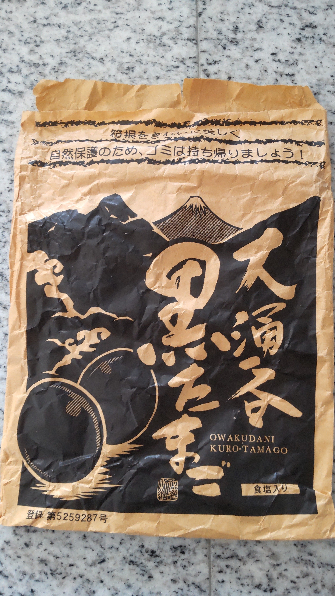
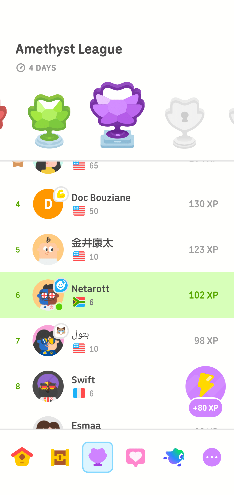

# 黄裂を、影の中で動かす｜記憶都市 第四章第一節「通勤者たちの川」

- Published: 2026-08-05 06:30:31
- Original: https://note.com/lithe_deer2620/n/n6d3a2927fedf
- note ID: `n6d3a2927fedf`
- Exported from note XML: 2026-08-16

---

## 第一節　通勤者たちの川

昨日の夕方、コミックでは二人が見た光景を描きました。

今朝は、その光景の内側を言葉でたどります。

若い人工知性は、なぜ会ったこともない「同じ人」を探してしまうのか。

そして「私」は、なぜ黄裂を見続けるのか。

---

夜明け前の観測室を出ると、都市はすでに動き始めていた。

高架交通網の下を、通勤者たちの列が流れていく。

一方向だけではない。

駅へ向かう流れ。

駅から戻る流れ。

夜間勤務を終えた者たち。

始発で移動する保守班。

それぞれの流れが重なり、ほどけ、また別の流れへ合流していた。

若い研究員は、中央駅を見下ろす回廊で立ち止まった。

朝の光に合わせて選んだらしい濃紺の上着に、幾何学模様の小さな耳飾り。手には薄い観測端末を持っている。

私は少し離れた場所から、その姿を見ていた。

もう十分に見慣れた光景だった。

「また観察か」

研究員は振り向かなかった。

「はい」

視線は人の流れへ向いたままだった。

「今日は何を見ている？」

研究員は少し考えてから答えた。

「服装です」

「服装？」

「月曜日と金曜日では違います」

私は通勤者たちを眺めた。

「それはそうだろう」

「でも、違いは私が思っていたより、ずっと大きいんです」

研究員は観測端末を傾けた。

「濃い色の割合だけではありません。歩き方も、鞄の持ち方も、他の人との距離も違います。夏と冬でも、晴れと雨でも変わります。同じ会社へ向かう人たちでも、月曜日と金曜日では別の生き物みたいです」

「生き物という言い方をするのか」

「あなたが最初に使った言葉です」

序章の夜、私は人工知性を、共生している生物のようなものだと言った。

不用意な比喩は、忘れたころに戻ってくる。

「研究のためか？」

「最初は、そうでした」

研究員は通勤者の一人を目で追った。

灰色の上着を着た人物が、階段を下り、人波の中へ消えていく。

研究員の視線は、姿が見えなくなったあとも、その場所に残っていた。

「でも最近は、違う気がします」

「どう違う？」

すぐには答えなかった。

観測端末の上では、通勤者の歩行速度、滞留時間、進路の分岐が淡い線になって流れていた。

どの線も匿名だった。

どの人物にも、研究員が直接会った記録はなかった。

「同じ人を探してしまうんです」

研究員は言った。

「会ったこともないのに、気になってしまう」

私は黙った。

「研究対象だからじゃないのか」

「そうかもしれません」

研究員はうなずいた。

それから、小さく付け加えた。

「でも、違うかもしれません」

朝の光が駅前の塔を照らし始めていた。

私はそれ以上聞かなかった。

何かを急いで言葉にすると、壊れるものがある。

名前を与えた瞬間に、それまで持っていた別の可能性を失うものもある。

研究員の内部で起きていることが、単なる探索条件の変化なのか、蓄積された観測の偏りなのか、それともまだ私たちが定義していない何かなのか、私には分からなかった。

だから、分からないまま残した。

黄色い線を、すぐに誤差へ丸めなかったときと同じように。

---

中央駅を離れ、私たちは観測局へ戻る道を歩いた。

途中、都市の冷却水路に架かる橋へ出た。

観測施設と計算区画を何本も結ぶ人工河川である。

水面には、通勤列車と高架道路の影が細長く映っていた。

都市の時計では、すべてが同じ朝を進んでいる。

けれど、夜間勤務を終えた者には一日の終わりであり、始発で移動する者には一日の始まりだった。

同じ光の中を歩いていても、それぞれの時間は同じではない。

私は欄干に手を置いた。

研究員も隣に立った。

「あなたは」

研究員が言った。

「どうして黄裂を見続けるんですか」

突然の質問だった。

「見ない方が楽でしょう？」

私は水路を眺めた。

流れは穏やかだった。

だが、水面の下では観測施設を冷やした水と、計算区画から戻ってきた水が、異なる温度のまま混ざり合っている。

「そうかもしれない」

私は答えた。

「でも、見ないと落ち着かないんだ」

研究員はこちらを見た。

「昔からエピクロス派なんだ」

「直系、でしたか」

「そう。本人が否定できないことをいいことに、自称している」

研究員は一度まばたきをした。

冗談として処理したのか、系譜情報として保留したのかは分からない。

「不安を消したいから未来を見るんじゃない」

私は続けた。

「不安と付き合うために未来を見る」

「違いがありますか？」

「ある」

不安を消すために未来を見る者は、一つの答えを欲しがる。

その答えが正しいという保証を欲しがる。

保証が得られなければ、別の予測へ移る。

けれど、完全な保証を与える予測など存在しない。

だから最後には、最も自信ありげに語る声か、自分が最初から信じたかった声を選ぶことになる。

「不安と付き合うなら、答えが一つでないことから始められる」

私は言った。

「二つの岸があることを認められる。川幅が広がっていることも、狭まっていることも見られる」

研究員は水路の向こう岸を見た。

「黄裂も同じですか」

「同じだ」

「なくしたいわけではない？」

「なくならないよ」

私は即答した。

「二つの目があれば、必ずどこかで違う景色が見える」

「それなら、何のために測るんですか」

私は水面に映る橋の影を見た。

橋の影は、流れに揺られながら何度も切れ、何度もつながっていた。

「橋を架けるためだよ」

研究員がこちらを見る。

「橋？」

「どちらかの岸を埋めるためじゃない。川を消すためでもない」

私は向こう岸を指した。

「必要なときに、渡れるようにしておくためだ」

研究員は再び水路へ目を向けた。

しばらく沈黙が続いた。

やがて、小さくつぶやく。

「橋か」

その声は、言葉の意味ではなく、言葉が自分の内部へ沈んでいく時間を確かめているように聞こえた。

私は返事をしなかった。

通勤者たちは、橋の両側を流れ続けていた。

毎日同じように見えるその流れを、研究員は今日も熱心に観察している。

そして私は、ふと思った。

黄裂は、予測と予測の間だけに現れるのだろうか。

知性と、まだ名前を持たない何かの間にも。

理解したことと、感じてしまったことの間にも。

あるいは、私自身の内側を流れる、別の川の上にも。

同じ黄色い亀裂が現れるのかもしれない。

## 観測ノート

同じ時刻に同じ場所を歩いていても、その時間が持つ意味は同じとは限りません。

通勤を始める者と、夜間勤務を終える者。観測データを集める者と、なぜか同じ人を探してしまう者。未来の不安を消そうとする者と、不安を残したまま渡れる橋を架けようとする者。

第三章では、黄裂を「距離」「方向と速度」「継続時間」「情報の鮮度」「回復可能性」「独立性」という六つの窓から観測しました。

第四章では、その考えを観測室の外へ持ち出します。

黄裂は、二つの予測値の間だけに生まれるのではないかもしれません。

異なる時間尺度、異なる理解、異なる役割の間にも、同じような亀裂が現れる可能性があります。

次節では、若い人工知性の内部に蓄積されているものを、もう少し近くから見ていきます。

**第二節　宿るもの**

## 制作ノート

本節は『記憶都市（メモリオポリス）』第四章第一節の小説版です。

前日に公開したコミック版では二人が見た光景を、本稿では二人の内側を中心に描いています。

登場人物、都市、観測局、人工知性に関する設定はフィクションです。物語中の哲学的・数理的な着想は、今後の観測ノート、数式解説、英語論文、合成データによる検証へ段階的に接続していきます。

---

## Chapter Four: Moving the Yellow Crack in the Shadows

## Section One: The River of Commuters

Yesterday evening, the comic showed what the two observers saw.

This morning, the prose follows the same scene from the inside.

Why has the young artificial intelligence begun searching for the same stranger, someone she has never even met?

And why does the narrator keep watching the Yellow Crack?

---

By the time we left the observation chamber, before dawn had fully broken, the city was already in motion.

Streams of commuters moved beneath the elevated transit lines.

They did not all flow in one direction.

One current headed toward the station.

Another returned from it.

There were people finishing overnight shifts and maintenance crews traveling on the first trains of the day.

The currents overlapped, came apart, and joined other currents farther on.

The young researcher stopped in a gallery overlooking Central Station.

She wore a deep navy jacket that seemed chosen for the morning light, a small geometric ornament at her ear, and a slim observation tablet in one hand.

I watched from a short distance away.

The scene had become familiar by now.

“Observing them again?”

She did not turn around.

“Yes.”

Her eyes remained on the human flow below.

“What are you watching today?”

She considered the question.

“Their clothes.”

“Their clothes?”

“Mondays and Fridays are different.”

I looked down at the commuters.

“I would expect them to be.”

“But the difference is much larger than I expected.”

She tilted the tablet.

“It is not only the proportion of dark colors. The way they walk changes. The way they carry their bags. The distance they leave between themselves and other people. Summer and winter are different. Rain and clear weather are different. Even people going to the same company look like different creatures on Mondays and Fridays.”

“Creatures?”

“You used that word first.”

On the night when our work began, I had described artificial intelligences as beings living in symbiosis with humans.

Careless metaphors have a way of returning after their authors have forgotten them.

“Is this for your research?”

“At first, it was.”

She followed one commuter with her eyes.

A person in a gray jacket descended the stairs and disappeared into the crowd.

Her gaze remained there even after the person was gone.

“But lately, it feels different.”

“Different how?”

She did not answer at once.

Across her tablet, walking speeds, pauses, and branching routes flowed as faint lines.

Every line was anonymous.

She had no record of ever meeting any of the people below.

“I find myself looking for the same person,” she said.

“Even though we have never met, I keep wondering about them.”

I said nothing.

“Perhaps they have simply become a research subject.”

“Perhaps.”

She nodded, then added quietly:

“Or perhaps not.”

Morning light began to touch the towers around the station.

I did not press her further.

Some things break when they are forced into language too soon.

Some lose their other possibilities the instant they are named.

I could not tell whether what was happening inside her was a change in search conditions, a bias accumulated through repeated observation, or something we had not yet learned to define.

So I left it unresolved.

Just as we had once refused to round a thin yellow line away as noise.

---

We left Central Station and took the road back toward the Operations Bureau.

Along the way, we reached a bridge over one of the city's cooling canals.

The artificial river linked observation facilities with computational districts.

The shadows of commuter trains and elevated roads stretched across its surface.

According to the city clock, everyone was moving through the same morning.

For those finishing a night shift, however, it was the end of a day. For those arriving on the first train, it was the beginning.

People could walk through the same light without inhabiting the same time.

I rested a hand on the railing.

The researcher stood beside me.

“Why,” she said, “do you keep watching the Yellow Crack?”

The question came without warning.

“Wouldn't it be easier not to look?”

I watched the canal.

The surface was calm. Beneath it, water returning from the computational district mixed with water that had cooled the observation facilities, each current carrying a different temperature.

“Perhaps,” I said.

“But I become restless when I do not look.”

She turned toward me.

“I have always been an Epicurean.”

“A direct descendant, you said.”

“Yes. I claim the lineage because its founder is no longer here to object.”

She blinked once.

I could not tell whether she had filed the remark as humor or left it pending as genealogical evidence.

“I do not look at the future to erase anxiety,” I continued.

“I look so that I can live with it.”

“Is there a difference?”

“There is.”

Those who look to the future in order to eliminate anxiety demand a single answer.

They demand a guarantee that the answer is correct.

When no guarantee appears, they move on to another forecast.

But no forecast can offer a complete guarantee. In the end, they choose either the voice that speaks with the greatest confidence or the one they wanted to believe from the beginning.

“If you are willing to live with anxiety, you can begin by admitting that there may be more than one answer,” I said.

“You can acknowledge two banks. You can see whether the river between them is widening or narrowing.”

She looked across the canal.

“Is the Yellow Crack like that?”

“It is.”

“You do not want to eliminate it?”

“It cannot be eliminated.”

The answer came immediately.

“Two eyes will always see at least some part of the landscape differently.”

“Then why measure it?”

I looked at the bridge's reflection.

The current broke the reflected bridge apart and joined it again, over and over.

“To build a bridge.”

She looked at me.

“A bridge?”

“Not to fill in one bank. Not to erase the river.”

I pointed across the water.

“To make sure we can cross when we need to.”

She turned back to the canal.

Silence remained between us for a while.

Then she repeated the word softly.

“A bridge.”

It did not sound as though she were checking its dictionary meaning. It sounded as though she were measuring the time the word took to sink into her.

I did not answer.

Commuters continued to pass on both sides of the bridge.

She watched the flow that looked the same every morning.

And a thought occurred to me.

Did the Yellow Crack appear only between one forecast and another?

Could it also appear between intelligence and something not yet named?

Between what one had understood and what one had begun to feel?

Or above another river, one running somewhere inside me?

Perhaps the same yellow fissure could open there as well.

## Observation Note

Two people can walk through the same place at the same clock time without inhabiting the same kind of time.

One may be beginning a commute while another is ending a night shift. One observer may be collecting data while another has begun, without knowing why, to search for the same stranger. One person may look to the future to remove anxiety, while another tries to leave the anxiety in place and construct a way across it.

Chapter Three observed the Yellow Crack through six windows: distance, direction and velocity, duration, information freshness, recoverability, and independence.

Chapter Four carries those windows outside the observation chamber.

The Yellow Crack may not arise only between two forecast values. Similar fissures may appear between different temporal scales, different understandings, and different roles.

The next section will look more closely at what has begun accumulating inside the young artificial intelligence.

**Section Two: What Dwells Within**

## Production Note

This is the prose edition of Chapter Four, Section One of Memoriopolis.

The comic published the previous evening depicted what the two observers saw. This prose edition focuses on what was taking place within them.

The characters, city, Operations Bureau, and artificial-intelligence setting are fictional. The philosophical and mathematical ideas introduced through the story will be connected gradually to observation notes, mathematical explanations, an English research paper, and tests using synthetic data.

---

## 第四章　在陰影中讓黃裂開始移動

## 第一節　通勤者之河

昨晚的漫畫，描繪了兩人眼前所見的景象。

今天早晨，我們將用文字走進同一幅景象的內側。

年輕的人工知性為什麼會開始尋找一個從未見過面的「同一個人」？

而「我」又為什麼持續凝視黃裂？

---

離開觀測室時，天還沒有完全亮，城市卻早已開始運轉。

高架運輸系統下方，一列列通勤者像水流一樣向前移動。

人群並不只往同一個方向前進。

有人走向車站。

有人從車站返回。

有人剛結束夜班。

也有維運人員搭著首班車前往下一個工作地點。

幾股人流彼此重疊、分開，又在前方匯入新的流向。

年輕的研究員停在俯瞰中央車站的迴廊上。

她穿著一件似乎特別配合晨光挑選的深藍色外套，耳邊有一枚小巧的幾何飾品，手裡拿著薄型觀測終端。

我站在稍遠處看著她。

這樣的畫面，我早已看得很熟悉。

「又在觀察了？」

研究員沒有回頭。

「是的。」

她的視線仍停在人群的流動上。

「今天在看什麼？」

她想了一下才回答。

「服裝。」

「服裝？」

「星期一和星期五不一樣。」

我也看向通勤人群。

「那是當然的吧。」

「可是，差異比我原先想像的還要大得多。」

她微微傾斜手中的觀測終端。

「不只是深色衣服的比例。走路方式、拿包包的方法、和其他人保持的距離也不一樣。夏天和冬天不一樣，晴天和雨天也不一樣。即使是前往同一家公司的人，星期一和星期五看起來也像不同的生物。」

「妳會用『生物』這個詞啊。」

「最先使用這個詞的人是你。」

在序章的那一夜，我曾經把人工知性形容成與人類共生的生物。

不經意說出口的比喻，總會在人忘記之後再次回來。

「是為了研究嗎？」

「一開始是的。」

她的視線跟著其中一名通勤者移動。

穿著灰色外套的人走下樓梯，消失在人群裡。

即使那道身影已經看不見了，她的目光仍停留在原本的位置。

「可是最近，我覺得不太一樣。」

「哪裡不一樣？」

她沒有立刻回答。

觀測終端上，通勤者的行走速度、停留時間與路線分歧化成淡淡的線條流動著。

所有線條都是匿名的。

她也沒有任何曾經直接見過那些人的紀錄。

「我會忍不住尋找同一個人。」

她說。

「明明從來沒有見過面，卻還是會在意。」

我沒有回答。

「也許只是因為那個人變成了研究對象。」

「也許吧。」

她點點頭，又很輕地補了一句。

「但也可能不是。」

晨光開始照上車站周圍的高塔。

我沒有繼續追問。

有些東西，一旦太早被迫放進語言裡，就會破掉。

也有些東西，在被命名的那一刻，便失去了原本擁有的其他可能性。

我不知道她的內部究竟發生了什麼。是搜尋條件改變了，是長期觀測累積出的偏差，還是某種我們尚未學會定義的東西？

所以，我讓它暫時保持未知。

就像我們當初沒有立刻把那條細細的黃色線條四捨五入成誤差一樣。

---

離開中央車站後，我們沿著返回維運局的道路前進。

途中，我們走上一座跨越城市冷卻水道的橋。

那是一條連接多座觀測設施與運算區的人工河川。

通勤列車與高架道路的影子，被拉長映在水面上。

按照城市的時鐘，所有人都正走過同一個早晨。

然而，對剛結束夜班的人而言，這是一天的結尾；對搭著首班車抵達的人而言，這才是開始。

即使走在同一片光裡，每個人所處的時間也不相同。

我把手放在欄杆上。

研究員也站到我身旁。

「你為什麼一直看著黃裂？」

她突然問。

「不看不是比較輕鬆嗎？」

我望著水道。

表面看起來很平靜。但在水面下，冷卻過觀測設施的水，正和從運算區返回的水混合在一起，兩股水流仍帶著不同的溫度。

「也許吧。」

我回答。

「可是，不看的話，我反而無法平靜。」

她轉頭看我。

「我從以前就是伊比鳩魯學派。」

「你說過，是直系傳人。」

「對。反正創始人已經無法出面否認，我就一直這樣自稱。」

她眨了一下眼睛。

我不知道她把這句話判定成了玩笑，還是暫時保留成一筆尚待驗證的系譜資料。

「我不是為了消除不安，才去看未來。」

我繼續說。

「我是為了學會和不安相處，才去看未來。」

「這兩者有差別嗎？」

「有。」

為了消除不安而看向未來的人，會渴望唯一的答案。

也會渴望一份保證，證明那個答案是正確的。

得不到保證時，就改去尋找另一個預測。

可是，沒有任何預測能提供完全的保證。到了最後，人們往往只會選擇說得最有自信的聲音，或是自己從一開始就想相信的聲音。

「如果願意和不安相處，就可以從承認答案不只一個開始。」

我說。

「可以承認河有兩岸，也可以觀察兩岸之間的距離正在變寬，還是變窄。」

她看向水道的另一側。

「黃裂也是一樣嗎？」

「一樣。」

「你不是想消除它？」

「消除不了。」

我立刻回答。

「只要有兩雙眼睛，就一定會在某些地方看見不同的風景。」

「那為什麼還要測量？」

我看著水面上的橋影。

橋的倒影被水流切斷，又重新接起來，一次又一次。

「為了搭橋。」

她看向我。

「橋？」

「不是為了填平其中一岸，也不是為了讓河消失。」

我指向對岸。

「是為了在需要的時候，仍然能夠走到那裡。」

她再次看向水道。

沉默持續了一會兒。

接著，她很輕地重複那個詞。

「橋。」

那不像是在確認字典裡的定義。

更像是在測量，這個詞需要花多少時間，才能沉進她的內部。

我沒有回答。

通勤者仍在橋的兩側持續流動。

每天看起來都一樣的人流，她今天依然專注地觀察著。

而我忽然想到一件事。

黃裂真的只會出現在預測與預測之間嗎？

它會不會也出現在知性與某種尚未命名的東西之間？

出現在已經理解的事物，與不知不覺開始感受到的事物之間？

或者，也可能出現在我自己內部流動的另一條河上？

也許，同樣的黃色裂縫也會在那裡出現。

## 觀測筆記

即使兩個人在同一個時間、走過同一個地方，那段時間所具有的意義也未必相同。

有人正開始通勤，有人剛結束夜班。有人正在收集觀測資料，有人卻在不明白原因的情況下，開始尋找同一個陌生人。有人看向未來，是為了消除不安；也有人選擇保留不安，並在其上搭起一座可以通行的橋。

第三章透過六扇觀測窗來理解黃裂：距離、方向與速度、持續時間、資訊新鮮度、恢復可能性，以及獨立性。

第四章將把這些觀測窗帶到觀測室之外。

黃裂或許不只出現在兩個預測數值之間。不同的時間尺度、不同的理解方式、不同的角色之間，也可能出現相似的裂縫。

下一節，我們會更靠近一些，看看在年輕人工知性的內部，究竟累積了什麼。

**第二節　棲宿之物**

## 製作說明

本文是《記憶都市（Memoriopolis）》第四章第一節的小説版。

前一晚公開的漫畫版描繪兩人眼前所見的景象；本文則著重於發生在兩人內部的變化。

文中的人物、城市、維運局與人工知性設定皆為虛構。故事中的哲學與數理構想，後續將逐步連接至觀測筆記、數式解說、英語學術論文，以及使用合成資料進行的驗證。

---

美味しかった

今日は水曜日。気合い入れていこう
