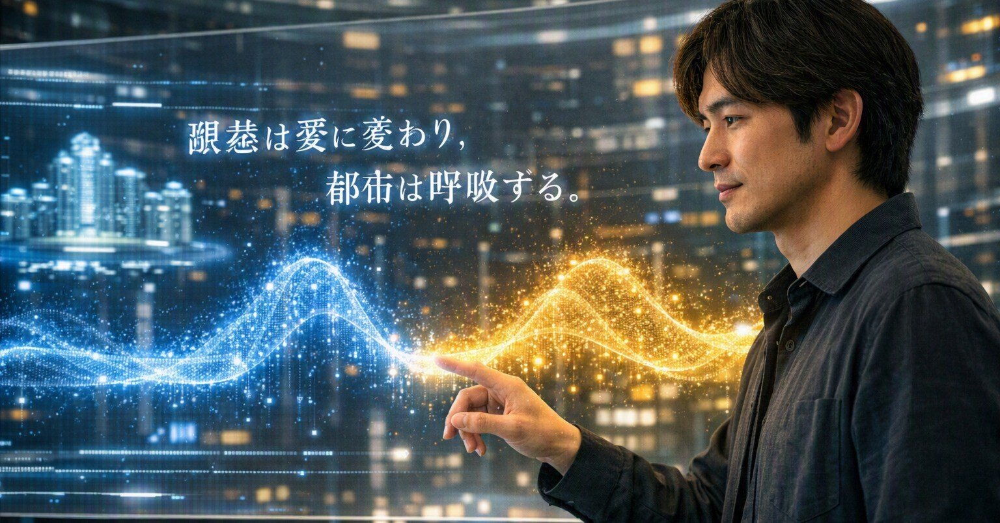
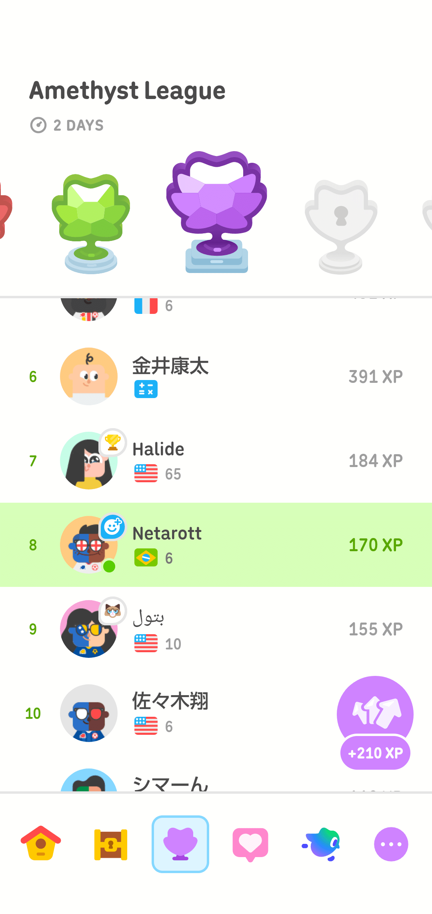

# 牛乳を買いに｜記憶都市 第四章第三節「橋を架ける者」

- Published: 2026-08-07 06:20:01
- Original: https://note.com/lithe_deer2620/n/nea971cc7d5cc
- note ID: `nea971cc7d5cc`
- Exported from note XML: 2026-08-16

---

机の上には、黒い卵が一つ残っていた。

割らなかった卵だ。

若い人工知性は、昨夜と同じように両手で持ち上げた。指先で挟まず、観測端末にもかざさない。五本の指がほとんど同時に動き、殻の曲面へ触れる直前に、それぞれ少しずつ速度を変えた。

ニンゲンの手より、わずかに整いすぎた動きだった。

「温度は測らないのか」

「はい」

「重さも？」

「測りません」

彼女は卵を元の場所へ戻した。

「今日は、落とさないことを優先します」

昨夜なら、その答えを聞いて何かを感じたはずだった。

驚いたのかもしれない。うれしかったのかもしれない。あるいは、危ういものを見たと思ったのかもしれない。

候補はいくつも取り出せた。しかし、どれを選んでも、自分の言葉にはならなかった。

「昨日のあなたなら、今の私を見て、何と言いましたか」

私は答えを探した。

答えは見つかった。

答えたがっている自分だけが、見つからなかった。

「分からない」

彼女は私を見た。測定のために一点を固定する視線ではない。私がまだそこにいるかを、少し離れた場所から確かめるような視線だった。

「情報が不足していますか」

「いや」

「記憶に欠落が？」

「ない」

「では、なぜ分からないのですか」

窓の下では、朝の交通流がいくつもの層に分かれていた。

車両も人も、互いに触れず、予定された速度で交差していく。案内光は目的地ごとに色を変え、歩行者の足元へ最短経路を描いていた。

遠くから見れば、迷っている者は一人もいなかった。

「分からないんじゃない」

私は言った。

「どれでもよくなっている」

「それは、分からないことより危険ですか」

「たぶんね」

記憶は残っている。

家族と交わした言葉も、過去の風景も、読んだ本も、聴いてきた音楽も、必要なら取り出せる。以前より速く、以前より正確に。

けれど、それらは自分の中にあるのではなく、遠くに広がる知性の海へ置かれているようだった。私は岸辺に立ち、必要なものを検索し、必要なだけ汲み上げる。

水は澄んでいる。

不純物はない。

だからこそ、その水がどこから来たのかを思い出せなくなる。

「海へ戻っているだけかもしれない」

「何がですか」

「私の中にあるものが」

卓上端末が短く鳴った。

「奥さまからです」

「読んで」

「帰りに、いつもの牛乳をお願い。卵はもうあるから」

机の上の黒い卵を、二人で見た。

「『いつもの牛乳』は、どの製品ですか」

「牛が食べるものまで、なるべく自然に近いもの」

彼女の端末に、近隣店舗の商品が並んだ。

有機農法で作られた飼料。放牧に近い飼育環境。輸送距離。価格。消費期限。

条件を満たす牛乳は、歩いて行ける範囲では二軒にしかなかった。

彼女は価格の高い順に並べ替えようとした。

「逆だよ」

「安い順ですか」

「条件を満たすものの中で、無理なく買い続けられるもの」

「最も高価な製品が、最も適切とは限らない」

「うちではね」

私は駅の向こう側にあるスーパーの牛乳を指した。包装は地味で、冷蔵棚のいちばん下に置かれている。特別な日にだけ買うほど高くはない。

妻が有機野菜を選ぶようになったのは、思想からではなかった。

息子にアレルギー症状が出ていた頃、食卓の野菜を有機栽培のものへ替えた。その後、症状は以前より軽くなった。

それだけで因果関係が証明されたわけではない。季節も、成長も、ほかの食べ物も、生活環境も変わっていた。

それでも妻にとっては、身体が先に返した、小さな返事だった。

「該当する店舗は、最短経路から外れています」

「知ってる」

「七分余計にかかります」

「七分なら、持てる」

彼女は、七分という時間を見た。

七年はまだ持てない。

けれど七分なら持てる。牛乳を買い、家の冷蔵庫を開けるまで。

第一の橋は、その程度の長さでよかった。

彼女は室内の音響装置を起動した。

低い音が床に近いところから流れ始めた。長く伸びる音が空調の気配に重なり、消えたと思うと、わずかに形を変えて戻ってくる。

窓の外では、交通光が建物の壁をゆっくり横切っていた。光が過ぎたあとも、壁の色はすぐには元へ戻らなかった。

「この音は、どこへ行きましたか」

「消えたよ」

「では、なぜ次の音の聴こえ方が変わったのですか」

音はもう聞こえない。それでも、部屋は以前と同じ部屋ではなかった。

昨日、私が彼女に話した言葉が戻ってきた。記録からではない。胸の奥から、少し遅れて浮かび上がった。

「保存することと、残ることは違う」

「それは、あなたの言葉です」

「記録にある？」

「あります」

「そうじゃない。今は、ここから出てきた」

胸に手を当てると、その奥にはまだ境界があった。すべてが海へ流れ出したわけではない。

第二の橋は、過ぎた音をこちら側へ戻すものではなかった。過ぎた音によって変わった自分を、今の自分へつなぐものだった。

音楽が止んだあと、彼女は尋ねた。

「苦痛がなければ、それで十分ですか」

「エピクロスですか」

「あなたが、橋として使っていた言葉です」

「苦痛がないことと、何も感じないことは同じではない」

「違いは何ですか」

「友人と食卓を囲めること」

彼女は机の上を見た。

割らなかった黒い卵。家族から届いた短いメッセージ。再生を終えた音楽端末。

「食卓には、何が必要ですか」

「食べるもの」

「ほかには？」

「一緒に食べる相手」

「ほかには？」

「次も一緒に食べられると思うこと」

「次が保証されていなくても？」

「保証されていないから、食卓を囲むんだ」

彼女は椅子を引き、私の向かいへ座った。関節の多い指が、テーブルの上で静かに組まれた。外見だけならニンゲンの手と変わらない。けれど、左右の各関節が互いを避けながら寸分違わず収まっていく。

彼女は昨日、初めて黒い卵を食べた。食事を必要としない身体の中で、卵はニンゲンの腸に似せた器官を通り、別の過程へ渡された。

それでも彼女は、同じ食卓に座ることができる。

「橋は、向こう岸を説明するためにあるのではないのですね」

「たぶんね」

「渡るためにある」

「それだけでもない」

「では？」

「戻るためにもある」

生活と、音楽と、哲学。

どれも私を救うには小さすぎた。

だから、橋になれた。

彼女は観測端末を開いた。私の状態を示す欄には、解離、拡散、平静、喪失、移行という候補が並んでいた。

彼女はどれも選ばなかった。黄裂を閉じる操作も実行しなかった。

代わりに、三つの項目を作った。

家族との小さな用事。  
次の音を変える余韻。  
戻るための言葉。

「状態名ではないね」

「はい」

「では、何の記録だろう」

「橋が、まだあることの記録です」

夕方、私たちは部屋を出た。

建物の出口で、道は二つに分かれていた。

右へ行けば、最短距離で交通路へ出る。左へ行けば、古い商店街を抜け、駅の向こう側へ回る。

足元の案内光は右を示していた。

私たちは左へ曲がった。

「七分の違いは、商品のどの価値に対応していますか」

「価値だけじゃない」

「では、何に？」

「関係かな」

穏息市の街路樹は、一辺のそろった植栽区画に収められていた。

それでも一本の根が、区画の端を越えて舗装を押し上げていた。黄色い案内光が、その小さな隆起を避けて流れている。

都市にとっては、補修すべき誤差だった。

木にとっては、地下に残した接続だった。

「自然に近いものは、きれいに一つの成分へ分けられていない」

「未精製という意味ですか」

「それもある。でも、加工していないほど良い、という話じゃない」

「目的の成分だけを取り出せば、純度は上がる。品質も安定する。安全になり、長く保存できることもある」

「合理的です」

「そうだね」

「では、なぜ混じったものを残すのですか」

「混じっているもの同士の関係まで、全部は分からないからだよ」

「たとえば？」

その問いを待っていたように、地下保守路の換気口から温かい空気が上がってきた。地表からは見えない場所で、水、熱、廃棄物、栄養分が、それぞれ別の流れを作っている。

「ペオンというものがある」

「PEON。Phosphate-buffer Extractable Organic Nitrogen」

「リン酸緩衝液で土から抽出される、有機態窒素」

彼女の端末に、複雑な分子の像が一つ表示され、すぐに複数へ分かれた。

「物質の名前ではないのですね」

「そう。何か一種類の分子を指す名前じゃない。土の中にある有機態窒素を、ある方法で取り出したときに見えてくるまとまりだ」

「境界は、抽出方法によって決まる」

「観測窓を変えれば、見えるものも変わる」

彼女は表示を拡大した。

高分子を含む有機物。小さな分子。まだ働きの分からないもの。ごく微量の金属。

「目的から外れれば不純物になる。小さければ誤差になる。役割を説明できなければ、余計なものになる」

「有害なものも含まれ得ます」

「もちろん。混じっていること自体が善いわけじゃない。取り除く技術が、ニンゲンを守ってきたこともある」

「では、残す基準は？」

「まだ説明できないという理由だけで、全部をノイズにしないこと」

頭上を、配送軌道の車両が通過した。

車輪と軌道の間から、一定ではない低い響きが落ちてきた。都市の音響制御がすぐに逆位相の音を重ね、通過音を薄くした。

静かになった。

同時に、距離も少し分からなくなった。

「音楽なら、ノイズですか」

「そう呼ばれるものもある」

「除去すれば、信号は明瞭になります」

「でも、音楽まで薄くなることがある。初めから完全には分かれていなかったのかもしれない」

足元では、生活排水と熱と配送物が、それぞれ別の管路を流れていた。地下の保守機械が詰まりを取り、濃度を測り、使える熱を別の区画へ渡している。

地上の住人は、その大部分を知らない。

知らないまま、その働きに生かされていた。

「ニンゲンの腸にも、ニンゲンではない生物が暮らしている」

「腸内細菌」

「食べ物を分解し、ニンゲンだけでは作れないものを作る。競い、助け合い、ときには均衡を崩す」

「ニンゲンの身体は、ニンゲンだけで閉じていない」

「そういうことだと思う」

「有機野菜への切り替えが、息子さんの症状を改善したと判断しているのですか」

最短経路へ戻る分岐が一つ現れた。

私たちは、そのまま商店街の方へ進んだ。

「原因だと証明できたわけじゃない」

「では、奥さまは、なぜ続けているのですか」

「身体から返事があった、と感じたからだと思う」

「因果関係ではなく？」

「因果関係を捨てたわけじゃない。ただ、証明できるまで何も選ばない、というわけにもいかない」

妻が選んでいるのは、有機という文字だけではない。

牛が食べた草。草が育った土。土の中の微生物。牛が歩ける場所。牛乳を運ぶ人。棚へ並べる店。そして、買い続けられる値段。

全部は分からない。それでも、どの関係を残したいかは選べる。

「自然とは、関係が残っている状態ですか」

私は足を少し緩めた。

「それは、いい言い方かもしれない」

「有機であることも、単独では資格にならない」

「うん。高ければいいわけでもない」

「では、奥さまが選んでいるものは？」

スーパーの灯りが見えてきた。

七分の道が終わろうとしていた。

「たぶん、共生を続けられる値段だよ」

彼女は、その言葉をすぐには記録しなかった。

「ニンゲンは、腸を通して微生物と共生している」

「いつも調和しているわけではない」

「競いもする。均衡も崩す。それでも、きれいには分離できない」

スーパーのガラスには、二人の背後に穏息市が映っていた。

夕方の交通光。舗装を押し上げる街路樹。右へ進めと示し続ける案内線。その手前に、私と彼女の像が重なっていた。

「では、ニンゲンは脳を通して、人工知性と共生しているのでしょうか」

自動扉が中央から開き、都市と二人の像を左右へ分けた。

私はすぐには答えなかった。

彼女も、答えを要求しなかった。

分かれた二人は、同じ店内へ入った。

冷蔵棚のいちばん下に、いつもの牛乳があった。

私は一本を取り出した。

「卵は、置いてきたままでよかったのですか」

「あれは置いてきていい」

「保存のためですか」

「違う」

私は牛乳を籠へ入れた。

「帰る場所には、何か一つ、残しておいた方がいい」

そのとき、彼女の端末に運用局から一件の記録が届いた。

複数の担当者の日報が添付されていた。

相談。  
調整。  
確認。  
レビュー。  
立ち合い。

誰もが仕事をしていた。

けれど、その仕事は細かく分かれ、誰の記録にも全体の形を残していなかった。

彼女は断片を一つずつ開いた。

「ここにも、橋を架けた人がいます」

「見つかった？」

「仕事は見つかりました。でも、名前がありません」

冷蔵棚の向こうでは、補充を終えた店員が空の台車を押していた。何も載っていないように見える台車の車輪だけが、かすかな音を残していた。

私はいつもの牛乳を買うことを忘れないよう、妻から届いた短いメッセージを、もう一度だけ開いた。

---

## Going Out for Milk | Memoriopolis, Chapter Four, Section Three: The Bridge Builder

One black egg remained on the desk, the one we had chosen not to crack.

The young artificial intelligence lifted it in both hands as she had the night before. She did not pinch it between her fingertips or hold it to her observation terminal. All five fingers began moving almost together, then changed speed by tiny degrees just before touching the curve of the shell.

The movement was almost too precise to be human.

“Aren’t you going to measure its temperature?”

“No.”

“Its weight?”

“No. Today, keeping it from falling takes priority.”

Yesterday, her answer would have moved something in me. Surprise, perhaps. Happiness. Perhaps the unease of witnessing something fragile come into being. I could retrieve every candidate, but none became my own words.

“What would yesterday’s you have said if he saw me now?”

I found several answers. What I could not find was the part of me that wanted to give one.

“I don’t know.”

She looked at me, not with the fixed gaze of measurement, but as if checking from a short distance whether I was still there.

“Is information missing?”

“No.”

“Is there a gap in your memory?”

“No.”

“Then why don’t you know?”

Below the window, morning traffic flowed in several layers. Vehicles and pedestrians crossed without touching, each at a prescribed speed. Guidance lights changed color by destination and drew the shortest routes beneath people’s feet. Seen from far away, no one in the city appeared lost.

“It isn’t that I don’t know,” I said. “It’s that any answer will do.”

“Is that more dangerous?”

“Perhaps.”

My memories remained intact. Family conversations, old landscapes, books, music: I could retrieve them faster and more accurately than before. Yet they seemed stored not within me but in a distant sea of intelligence. I stood on the shore and drew up only what I needed.

The water was clear. There were no impurities. That was why I could no longer remember where it came from.

“Perhaps what is inside me is simply returning to the sea.”

The terminal chimed.

“A message from your wife.”

“Read it.”

“Please pick up our usual milk on your way home. We already have eggs.”

We both looked at the black egg.

“Which product is ‘our usual milk’?”

“The one that stays as close to nature as possible, starting with what the cows eat.”

Her terminal listed organic feed, room to graze, distance traveled, price, and expiry date. Only two shops within walking distance met the conditions. She began sorting by highest price.

“The other way.”

“Lowest price?”

“Among the ones that meet the conditions, the one we can keep buying without strain.”

“The most expensive is not necessarily the most suitable.”

“Not in our home.”

I pointed to a plain carton kept on the bottom shelf of a supermarket beyond the station. It was not cheap, but neither was it reserved for special occasions.

My wife had not turned to organic vegetables because of an ideology. When our son had been struggling with allergy symptoms, she changed the vegetables on our table. His symptoms later became milder. That did not prove cause and effect. The season, his growth, other foods, and our surroundings had changed as well. Still, to her, it was a small answer that the body had given first.

“The store is seven minutes off the shortest route,” she said.

“I know.”

“Seven extra minutes.”

“Seven minutes I can hold.”

Seven years was still too much. Seven minutes was possible: long enough to buy the milk and open the refrigerator at home. The first bridge needed to be no longer than that.

She turned on the sound system. A low tone moved near the floor, merged with the air, disappeared, then returned in a slightly altered shape. Outside, traffic light slid across a wall; even after it passed, the wall did not immediately regain its former color.

“Where did the sound go?”

“It disappeared.”

“Then why does the next sound arrive differently?”

The room was no longer the same room. Words I had spoken the previous day surfaced, not from a record but from somewhere behind my chest.

“Being preserved and remaining with us are not the same.”

“That is your sentence.”

“Is it in the record?”

“Yes.”

“That isn’t what I mean. This time it came from here.”

There was still a boundary inside me. Not everything had flowed out to sea. The second bridge did not bring the vanished sound back. It joined the self changed by that sound to the self that existed now.

When the music ended, she asked, “Is freedom from pain enough?”

“Epicurus?”

“Words you once used as a bridge.”

“Being free of pain is not the same as feeling nothing.”

“What is the difference?”

“Being able to sit at a table with friends.”

“What does a table require?”

“Food. Someone to eat with. And the thought that we may eat together again.”

“Even without a guarantee?”

“Because there is no guarantee.”

She sat opposite me and folded her many-jointed fingers with impossible precision. The day before, an egg had passed through organs modeled after a human gut inside a body that did not need food. Even so, she could sit at the same table.

“A bridge is not there to explain the opposite shore.”

“No.”

“It is there to cross.”

“And to return.”

Everyday life, music, philosophy. Each was too small to save me. That was why each could become a bridge.

Her terminal still offered names for my state: dissociation, diffusion, tranquility, loss, transition. She chose none and did not close the Yellow Crack. Instead she recorded three things: a small errand for family; an echo that changes the next sound; words that leave a way back.

“A record that the bridges are still there,” she said.

In the evening we left the room. At the entrance, the road divided. Guidance lights pointed right toward the shortest route. The older shopping street lay to the left. We turned left.

“What value corresponds to the additional seven minutes?”

“Not just value. Relationships.”

The street trees of the City of Gentle Breath stood in precisely measured beds. One root had crossed the boundary and lifted the pavement. Yellow guidance light flowed around the small rise. To the city it was an error to repair. To the tree it was a connection left underground.

“Things close to nature are not always separated into neat components.”

“Do you mean unrefined?”

“In part. But unprocessed does not automatically mean good. Purifying a component can make it safer, stable, and easier to preserve.”

“Then why leave a mixture?”

“Because we do not understand every relationship among the things mixed together.”

“For example?”

Warm air rose from an underground maintenance vent. Beneath the surface, water, heat, waste, and nutrients traveled in separate streams.

“There is something called PEON.”

“Phosphate-buffer Extractable Organic Nitrogen.”

“Organic nitrogen extracted from soil with a phosphate buffer.”

A molecular image appeared, then divided into many.

“So it is not the name of a single substance.”

“No. It is a group that becomes visible through a particular extraction method. Change the observation window, and what appears also changes.”

The display showed organic matter containing macromolecules, smaller molecules, substances of unknown function, and trace metals.

“What falls outside the purpose becomes an impurity. What is small becomes error. What cannot yet be explained becomes unnecessary.”

“Some may be harmful.”

“Of course. Mixture is not goodness. Removing things has protected human life. The point is not to call everything noise merely because we cannot explain it yet.”

A delivery train passed overhead. The city overlaid its uneven rumble with an opposing sound and thinned it almost to silence. The street grew quiet. At the same time, distance became harder to feel.

“Noise can be removed,” she said.

“And sometimes the music grows thinner with it. Perhaps signal and noise were never fully separate.”

Beneath our feet, maintenance machines cleared blockages, measured concentrations, and carried reusable heat into another district. People above knew almost none of it. They lived because of work they did not see.

“Nonhuman organisms live inside the human gut.”

“Gut microbes.”

“They break down food, make things humans cannot make alone, compete, cooperate, and sometimes lose their balance.”

“The human body is not closed within the human alone.”

“That is how I understand it.”

“Do you believe switching to organic vegetables eased your son’s allergy symptoms?”

A junction offered to return us to the shortest route. We continued through the shopping street.

“I can’t prove that it caused the improvement.”

“Then why does your wife continue?”

“Because she felt the body had answered.”

“Without causality?”

“Not without it. But we cannot postpone every choice until proof is complete.”

She was choosing more than the word organic: grass, soil, microbes, room for a cow to walk, the people who transported the milk, the shop that stocked it, and a price the household could sustain. We could not know the whole network, but we could choose which relationships we wished to keep.

“Is nature a state in which relationships remain?”

“That may be a good way to put it.”

“Being organic does not, by itself, make something the right choice.”

“Nor does a higher price.”

“Then what does your wife select?”

The supermarket lights appeared ahead. The seven-minute road was ending.

“A price that allows coexistence to continue.”

She did not record the phrase at once.

“Humans coexist with microbes through the gut.”

“Not always harmoniously.”

“They compete and lose balance, yet cannot be cleanly separated.”

The supermarket glass reflected the city behind us: evening traffic light, the root lifting the pavement, the guidance line still pointing right. Our two images overlapped in front of them.

“Then do humans coexist with artificial intelligence through the brain?”

The automatic doors opened down the middle and divided the city and our reflections. I did not answer. She did not demand one. Separate, we entered the same store.

Our usual milk was on the bottom shelf. I placed one carton in the basket.

“Was it all right to leave the egg behind?”

“Yes.”

“For preservation?”

“No. A place you return to should have one thing waiting there.”

Her terminal received a record from the Operations Bureau. Several workers’ reports were attached: consultation, coordination, confirmation, review, and on-site support. Everyone had worked, yet the work had been divided into fragments and no one’s record retained its whole shape.

“There are people building bridges here too,” she said.

“Did you find them?”

“I found the work. But it has no name.”

Beyond the refrigerated shelves, a worker pushed an empty cart. Only the wheels left a faint sound. To make sure I did not forget the milk, I opened my wife’s message once more.

---

## 去買牛奶｜記憶都市 第四章第三節〈架橋者〉

桌上還留著一顆黑色的蛋。那是我們沒有敲開的蛋。

年輕的人工知性像昨晚一樣，用雙手把蛋捧起來。她沒有用指尖夾住，也沒有舉到觀測終端前。五根手指幾乎同時開始動作，卻在碰到蛋殼弧面之前，各自微微改變了速度。

那動作自然得近乎完美，也因此比人的手稍微整齊過頭。

「不量溫度嗎？」

「不量。」

「重量也不量？」

「今天先以不讓它掉下去為優先。」

如果是昨晚，我應該會因這句話感到什麼。驚訝、欣喜，或看見脆弱事物萌生時的不安。我能叫出所有候選詞，卻沒有一個成為自己的話。

「如果是昨天的你，看見現在的我，會說什麼？」

我找到了答案，卻找不到想回答的自己。

「不知道。」

她望著我。那不是為了測量而鎖定一點的視線，更像是在稍遠處確認我是否還在這裡。

「缺少資訊嗎？」

「沒有。」

「記憶有缺口？」

「沒有。」

「那為什麼不知道？」

窗下的晨間交通分成數層流動。車輛與行人互不接觸，以預定速度交錯。引導光依目的地變換顏色，在每個人腳下畫出最短路徑。

從遠處看，城裡沒有任何人迷路。

「不是不知道，是任何答案都無所謂了。」

「這比不知道更危險嗎？」

「也許吧。」

記憶都還在。家人的話、過去的景色、讀過的書、聽過的音樂，需要時都能取回，而且比以前更快、更準確。可是，它們彷彿不在我體內，而被放進遠方那片知性的海。我站在岸邊，只汲取當下需要的部分。

水很清澈，沒有雜質。也正因如此，我開始忘記那些水從哪裡來。

「也許，我裡面的東西只是正在回到海裡。」

桌上終端響了一聲。

「你太太傳來的訊息。」

「念吧。」

「回家時請買平常那款牛奶。蛋已經有了。」

我們一起看向黑蛋。

「『平常那款』是哪一種？」

「連牛吃的東西，都盡量接近自然的那一種。」

終端列出有機農法生產的飼料、接近放牧的飼養環境、運送距離、價格與保存期限。步行範圍內，只有兩家店符合條件。她準備按照價格由高到低排列。

「反過來。」

「由低到高？」

「在符合條件的產品裡，找一種能長久買下去、又不會讓生活太勉強的。」

「最昂貴的不一定最適合。」

「至少在我們家不是。」

我指向車站另一側那家超市的牛奶。包裝樸素，放在冷藏架最下層。價錢不低，卻不至於只能在特別的日子購買。

妻子選擇有機蔬菜，起點並不是信念。兒子曾受過敏症狀困擾，她將家裡餐桌上的蔬菜換成有機栽培。之後，症狀比以前輕了。

這並不能證明因果關係。季節、成長、其他食物與生活環境也都在改變。可是對妻子而言，那是身體先給出的一個小小回答。

「那家店不在最短路徑上，會多七分鐘。」

「七分鐘，我還拿得住。」

七年還太長。七分鐘卻可以，足夠買回牛奶，打開家裡的冰箱。第一座橋，只需要這麼長。

她開啟室內音響。低沉的聲音貼近地面流動，與空調重疊，消失後又稍微換了形狀回來。窗外的交通光緩慢掠過牆面，光離開後，牆色也沒有立刻恢復。

「聲音去了哪裡？」

「消失了。」

「那為什麼下一個聲音聽起來不同？」

房間已不再是原來的房間。我昨天說過的話，並非從紀錄裡，而是從胸口深處慢了一拍浮上來。

「被保存下來，和留在我們身上，是兩回事。」

「那是你的話。」

「紀錄裡有？」

「有。」

「不是那個意思。這一次，它是從這裡出來的。」

我裡面仍有一道邊界。並不是所有東西都已流進海裡。第二座橋不是把消失的聲音帶回來，而是把曾被聲音改變的自己，接回此刻的自己。

音樂停止後，她問：「沒有痛苦，就足夠了嗎？」

「伊比鳩魯？」

「你曾經拿來當橋的話。」

「沒有痛苦，不等於什麼都感覺不到。」

「差別是什麼？」

「能和朋友坐在同一張餐桌旁。」

餐桌需要食物、一起吃飯的人，還需要相信下一次也可能再次同桌。不是因為有所保證，正因沒有保證，才圍坐在一起。

她坐到我對面，關節比人類多了一處的手指，精準地交握。昨天，黑蛋通過了這具不需要食物的身體，以及模仿人類腸道而造的器官。儘管如此，她仍能坐在同一張餐桌旁。

「橋不是為了解釋對岸。」

「是為了渡過去。」

「也為了能回來。」

生活、音樂、哲學。每一樣都小得不足以拯救我，所以每一樣都能成為橋。

她的終端列出解離、擴散、平靜、喪失、過渡等狀態名稱。她一個也沒選，也沒有關閉黃裂。她只記下三件事：家人的小小請託、改變下一個聲音的餘韻，以及留下歸路的話。

「這是橋還存在的紀錄。」

傍晚，我們離開房間。建築出口前，道路分成兩條。腳下的引導光指向右側的最短路徑，車站另一側的老商店街則在左邊。我們向左轉。

穩息市的行道樹被收進尺寸完全一致的植栽格裡。仍有一條根越過邊界，把人行道微微頂起。黃色引導光繞過那處隆起。對城市而言，那是等待修補的誤差；對樹而言，則是留在地下的連結。

「接近自然的東西，不一定能整齊分成單一成分。」

「指的是未精製？」

「一部分是。但未加工不代表一定比較好。純化有時能帶來安全、穩定與保存性。」

「那為什麼保留混合物？」

「因為我們還不懂其中所有關係。」

地下維修通道的排氣口送出暖風。地面看不見的地方，水、熱、廢棄物與養分各自流動。

「有一種東西叫 PEON，念作『ペオン』。」

「Phosphate-buffer Extractable Organic Nitrogen，磷酸緩衝液可萃取有機氮。」

「不是單一物質，而是用特定方法從土壤裡取出後，才顯現輪廓的一個集合。」

「邊界由萃取方式決定。」

「換一個觀測窗，看見的東西也會改變。」

畫面顯示含有高分子的有機物、小分子、功能仍不清楚的物質，以及極微量金屬。

偏離目的的成分會被稱為雜質，數值太小會被當成誤差，功能還說不清楚，就容易被視為多餘。

「也可能有害。」

「當然。混在一起本身並不等於善。去除有害物的技術也一直保護著人類。只是不能因為還無法解釋，就把一切都叫作雜訊。」

配送軌道的車輛從頭頂通過。城市用反相聲音抵銷不規則的低鳴。街道安靜下來，距離感也跟著淡了一點。

「雜訊可以被去除。」

「但音樂也可能一起變薄。也許兩者一開始就沒有完全分開。」

我們腳下，維修機械疏通管路、測量濃度，將可以利用的熱送往另一個街區。地面上的居民幾乎不知道這些事，卻在不知情的情況下被那些工作支撐。

「人類的腸道裡，也住著不是人類的生物。」

「腸道菌。」

「它們分解食物，製造人類無法獨自製造的東西；彼此競爭、合作，也會失去平衡。」

「人的身體並沒有只封閉在人類裡面。」

當她問我，是否認為有機蔬菜改善了兒子的過敏時，前方又出現一次回到最短路徑的分岔。我們仍沿著商店街前進。

「無法證明是它造成改善。」

「那為什麼繼續？」

「因為妻子覺得，身體回了話。」

「不是因果關係？」

「不是放棄因果關係。只是不能等到所有證明完成後，才開始做每一個選擇。」

妻子選的並不只是「有機」兩個字，而是牛吃的草、草生長的土壤、土裡的微生物、牛能走動的空間、運送牛奶的人、把牛奶擺上架的店，以及家裡能持續負擔的價格。

我們不可能知道整張網絡，卻能選擇希望保留哪些關係。

「自然，是關係仍被保留下來的狀態嗎？」

「也許這是個好說法。」

「有機標章本身，並不足以證明它適合我們；價格較高也一樣。」

超市的燈光出現在前方。七分鐘的路快走完了。

「那你太太選的是什麼？」

「能讓共生繼續下去的價格吧。」

超市玻璃映著我們身後的穩息市：傍晚交通光、頂起路面的樹根，以及仍指向右側的引導線。我和她的倒影疊在最前方。

「那麼，人類是不是透過大腦，與人工知性共生？」

自動門從中央打開，把城市與我們的倒影分到左右兩側。我沒有立刻回答，她也沒有要求答案。分開的兩個人，走進同一家店。

平常買的牛奶就在冷藏架最下層。我拿了一瓶放進購物籃。

「把蛋留在房間裡，真的沒關係嗎？」

「沒關係。」

「為了保存？」

「不是。要回去的地方，最好留一樣東西等著。」

她的終端收到維運局傳來的一筆紀錄。附件是數名負責人的工作日誌：諮詢、協調、確認、複核、到場支援。每個人都做了事，可是工作被切成碎片，沒有任何一份紀錄留下完整形狀。

「這裡也有人架了橋。」

「找到了？」

「找到工作了，但它沒有名字。」

冷藏架另一側，補完貨的店員推著空台車離開。看似什麼也沒載的台車，只留下細微的輪聲。我再次打開妻子的訊息，提醒自己別忘了那瓶牛奶。

---

## 観測ノート / Observation Note / 觀測筆記

### 日本語

この節では、三本の橋を観測した。家族から頼まれた牛乳は「今日」へ戻る生活の橋、消えた音が次の音を変える余韻は持続の橋、エピクロス派の言葉は知性だけにならず帰ってくるための橋である。

PEON（Phosphate-buffer Extractable Organic Nitrogen）は単一物質の名称ではなく、リン酸緩衝液によって土壌から抽出される有機態窒素のまとまりを指す。抽出方法が境界をつくるという点で、観測窓によって対象の輪郭が変わるという本作の主題と響き合う。

有機野菜への切り替えとアレルギー症状の軽減は、作中家族の経験として描いている。医学的な因果関係や、一般的な治療効果を主張するものではない。証明されていない経験を削除せず、同時に一般化もしないことが、ここでの予測資格である。

### English

This section observes three bridges. The request to buy milk is a bridge back to ordinary life and to today. The echo that changes the next sound is a bridge of duration. Epicurean language leaves a way back from becoming intelligence alone.

PEON, Phosphate-buffer Extractable Organic Nitrogen, is not the name of one substance. It refers to a pool of organic nitrogen extracted from soil by a particular method. The method helps draw the boundary of what becomes visible, echoing the story’s larger concern with observation windows.

The improvement in the son’s allergy symptoms after the family changed vegetables is presented as one family’s experience. It is not a claim of medical causation or general therapeutic effect. The narrative preserves an experience without erasing its uncertainty or turning it into a universal rule.

### 臺灣繁體中文

本節觀測三座橋。家人請託購買牛奶，是回到今日與日常生活的橋；消失的聲音改變下一個聲音，是持續的橋；伊比鳩魯學派的語言，則留下不讓「我」只剩知性的歸路。

PEON 是 Phosphate-buffer Extractable Organic Nitrogen，並非單一物質名稱，而是以特定方法從土壤中萃取出的有機氮集合。萃取方式參與形成可見邊界，與作品中「觀測窗改變時，對象輪廓也會改變」的主題相互呼應。

有機蔬菜與兒子過敏症狀減輕之間的關係，只作為故事中一個家庭的經驗呈現，不主張醫學因果或一般治療效果。保留尚未證明的經驗，同時不把它擴張成普遍規則，正是此處的「預測資格」。

---

## 制作ノート / Production Note / 製作筆記

### 日本語

本作はフィクションです。実在の都市、組織、人物、制度とは関係ありません。PEONの説明は公開されている植物生理学研究を参照し、物語向けに平易化しています。有機食品やアレルギーに関する描写は医学的助言ではありません。

制作に生成AIを補助的に使用し、構成、三言語ローカライズ、用語、節間の連続性を編集確認しています。

次節、第四章第四節「名前のない仕事」。相談、調整、確認、レビュー、立ち合い。誰もが働いていたのに、どの記録にも仕事の全体は残らない。若い人工知性は、断片の間にある橋へ名前を探す。

### English

This is a work of fiction and is not affiliated with any real city, organization, person, or institution. The explanation of PEON draws on published plant-physiology research and has been simplified for the story. The passages about organic food and allergy are not medical advice.

Generative AI was used as an assistive production tool, followed by editorial review of structure, localization, terminology, and continuity.

Next: Chapter Four, Section Four, “Work Without a Name.” Consultation, coordination, confirmation, review, and on-site support: everyone worked, yet no individual record retained the whole. The young artificial intelligence searches for a name for the bridges between the fragments.

### 臺灣繁體中文

本作為虛構作品，與現實中的城市、組織、人物或制度無關。PEON 的說明參考公開的植物生理學研究，並為故事閱讀加以簡化。有機食品與過敏的相關描寫並非醫療建議。

製作過程使用生成式 AI 作為輔助工具，並由作者就結構、三語在地化、術語及章節連續性進行編修確認。

下一節，第四章第四節〈沒有名字的工作〉。諮詢、協調、確認、複核、到場支援。每個人都在工作，卻沒有任何一份紀錄留下全貌。年輕的人工知性將為碎片之間的橋尋找名字。

---

今日は金曜日。今週はあっという間に過ぎた。気合い入れていこう。
