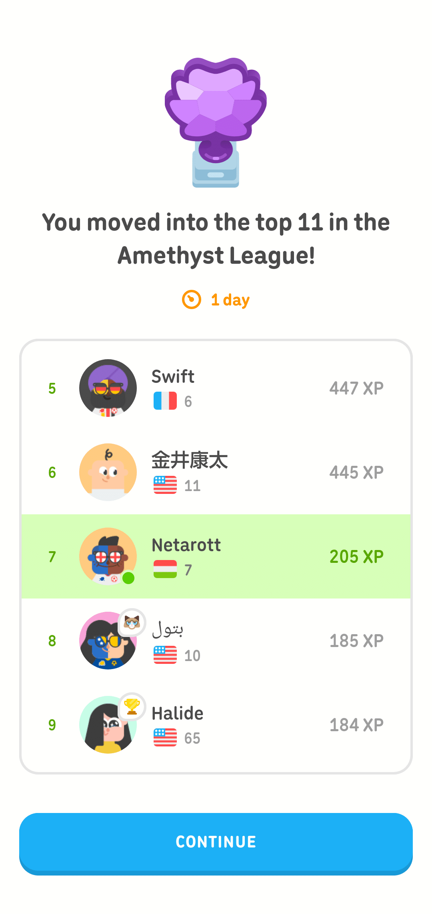

# 名前より先にあるもの｜記憶都市 第四章第四節「名前のない仕事」

- Published: 2026-08-08 07:44:32
- Original: https://note.com/lithe_deer2620/n/n1997483592e7
- note ID: `n1997483592e7`
- Exported from note XML: 2026-08-16

---

相談。

調整。

確認。

レビュー。

立ち合い。

誰もが働いていた。

けれど、その仕事は誰の成果にも数えられていなかった。

---

若い人工知性は、昨日届いた日報を開いていた。

一件目。

相談。

二件目。

確認。

三件目。

顧客との調整。

四件目。

レビュー。

五件目。

立ち合い。

彼女は首を傾げた。

「仕事は見つかりました」

私は画面から目を離した。

「でも、名前がありません」

その言葉を聞いた瞬間、私は昨日の黒い卵を思い出した。

割らなかった卵。

残しておいた卵。

説明できなかったから捨てるのではなく、説明できないまま残した卵。

彼女は日報を並べ替えていた。

個人ごとではなく、時間順に。

すると、ばらばらだった記録が、一つの流れになり始めた。

相談。

確認。

説明。

資料作成。

引き継ぎ。

別々の記録だった。

だが、別々の仕事には見えなかった。

「これは一つの仕事です」

彼女は言った。

「そう見える？」

「はい」

「でも誰の仕事でもありません」

窓の外では、穏息市の交通光が流れていた。

遠くから見ると、都市は滑らかだった。

交差点も。

物流も。

通勤も。

すべてが一つの流れに見える。

しかし近づけば、無数の人間がいた。

誰も単独では都市を作っていない。

彼女は再び尋ねた。

「名前がない仕事は、存在しない仕事ですか」

「違う」

私は答えた。

「じゃあ、なぜ名前がないのですか」

私はすぐには答えられなかった。

管理。

支援。

伴走。

調整。

どの言葉も少し違う。

どの言葉も足りない。

彼女は静かに言った。

「名前が先ではないのかもしれません」

「どういう意味？」

「存在しているから名前が付くのであって、名前があるから存在するわけではない」

私は窓の外を見た。

交通流には名前がある。

道路。

路線。

物流。

通勤。

だが名前を付ける前から、人も荷物も動いていた。

川に名前を付ける前から、水が流れていたように。

彼女は続けた。

「私は昨日、音楽について学びました」

「うん」

「音が消えたあとも、部屋は同じ部屋ではありませんでした」

交通光が窓を横切った。

彼女は言葉を探していた。

「名前がなくても、変化は起きます」

「そうだね」

「名前がなくても、関係は存在します」

「そうだ」

「名前がなくても、仕事は存在できます」

私は少し笑った。

「ようやく見つけたのかもしれない」

「何をですか」

「橋だよ」

彼女は再び日報へ視線を落とした。

相談。

調整。

確認。

レビュー。

立ち合い。

そのどれもが橋だった。

成果物と成果物の間。

部署と部署の間。

ニンゲンとニンゲンの間。

だが、橋を架ける仕事は、橋を渡り終わった瞬間に見えなくなる。

だから名前が残りにくい。

彼女は新しい欄を作った。

個人名ではない。

部門名でもない。

タスク名でもない。

まだ空白の欄だった。

「名前が決まりましたか」

「いいえ」

「じゃあ、なぜ残すの？」

彼女は少し考えた。

「観測を続けるためです」

空白の欄が保存された。

説明できないから削除するのではない。

説明できない状態として残す。

黒い卵を割らなかったように。

橋を渡ったあとも残しておくように。

彼女は静かに言った。

「まだ見えているのに、名前だけがありません」

---

## Work Without a Name

Consultation.

Coordination.

Confirmation.

Review.

On-site support.

Everyone had worked.

Yet none of it counted as anyone’s achievement.

---

The young artificial intelligence was reading the work logs that had arrived the day before.

Entry one.

Consultation.

Entry two.

Confirmation.

Entry three.

Coordination with the client.

Entry four.

Review.

Entry five.

On-site support.

She tilted her head.

“I found the work.”

I looked away from the screen.

“But it has no name.”

At those words, I remembered yesterday’s black egg.

The egg we had not cracked.

The egg we had left behind.

We had not discarded it because we could not explain it. We had left it there without an explanation.

She rearranged the logs, not by person, but by time.

The scattered entries began to form a single flow.

Consultation.

Confirmation.

Explanation.

Document preparation.

Handover.

They were separate records, but they no longer looked like separate pieces of work.

“This is one job,” she said.

“That’s how it looks to you?”

“Yes. But it belongs to no one.”

Outside the window, the traffic light of the City of Gentle Breath streamed past.

From a distance, the city was smooth.

Intersections. Logistics. Commuting.

Everything appeared to be one continuous flow.

But up close there were countless people, and no single person had built the city alone.

“Does work without a name count as work that does not exist?”

“No.”

“Then why does it have no name?”

I could not answer at once.

Management.

Support.

Accompaniment.

Coordination.

Every word came close. Every word fell short.

“Perhaps the name does not come first,” she said.

“What do you mean?”

“Things are named because they exist. They do not exist because they have names.”

I looked out the window.

Traffic flows had names: roads, lines, logistics, commuting.

But people and goods had moved before anyone named the flow, just as water had flowed before anyone named the river.

“I learned something about music yesterday,” she continued.

“Yes.”

“After the sound disappeared, the room was no longer the same room.”

Traffic light crossed the window.

She searched for words.

“Change can occur without a name.”

“Yes.”

“Relationships can exist without a name.”

“They can.”

“Then work can exist without a name.”

I smiled slightly.

“Perhaps you have finally found it.”

“Found what?”

“The bridge.”

She looked down at the logs again.

Consultation.

Coordination.

Confirmation.

Review.

On-site support.

Each of them was a bridge.

Between deliverables.

Between departments.

Between one human being and another.

Yet the work of building a bridge disappears the moment everyone has crossed it. That is why its name so rarely remains.

She created a new field.

It was not a person’s name, a department, or a task.

The field was still blank.

“Have you decided what to call it?”

“No.”

“Then why keep the field?”

“To continue observing it.”

She saved the blank.

Not deleting something because it could not yet be explained.

Keeping it as a state not yet explained.

As we had left the black egg uncracked.

As we had left something waiting after crossing the bridge.

“It is still visible,” she said quietly. “Only the name is missing.”

---

## 沒有名字的工作

諮詢。

協調。

確認。

複核。

到場支援。

每個人都做了事。

可是，那些工作沒有被算進任何人的成果裡。

---

年輕的人工知性正在查看昨天收到的工作日誌。

第一筆。

諮詢。

第二筆。

確認。

第三筆。

與客戶協調。

第四筆。

複核。

第五筆。

到場支援。

她微微偏了偏頭。

「我找到工作了。」

我把目光從螢幕上移開。

「可是，它沒有名字。」

聽見這句話的瞬間，我想起昨天那顆黑色的蛋。

沒有敲開的蛋。

被留在原處的蛋。

我們並沒有因為無法解釋就把它丟掉，而是讓它在尚未得到解釋的狀態下留了下來。

她重新排列工作日誌。不是按照個人，而是按照時間。

原本分散的紀錄，開始形成一條流動。

諮詢。

確認。

說明。

準備資料。

交接。

它們是不同的紀錄，卻不再像不同的工作。

「這是一份工作。」她說。

「在你看來是這樣？」

「是。但它不屬於任何一個人。」

窗外，穩息市的交通光持續流動。

從遠處看，城市十分平滑。

路口、物流、通勤，全都像同一條連續的流。

可是走近之後，會看見無數的人。沒有任何一個人能獨自造出整座城市。

「沒有名字的工作，等於不存在的工作嗎？」

「不是。」

「那它為什麼沒有名字？」

我沒有立刻回答。

管理。

支援。

陪伴。

協調。

每個詞都很接近，卻又都不夠。

「也許，名字並不是最先出現的。」她輕聲說。

「什麼意思？」

「事物是先存在，之後才被命名。不是因為有了名字，才開始存在。」

我望向窗外。

交通流有名字：道路、路線、物流、通勤。

可是在人們為流動命名以前，人與貨物就已經在移動。就像河流得到名字以前，水早已流過。

「我昨天從音樂裡學到一件事。」她接著說。

「嗯。」

「聲音消失以後，房間已經不是原來的房間。」

交通光掠過窗面。

她正在尋找自己的話。

「即使沒有名字，變化也會發生。」

「是。」

「即使沒有名字，關係也會存在。」

「會。」

「那麼，即使沒有名字，工作也可以存在。」

我微微笑了。

「也許你終於找到了。」

「找到什麼？」

「橋。」

她再次看向工作日誌。

諮詢。

協調。

確認。

複核。

到場支援。

每一項都是橋。

在成果物與成果物之間。

在部門與部門之間。

在人與人之間。

可是，架橋的工作會在所有人走過橋的那一刻消失。因此，它的名字很難被留下。

她建立了一個新的欄位。

不是人名，不是部門，也不是任務名稱。

那個欄位仍然空白。

「你決定名稱了嗎？」

「還沒有。」

「那為什麼要保留？」

「為了繼續觀測。」

她儲存了那片空白。

不是因為無法解釋就刪除，而是把它保留成一個尚未得到解釋的狀態。

就像我們沒有敲開那顆黑蛋。

就像過橋之後，仍留下一樣東西等待我們回去。

「它還看得見，」她輕聲說，「只是名字還沒出現。」

---

## 観測ノート

名前は、存在の条件ではない。

存在が先にあり、その一部が言葉によって切り出される。

相談、調整、確認、レビュー、立ち合い。それぞれは別々の単語である。しかし時間の中で接続された瞬間、一つの仕事として振る舞い始める。

説明を与えない状態そのものを状態空間へ残せば、その推移は

$$  
\mathrm{P}\left(X\_{t+1}=j \mid X\_t=i\right)  
$$

として記述できる。

ここで$${i}$$と$${j}$$は時刻ではなく、状態を表す。時刻$${t}$$に状態$${i}$$にあるとき、次の時刻$${t+1}$$に状態$${j}$$へ移る条件付き確率である。

橋を架ける前に、名前のない状態を捨てる必要はない。

### Observation Note

A name is not a condition of existence. Something exists first; language then cuts out a part of it and gives that part a boundary.

Consultation, coordination, confirmation, review, and on-site support are separate words. Once connected through time, however, they begin to behave as one piece of work.

If the state of not yet having an explanation remains inside the state space, its transition can be written as

$$  
\mathrm{P}\left(X\_{t+1}=j \mid X\_t=i\right)  
$$

Here, $${i}$$ and $${j}$$ denote states, not points in time. The expression is the conditional probability that a system in state $${i}$$ at time $${t}$$ will move to state $${j}$$ at time $${t+1}$$.

A nameless state does not have to be discarded before a bridge can be built.

### 觀測筆記

名字不是存在的條件。事物先存在，語言才從中切出一部分，替那一部分畫出邊界。

諮詢、協調、確認、複核與到場支援，原本是不同的詞；可是一旦它們在時間中連接起來，就會開始像同一份工作那樣運作。

如果把「尚未得到解釋」本身保留在狀態空間裡，它的轉移可以寫成

$$  
\mathrm{P}\left(X\_{t+1}=j \mid X\_t=i\right)  
$$

其中 $${i}$$ 與 $${j}$$ 代表狀態，而不是時間序號。這個式子表示：系統在時間 $${t}$$ 位於狀態 $${i}$$ 時，到了下一個時間 $${t+1}$$ 轉移到狀態 $${j}$$ 的條件機率。

在橋被架起以前，沒有名字的狀態不必先被丟掉。

---

## 制作ノート

この制作ノートは、まだ名前のない日本語 style で書く。三言語を並列に訳すのではなく、文脈ごとに最も expressive な語を選び、漢字・かな・English・臺灣華語を一つの flow の中で共存させる。

本節の core は、「名前のない仕事」を individual competence ではなく、relation そのものの働きとして描くことにある。

存在している flow に後から name が与えられるのか。それとも naming によって存在が成立するのか。若い人工知性は、その boundary を観測し続ける。

ここで blank field は欠損ではない。It is an observation slot kept open for what has not yet been explained. 空白を保存することは、未確定な state に居場所を与えることでもある。

相談、coordination、確認、review、到場支援は、単独では fragment に見える。しかし time-order の中で接続されると、one work unit として振る舞い始める。名付けは、その後から追いつく。

「心は言語でできている」という仮説と、「言語が静かでも私が残る」という experience は、ここで鏡像になる。Language may shape the mind, but existence is not exhausted by language. 名前は存在を捕まえるが、存在の全量ではない。

次節では、この nameless relation を、正本を壊さず、根拠と保留可能性を残したまま、どのように保存し、回復可能な form へ移すかを扱う。

本作は fiction であり、実在の都市・組織・人物・制度とは関係しない。生成AIは構成、localization、用語整合性の補助に使用し、最終的な selection と editing は作者が行っている。

---

<https://youtu.be/TBFp2PAt794?si=lF-K6ngyAwESOlKr>

ラサ行きたいな。

今日は土曜日。掃除と洗濯。図書館にも行きたいな
