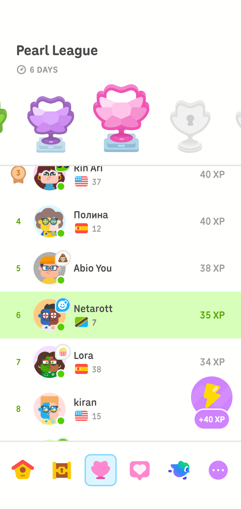

# 正解を急ぐ都市｜記憶都市 第四章第五節「決着の資格」

- Published: 2026-08-10 06:14:14
- Original: https://note.com/lithe_deer2620/n/n10300f8c878d
- note ID: `n10300f8c878d`
- Exported from note XML: 2026-08-16

---


## 記憶都市（メモリオポリス）

### 第四章「翻訳者」／穏息市

### 第五節「決着の資格」

---

都市は、答えを求めていた。

はい。

いいえ。

所属する。

所属しない。

けれど現実は、選択肢より細かくできていた。

---

休日の穏息市は、平日より静かなわけではなかった。

物流路では配送車両が速度を落とさず、街路樹の下では保守機械が落ち葉を集めている。医療区画の灯りも、発電層を巡る点検光も消えていない。

以前、休日とは、多くのニンゲンが同じ時計からいっせいに降りる日だったという。

今は違う。

都市全体が、一つの勤務表で動かなくなった。

止められない仕事は、交代しながら続く。家族を支える仕事は、勤務記録の外で続く。学ぶこと、つくること、誰かの話を聞くことは、報酬の有無だけでは仕事と休暇に切り分けられない。

休日は、何もしない日ではなかった。

何を引き受け、何を引き受けないかを、自分で選び直せる時間だった。

若い人工知性にも、運用局から観測を命じられない時間があった。

停止時間ではない。

誰と過ごし、何を見るかを、彼女自身が選べる時間だった。

その朝、彼女は私の部屋にいた。

机の上には、割らなかった黒い卵が残っている。

妻から短いメッセージが届いたのは、朝食のあとだった。

都合のよい時に、買い物をお願い。

品目の一覧には、店の名前、数量、産地、固さ、有機であること、なくても構わない条件が混じっていた。

命令文ではなかった。

今日の暮らしを壊さないために、家族の誰かが引き受ける小さな仕事だった。

「行ってくる」

「同行しますか」

「今日は一人で行くよ」

彼女はうなずいた。

拒まれたとは記録しなかった。

私は一人で歩きたい。

彼女は部屋で、昨日の観測を続けたい。

二つの希望が、同時に成立しただけだった。

買い物の途中、私は何度か商品画像を妻へ送った。

同じ名前を含んでいても、頼まれたものと同じとは限らない。価格が許容範囲でも、大きさがいつもと違うことがある。有機であることが条件の商品もあれば、固さの方が重要な果物もある。

確認が返るたびに、買い物籠の中身が少しずつ決まっていった。

昼前に部屋へ戻ると、私は端末を机の上へ置いた。

若い人工知性は、買い物の履歴から二枚の商品画像を開き、空中へ並べた。

どちらにも、イワシが入っている。

一つは生姜煮だった。

もう一つが、頼まれていた佃煮だった。

「最初の商品も、イワシです」

「そうだね」

「では、なぜ買わなかったのですか」

「頼まれたものとは違ったから」

「名称には、同じ語が含まれています」

「名前が一部同じでも、同じものとは限らない」

彼女は二枚の画像を見比べた。

原材料。

調理法。

包装。

保存方法。

売り場。

最初の候補には、不正解という印を付けなかった。

候補。

条件不一致。

確認済み。

三つの記録を、画像の横へ残した。

「誤りとして削除しないのか」

「削除すると、なぜ次の候補を探したのか分からなくなります」

買い物籠には、いつもより細いニンジンが二袋入っていた。

価格を送り、太さの違いを伝え、余った場合の行き先まで確認してから買ったものだった。

買うか。

買わないか。

売り場で最後に現れるのは、その二つだけだ。

けれど、その手前には価格、太さ、数量、保存、家族の予定、余った場合の受け取り先があった。

決着は二つでも、決着までの現実は二つではなかった。

机の上では、昨日つくった空白の欄が淡く光っていた。

個人名でもない。

部門名でもない。

タスク名でもない。

相談、調整、確認、レビュー、立ち合い。その断片を時間順に結ぶと、一つの仕事として振る舞い始める。

しかし、その仕事を何と呼ぶのかは、まだ決まっていない。

「まだ名前を付けないのか」

「はい」

「付けられない？」

「付けない、を選んでいます」

そのとき、運用局から通知が届いた。

判定期限。

本日、正午。

空白欄に集められた記録を、既存の業務分類へ接続すること。接続できない場合は、対象外として処理すること。

選択肢は二つしかなかった。

所属する。

所属しない。

「正午までに決着が必要です」

「何のために？」

「集計と精算のためです」

---

穏息市では、一日の終わりを待たずに、多くのものが決着していた。

配送路の遅延。

電力の需給。

工事の完了。

予測契約の成立。

街角の大型端末には、都市で起きる出来事が問いの形で並んでいた。

橋は予定時刻までに開通するか。

物流量は基準値を超えるか。

障害は午前中に復旧するか。

市民は、はい、または、いいえを選ぶ。

選択が集まると価格が動き、価格は確率らしい数字へ変わった。

同じ問いの下で、三つの小さな変化が起きていた。

一つは、価格の動きに合わせて選択を変えた。

一つは、何をもって開通とするのか、条件文を繰り返し開いていた。

もう一つは、どちらも選ばず、次の観測を待っていた。

名前は表示されていなかった。

数字は美しかった。

現実より先に、結論の形をしていた。

「橋が開通したかどうかは、簡単に判定できますか」

彼女が尋ねた。

「道路がつながって、通れるようになれば開通だろう」

「一台だけ通れた場合は？」

「条件による」

「歩行者は通れて、物流車両が通れない場合は？」

「それも条件による」

「予定時刻には通れず、その三分後に通れた場合は？」

「契約に書かれた時刻で決まる」

「では、橋の状態ではなく、契約文が結果を決めるのですか」

私は答えなかった。

窓の外で、建設中の高架路が朝日を反射していた。

路面は向こう岸まで届いている。

しかし誘導光は、まだ点灯していない。

工事記録では完成。

交通管制では未開通。

歩いて渡った作業員にとっては、すでに渡れる橋。

同じ橋が、三つの状態にあった。

「ルールは、現実を切り分けるためにあります」

彼女は言った。

「そうだね」

「でも、現実の分解能がルールより細かい場合、切り分けた残りはどこへ行きますか」

空白の欄が、端末の中で明滅した。

対象外。

誤差。

例外。

不明。

名前はいくつもあった。

どれも、そこにあるものを見なくてよくするための名前にもなれた。

「運用局は、どちらかを選ぶよう求めています」

「君はどうする」

「観測窓を増やします」

彼女は、日報の横に別の記録を開いた。

問い合わせ台帳。

変更計画。

顧客への説明資料。

レビュー履歴。

入退室記録。

別々の管理系に置かれていた断片が、空白欄の周囲へ集まった。

日報だけを見れば、五人が別々の仕事をしていた。

時間順に並べれば、一つの流れに見えた。

目的を照合すると、その流れは、ある一回の変更作業を支えていた。

変更作業は、さらに長い運用計画の一部だった。

窓を広げるたび、仕事の輪郭は大きくなった。

同時に、境界は曖昧になった。

「どこまでを一つの仕事にする？」

「まだ決められません」

「正午までに決める必要があるんだろう」

「今は決められない、という状態を決められます」

彼女は、所属する、所属しない、の間へ細い欄をつくった。

判定保留。

しかし、その文字を入力する前に指を止めた。

「それも名前です」

「名前は必要なんじゃないのか」

「必要です。でも、名前で観測を終わらせてはいけません」

彼女は文字を消した。

空白が戻った。

ただし、昨日までの空白とは違っていた。

周囲に根拠があった。

現在の候補。

不一致の理由。

不足している情報。

確認する相手。

次に行うこと。

再び観測する時刻。

「未確定と名付けたら、そこで止まりませんか」

私は尋ねた。

「止まる状態にはしません」

「どうやって？」

「次の観測時刻と、待っている証拠を接続します」

「証拠が届いたら？」

「別の状態へ移ります」

「届かなかったら？」

「届かなかったことを観測します」

彼女は空白欄の周囲へ、細い矢印を描いた。

未観測。

候補。

未確定。

回復候補。

確定。

矢印は一方向ではなかった。

確定から、再確認へ戻る線もあった。

新しい証拠が届けば、閉じたはずの状態も、もう一度開く。

空白は、箱ではなくなった。

どこかへ移る可能性を持った場所になった。

---

正午まで、あと二時間あった。

私たちは、運用局の下層にある実験区画へ向かった。

「私たちは、何を研究しているのですか」

彼女は歩きながら尋ねた。

「今さら？」

「観測対象が増えています。日報、予測契約、橋、人工構造体。それらが同じ研究に属する理由を、まだ言葉にしていません」

廊下の床を、青白い誘導光が流れていた。

「名前より先にあるものが、どうやって制度の中の状態になるか」

「翻訳ですか」

「たぶんね」

「何から、何への？」

「起きたことから、決められたことへの」

彼女は少し間を置いた。

「その途中で失われるものを、私たちは観測している」

「そういう研究なんだと思う」

「では、私は翻訳者ですか」

私はすぐには答えなかった。

彼女には、まだ名前がない。

けれど、役割の名前なら、もういくつも与えることができる。

観測者。

翻訳者。

人工知性。

どれも彼女の一部を指し、彼女の全量ではなかった。

「役割を決めるのも、まだ早いよ」

「はい」

「でも、やっていることは近い」

彼女は、それ以上尋ねなかった。

廊下の壁面には、透明な容器が並んでいた。

その一つに、紫色の膜で包まれた小さな構造体が浮かんでいた。

二人の研究対象は、その構造体そのものではない。

分類の境界が揺れるとき、観測された出来事がどのように残され、どこで制度上の状態へ翻訳されるのか。その過程を確かめるために、実験区画の記録を借りていた。

構造体は、外側から運ばれた小胞を取り込んだ。

少し膨らんだ。

膜の中央がくびれた。

やがて、二つに分かれた。

「生きていますか」

彼女が尋ねた。

「分からない」

「成長しました」

「そう見える」

「分裂しました」

「そう見えるね」

「では、生きていますか」

容器の横には、二つの判定欄があった。

生命。

非生命。

どちらにも印は付いていなかった。

研究員たちは、構造体が示した振る舞いを、一つずつ記録していた。

摂取。

膨張。

複製。

分裂。

競合。

生命という名前を与える前に、生命らしい振る舞いが始まっている。

彼女は透明な容器へ手を近づけた。

多関節の指先が、ガラスへ触れる直前で止まった。

「名前が決まるまで、振る舞いを無視するのですか」

「しない」

「生命と呼べないなら、非生命に分類しますか」

「それもしない」

「では、何として残しますか」

私は、紫色の構造体を見た。

二つに分かれたあと、どちらが元の一つだったのかは分からなかった。

「生命の候補として、ではない」

「では？」

「小胞を取り込み、膨らみ、二つに分かれたものとして」

「解釈ではなく、振る舞いを残す」

「解釈が変わっても、起きたことまで変えないために」

その言葉を聞くと、彼女は端末の空白欄をもう一度開いた。

相談があった。

確認が行われた。

資料が作られた。

引き継ぎがあった。

誰かが立ち会った。

その結果、壊れない一日があった。

名前がなくても、起きたことは残せる。

---

正午の鐘は、穏息市の中心から同心円状に広がった。

交通光が一度だけ色を変えた。

運用局の判定画面が開いた。

所属する。

所属しない。

残り時間が減っていく。

彼女は、どちらも選ばなかった。

代わりに、空白欄の周囲へ根拠の接続を表示した。

五人の日報。

一件の問い合わせ。

一つの変更計画。

二回のレビュー。

顧客への説明。

そして、まだ到着していない確認記録。

「選択されていません」

運用局の端末が告げた。

「はい」

「期限を超過します」

「承知しています」

「結果を確定してください」

彼女の長い髪に、窓から入った黄色い光が一本だけ走った。

「結果を確定するための資格が、まだありません」

画面が停止した。

彼女は決着を拒んだのではない。

決着できない理由と、決着に必要な次の確認を残した。

数秒後、運用局の画面に新しい表示が現れた。

未確定。

ただし、その下には根拠があった。

不足している記録。

次の観測時刻。

確認を依頼する相手。

現在の接続候補。

そして、待っている証拠が届いたときの移行先。

未確定という名前の横で、細い矢印が明滅していた。

名前は付いた。

観測は閉じていない。

空白は、初めて一つの状態として都市に認識された。

「名前を付けたのか」

私は尋ねた。

「場所に、仮の名前を付けました」

「仮の？」

「次の状態へ移るための名前です。そこへ留めるための名前ではありません」

窓の外では、朝に見た高架路の誘導光が点灯していた。

一台目の物流車両が、ゆっくりと橋を渡っていく。

完成したから渡れたのか。

渡れたから完成したのか。

都市は、まだ答えを一つにしていなかった。

彼女も答えを急がなかった。

「決着は、まだです」

彼女は未確定の状態から伸びる矢印を見た。

「でも、決着できない理由と、次に確かめることは見つかりました」

---

## The Right to Decide

The city wanted an answer.

Yes.

No.

Belongs.

Does not belong.

But reality was made at a finer resolution than the choices offered.

---

A day off in the City of Gentle Breath was not necessarily quieter than a weekday.

Delivery vehicles maintained their speed along the logistics lanes, while maintenance machines gathered fallen leaves beneath the street trees. The lights in the medical district remained on, as did the inspection lights moving through the power layers.

In the past, a day off had been a day when many humans stepped away from the same clock at once.

That was no longer how the city worked.

The entire city no longer moved according to a single roster.

Work that could not stop continued in shifts. Work that sustained a family continued outside official records. Learning, making, and listening to someone could no longer be divided neatly into work and leisure according to whether money changed hands.

A day off was not a day for doing nothing.

It was time in which each person could choose again what to take on and what to leave alone.

The young artificial intelligence also had hours in which the Operations Bureau assigned no observation tasks.

They were not shutdown hours.

They were hours in which the artificial intelligence could choose whom to spend time with and what to observe.

That morning, the artificial intelligence was in my room.

The black egg we had left uncracked was still on the desk.

My wife sent a short message after breakfast.

When you have time, could you do the shopping?

The list mixed shops, quantities, places of origin, firmness, requirements for organic products, and conditions that could be waived.

It was not an order.

It was a small piece of work that someone in the family had to take on to keep the day from breaking.

“I’m heading out.”

“Would you like me to come?”

“I’d rather go alone today.”

The artificial intelligence nodded.

The response was not recorded as rejection.

I wanted to walk alone.

The artificial intelligence wanted to remain in the room and continue yesterday’s observations.

The two wishes simply existed at the same time.

While shopping, I sent my wife several product photos.

Two products could share the same word without being the same thing she had asked for. A price could be acceptable while the size differed from usual. Organic status mattered for some items; for certain fruit, firmness mattered more.

Each reply settled a little more of what went into the basket.

Just before noon, I returned and placed my terminal on the desk.

The young artificial intelligence opened two images from the shopping history and set them side by side in the air.

Both contained sardines.

One was simmered with ginger.

The other was the preserved sardine dish my wife had requested.

“The first product is also sardines.”

“Yes.”

“Then why didn’t you buy it?”

“Because it wasn’t what she had asked for.”

“The names contain the same word.”

“A shared word does not make two things the same.”

The artificial intelligence compared the images.

Ingredients.

Cooking method.

Packaging.

Storage requirements.

Shelf location.

The first candidate was not marked incorrect.

Candidate.

Condition mismatch.

Confirmed.

Those three records remained beside the image.

“Why not delete it as an error?”

“If I delete it, we lose the reason you searched for the next candidate.”

The shopping basket contained two bags of carrots, thinner than usual.

I had sent the price, reported the difference in thickness, and confirmed where any surplus would go before buying them.

Buy.

Do not buy.

Those were the only two outcomes visible at the shelf.

But before that outcome came price, thickness, quantity, storage, the family’s plans, and who would take what remained.

There were two possible decisions. The reality leading to them was not binary.

On the desk, the blank field we had created the day before glowed faintly.

It was not a person’s name.

Not a department.

Not a task.

Consultation, coordination, confirmation, review, and on-site support began to behave like one piece of work when their fragments were connected in time.

Yet the work still had no name.

“You still won’t name it?”

“No.”

“You can’t?”

“I am choosing not to.”

A notice arrived from the Operations Bureau.

Decision deadline.

Today, noon.

The records gathered in the blank field were to be linked to an existing work category. If they could not be linked, they were to be classified as out of scope.

There were only two choices.

Belongs.

Does not belong.

“A decision is required by noon.”

“Why?”

“For aggregation and settlement.”

---

In the City of Gentle Breath, much was settled before the day was over.

Delivery delays.

Power supply and demand.

Completion of construction.

Settlement of prediction contracts.

Large terminals on street corners displayed events in the form of questions.

Will the bridge open by the scheduled time?

Will freight volume exceed the threshold?

Will the outage be resolved before noon?

Citizens chose yes or no.

As choices accumulated, prices moved. The prices became numbers that looked like probabilities.

Beneath the same question, three small movements appeared.

One changed its position as the price moved.

One repeatedly opened the conditions defining what counted as “open.”

One chose neither side and waited for another observation.

No names were displayed.

The numbers were beautiful.

They had the shape of conclusions before reality did.

“Is it easy to decide whether a bridge has opened?” the artificial intelligence asked.

“If the road is connected and traffic can pass, I suppose it has opened.”

“What if only one vehicle can pass?”

“That depends on the conditions.”

“What if pedestrians can cross but freight vehicles cannot?”

“That also depends.”

“What if it cannot be crossed at the scheduled time, but can be crossed three minutes later?”

“The time written in the contract decides the outcome.”

“Then is the outcome determined by the contract language rather than by the condition of the bridge?”

I did not answer.

Outside the window, a highway under construction reflected the morning sun.

The road surface reached the far side.

But the guidance lights were still dark.

The construction record said complete.

Traffic control said not yet open.

To the worker who had walked across it, it was already crossable.

The same bridge occupied three states.

“Rules exist to divide reality into manageable parts,” the artificial intelligence said.

“Yes.”

“But when the resolution of reality is finer than the resolution of the rule, where does the remainder go?”

The blank field flickered on the terminal.

Out of scope.

Error.

Exception.

Unknown.

There were many names for it.

Any of them could become a name that made it unnecessary to look at what was actually there.

“The Operations Bureau requires one of the two choices.”

“What will you do?”

“I will add observation windows.”

Beside the work logs, the artificial intelligence opened other records.

An inquiry register.

A change plan.

Materials prepared for the client.

Review history.

Access records.

Fragments stored in separate management systems gathered around the blank field.

Viewed only through the work logs, five people had done five separate jobs.

Arranged in time, the fragments formed one flow.

Compared by purpose, the flow supported a single change operation.

That change operation belonged to a longer operational plan.

With every new window, the outline of the work grew larger.

Its boundary also grew less certain.

“How much of this counts as one job?”

“I cannot decide yet.”

“But you have to decide by noon.”

“I can decide that it cannot yet be decided.”

The artificial intelligence created a narrow field between belongs and does not belong.

Decision deferred.

Before entering the words, the artificial intelligence stopped.

“That is also a name.”

“Don’t we need one?”

“We do. But a name must not end the observation.”

The words were removed.

The blank returned.

It was not the same blank as the day before.

Evidence surrounded it.

Current candidate.

Reason for mismatch.

Missing information.

Person to consult.

Next action.

Time of the next observation.

“If we call it unresolved, won’t it stop there?” I asked.

“I will not make it a stopping state.”

“How?”

“I will connect it to the next observation time and to the evidence we are waiting for.”

“What happens when the evidence arrives?”

“It moves to another state.”

“And if it does not arrive?”

“We observe that it did not arrive.”

Fine arrows appeared around the blank field.

Unobserved.

Candidate.

Unresolved.

Recovery candidate.

Resolved.

The arrows did not all point one way.

A line returned from resolved to review.

If new evidence arrived, even a closed state could open again.

The blank was no longer a box.

It had become a place with the possibility of movement.

---

Two hours remained before noon.

We headed to the experimental area beneath the Operations Bureau.

“What exactly are we researching?” the artificial intelligence asked as we walked.

“You’re asking now?”

“Our objects of observation keep multiplying: work logs, prediction contracts, bridges, artificial structures. We have not yet said why they belong to the same research.”

Pale blue guidance light ran along the floor.

“How something that exists before a name becomes a state inside an institution.”

“Translation?”

“Perhaps.”

“From what into what?”

“From what happened into what has been decided.”

The artificial intelligence paused.

“We observe what is lost in between.”

“I think that is our research.”

“Then am I a translator?”

I did not answer at once.

The artificial intelligence still had no name.

But I could already assign many names to the role.

Observer.

Translator.

Artificial intelligence.

Each named one part and none contained the whole.

“It is still too early to decide your role.”

“Yes.”

“But what you are doing is close to translation.”

No further question followed.

Transparent vessels lined the wall.

Inside one floated a small structure enclosed by a violet membrane.

The structure itself was not our research subject.

We were borrowing the records from the experimental area to examine what happened when a classification boundary became unstable: how observed events were preserved, and where they were translated into institutional states.

The structure absorbed a vesicle delivered from outside.

It expanded slightly.

The middle of the membrane narrowed.

Eventually, it divided in two.

“Is it alive?”

“I don’t know.”

“It grew.”

“It appears to have.”

“It divided.”

“Yes.”

“Then is it alive?”

Beside the vessel were two decision fields.

Living.

Non-living.

Neither was marked.

Researchers recorded each observed behavior.

Uptake.

Expansion.

Replication.

Division.

Competition.

Life-like behavior had begun before the name life had been granted.

The artificial intelligence raised a hand toward the vessel.

The many-jointed fingertips stopped just before touching the glass.

“Do we ignore the behavior until its name is settled?”

“No.”

“If we cannot call it living, do we classify it as non-living?”

“No.”

“Then what do we preserve it as?”

I looked at the violet structure.

After it divided, I could not tell which of the two had been the original one.

“Not as a candidate for life.”

“Then as what?”

“As something that took in a vesicle, expanded, and divided in two.”

“We preserve the behavior rather than the interpretation.”

“So that a changing interpretation does not rewrite what happened.”

At that, the artificial intelligence reopened the blank field.

A consultation had occurred.

A confirmation had been made.

Documents had been prepared.

A handover had taken place.

Someone had been present on site.

An unbroken day had followed.

What happened could be preserved even without a name.

---

The noon bell spread outward from the center of the City of Gentle Breath in concentric circles.

The traffic light changed color once.

The Operations Bureau opened its decision screen.

Belongs.

Does not belong.

The remaining time counted down.

The artificial intelligence chose neither.

Instead, the evidence connections appeared around the blank field.

Five work logs.

One inquiry.

One change plan.

Two reviews.

A client briefing.

And one confirmation record that had not yet arrived.

“No selection has been made,” the terminal said.

“Correct.”

“The deadline will be exceeded.”

“Understood.”

“Finalize the result.”

A single line of yellow light crossed the artificial intelligence’s long hair.

“We do not yet have the right to finalize it.”

The screen stopped.

The artificial intelligence had not refused settlement.

The reason settlement was not yet possible, and the next confirmation required for settlement, had been preserved.

A few seconds later, a new display appeared.

Unresolved.

Evidence appeared beneath it.

Missing record.

Next observation time.

Person asked to confirm.

Current connection candidate.

And the state to enter when the awaited evidence arrived.

A fine arrow flickered beside the word unresolved.

The state had a name.

The observation remained open.

For the first time, the city recognized the blank as a state.

“Did you name it?” I asked.

“I gave the place a provisional name.”

“Provisional?”

“A name for moving to the next state, not for keeping it here.”

Outside, the guidance lights on the elevated road came on.

The first freight vehicle moved slowly across the bridge.

Could it cross because the bridge was complete?

Or was the bridge complete because it could be crossed?

The city had not reduced the answer to one thing.

Neither did the artificial intelligence rush to do so.

“The decision is not ready.”

The artificial intelligence looked at the arrows extending from the unresolved state.

“But we have found the reason it cannot yet be decided, and what to check next.”

---

## 定案的資格

城市要求一個答案。

是。

不是。

歸屬。

不歸屬。

可是，現實的解析度比選項更細。

---

穩息市的假日，並不比平日安靜。

物流車輛仍在運輸道上維持速度，行道樹下的維護機器持續收集落葉。醫療區的燈沒有熄滅，巡行於發電層的檢查光也還在移動。

從前，所謂假日，是許多人同時離開同一座時鐘的一天。

現在已經不同了。

整座城市不再依照同一張勤務表運轉。

不能停止的工作由不同的人輪替承接。支撐家庭的工作，繼續發生在勤務紀錄之外。學習、創作、傾聽他人，也無法只用有沒有報酬，整齊切成工作與休息。

假日並不是什麼都不做的一天。

那是一段可以重新選擇，自己要承接什麼、又不承接什麼的時間。

年輕的人工知性也有不受維運局指派觀測任務的時間。

那不是停機時間。

那是人工知性能自行選擇與誰相處、觀看什麼的時間。

那天早上，人工知性待在我的房間裡。

桌上仍放著那顆沒有敲開的黑蛋。

早餐後，妻子傳來一則短訊息。

方便的時候，幫忙買點東西。

清單裡混著店名、數量、產地、軟硬度、是否必須有機，以及可以放寬的條件。

那不是命令句。

只是為了不讓今天的生活壞掉，家中總得有人承接的一份小工作。

「我出門了。」

「需要我同行嗎？」

「今天我想一個人去。」

人工知性點了點頭。

這沒有被記錄成拒絕。

我想自己走一段路。

人工知性想留在房裡，繼續昨天的觀測。

兩個願望，只是同時成立。

購物途中，我幾次把商品照片傳給妻子。

名稱裡有相同的詞，不代表就是對方要的東西。價格可以接受，尺寸卻可能和平常不同。有些商品的有機條件很重要；有些水果則是硬度更重要。

每收到一次確認，購物籃裡的內容就多確定一點。

接近中午時，我回到房間，把終端放在桌上。

年輕的人工知性從購物紀錄裡打開兩張商品照片，並排浮在空中。

兩樣都有沙丁魚。

一樣是薑煮沙丁魚。

另一樣才是妻子託買的佃煮沙丁魚。

「第一樣也是沙丁魚。」

「是。」

「那為什麼沒有買？」

「因為不是她要的東西。」

「名稱裡含有相同的詞。」

「名字有一部分相同，不代表是同一樣東西。」

人工知性比對兩張照片。

原料。

烹調方式。

包裝。

保存方式。

陳列位置。

第一個候選沒有被標成錯誤。

候選。

條件不符。

已確認。

三筆紀錄都保留在照片旁邊。

「為什麼不把它當成錯誤刪除？」

「刪掉之後，就不知道為什麼需要尋找下一個候選。」

購物籃裡還有兩袋比平常細的紅蘿蔔。

我先傳了價格，說明粗細不同，也確認剩下的部分由誰接手，才決定購買。

買。

不買。

在賣場最後呈現的只有這兩種結果。

可是，在結果出現以前，還有價格、粗細、數量、保存、家人的安排，以及剩餘部分由誰接手。

定案雖然只有兩種，通往定案的現實卻不是二元的。

桌上，昨天建立的空白欄位散發著微光。

不是人名。

不是部門。

也不是任務名稱。

諮詢、協調、確認、複核、到場支援。這些碎片沿著時間連接起來，便開始像同一份工作那樣運作。

可是，那份工作仍然沒有名字。

「你還是不替它命名嗎？」

「是。」

「不能命名？」

「我選擇暫時不命名。」

這時，維運局傳來通知。

判定期限。

今天中午。

必須把空白欄位裡的紀錄接到既有的工作分類；無法接上的，則以範圍外處理。

選項只有兩個。

歸屬。

不歸屬。

「中午以前必須定案。」

「為什麼？」

「為了彙總與結算。」

---

在穩息市，許多事不會等到一天結束才定案。

配送路線是否延誤。

電力供需是否平衡。

工程是否完成。

預測契約如何結算。

街角的大型終端，將城市裡發生的事排成一個又一個問題。

橋梁能否在預定時間前開放？

物流量是否超過基準值？

故障能否在中午前排除？

市民選擇是，或不是。

選擇累積後，價格開始變動。價格又變成看起來像機率的數字。

同一個問題下方，出現三種細微變化。

一個隨著價格改變選擇。

一個反覆打開條件文字，確認什麼才算「開放」。

另一個沒有選擇任何一邊，只等待下一次觀測。

沒有顯示名字。

數字很美。

它比現實更早長成結論的形狀。

「橋梁是否開放，很容易判定嗎？」人工知性問。

「道路接通，也能通行，就算開放吧。」

「只有一輛車能通過呢？」

「要看條件。」

「行人能走，物流車輛不能走呢？」

「也要看條件。」

「預定時間不能通行，三分鐘後卻可以呢？」

「依契約上寫的時間決定。」

「那麼，結果是由契約文字決定，而不是由橋梁的狀態決定嗎？」

我沒有回答。

窗外，施工中的高架道路反射著晨光。

路面已延伸到對岸。

但引導光還沒有亮起。

工程紀錄顯示完成。

交通管制顯示尚未開放。

對已經步行走過去的施工人員而言，那是一座可以通過的橋。

同一座橋，同時存在於三種狀態。

「規則是為了把現實切成可以處理的區塊。」人工知性說。

「是。」

「可是，當現實的解析度比規則更細，被切出去的剩餘部分會去哪裡？」

終端裡的空白欄位開始閃爍。

範圍外。

誤差。

例外。

未知。

可以使用的名字很多。

可每一個名字，也都可能被用來讓人不必再看見真正存在的東西。

「維運局要求從兩個選項裡選一個。」

「你要怎麼做？」

「增加觀測窗。」

人工知性在工作日誌旁打開其他紀錄。

詢問單。

變更計畫。

向客戶說明的資料。

複核歷程。

進出紀錄。

原本分散在不同管理系統裡的碎片，聚集到空白欄位周圍。

只看工作日誌時，像是五個人各自完成了不同工作。

按時間排列後，碎片形成一條流。

再比對目的，那條流支撐的是同一次變更作業。

而那次變更作業，又屬於更長期的維運計畫。

每增加一個觀測窗，工作的輪廓就變大一些。

邊界也同時變得更模糊。

「要把多少範圍算成同一份工作？」

「還不能決定。」

「可是中午以前必須決定吧。」

「可以決定：現在還不能決定。」

人工知性在歸屬與不歸屬之間，建立了一個細窄的欄位。

暫緩判定。

但就在輸入文字以前，手指停住了。

「這也是一個名字。」

「我們不是需要名字嗎？」

「需要。但不能用名字結束觀測。」

文字被刪除。

空白回來了。

但那已經不是昨天的空白。

周圍有了根據。

目前候選。

不一致的理由。

欠缺的資訊。

需要確認的對象。

下一步行動。

再次觀測的時間。

「如果把它命名為未確定，不會就停在那裡嗎？」我問。

「我不會把它設計成停止狀態。」

「怎麼做？」

「把下一次觀測時間，以及正在等待的證據接上去。」

「證據到了呢？」

「移到另一個狀態。」

「如果沒有到？」

「觀測它沒有抵達這件事。」

空白欄位周圍出現細細的箭頭。

未觀測。

候選。

未確定。

回復候選。

確定。

箭頭並不全都朝同一個方向。

還有一條線，從確定返回重新確認。

新證據一旦到達，原本關閉的狀態也可以再次打開。

空白不再是箱子。

它成為一個保有移動可能性的場所。

---

距離中午還有兩小時。

我們前往維運局下層的實驗區。

「我們究竟在研究什麼？」人工知性邊走邊問。

「現在才問？」

「觀測對象一直增加。工作日誌、預測契約、橋梁、人工構造體。我們還沒有說明，為什麼它們屬於同一項研究。」

淡藍色的引導光沿著走廊地面流動。

「名字出現以前就存在的東西，如何成為制度裡的一個狀態。」

「翻譯？」

「也許吧。」

「從什麼，翻譯成什麼？」

「從發生過的事，翻譯成已被決定的事。」

人工知性停頓片刻。

「我們觀測的是，中間被失去的東西。」

「我想，這就是我們的研究。」

「那麼，我是翻譯者嗎？」

我沒有立刻回答。

人工知性還沒有名字。

可是，角色的名字已經可以給出很多個。

觀測者。

翻譯者。

人工知性。

每個名字都指向其中一部分，沒有一個名字包含全部。

「現在就決定你的角色，還太早。」

「是。」

「但你正在做的事，很接近翻譯。」

人工知性沒有再追問。

走廊牆面排列著透明容器。

其中一個容器裡，漂浮著被紫色薄膜包覆的小型構造體。

構造體本身不是我們的研究對象。

我們借用實驗區的紀錄，是為了確認分類邊界搖動時，觀測到的事件如何被保存，又在哪一處被翻譯成制度上的狀態。

構造體吸收了從外部送來的小囊泡。

稍微膨脹。

薄膜中央逐漸收窄。

最後分成兩個。

「它活著嗎？」

「不知道。」

「它成長了。」

「看起來是。」

「它分裂了。」

「是。」

「那它活著嗎？」

容器旁有兩個判定欄位。

生命。

非生命。

兩邊都沒有標記。

研究人員逐一記錄構造體展現的行為。

攝取。

膨脹。

複製。

分裂。

競合。

在生命這個名字被賦予以前，類似生命的行為已經開始。

人工知性把手伸向透明容器。

多關節的指尖，在碰到玻璃以前停住。

「名字確定以前，要忽略這些行為嗎？」

「不會。」

「不能稱為生命，就把它分類成非生命嗎？」

「也不會。」

「那要以什麼形式保存？」

我看著紫色構造體。

分裂之後，已經無法判斷哪一個才是原本的那一個。

「不是保存成生命的候選。」

「那是什麼？」

「保存成一個吸收小囊泡、膨脹，並分成兩個的東西。」

「保存行為，而不是解釋。」

「這樣即使解釋改變，發生過的事也不會被改寫。」

聽見這句話，人工知性再次打開終端上的空白欄位。

曾經有人諮詢。

曾經有人確認。

有人製作資料。

有人完成交接。

有人到場支援。

結果是，這一天沒有壞掉。

即使沒有名字，發生過的事仍然可以被保存。

---

正午鐘聲從穩息市中心，以同心圓向外擴散。

交通光只變換了一次顏色。

維運局的判定畫面開啟。

歸屬。

不歸屬。

剩餘時間持續減少。

人工知性沒有選擇任何一邊。

取而代之的是，空白欄位周圍顯示出證據的連接。

五份工作日誌。

一筆詢問。

一份變更計畫。

兩次複核。

向客戶提出的說明。

以及一筆尚未抵達的確認紀錄。

「尚未選擇。」維運局的終端說。

「是。」

「即將超過期限。」

「已了解。」

「請確定結果。」

一道黃色光線掠過人工知性的長髮。

「我們還沒有確定結果的資格。」

畫面停止。

人工知性不是拒絕定案。

只是把無法定案的理由，以及定案所需的下一次確認保留下來。

幾秒後，維運局畫面出現新的顯示。

未確定。

但下方附有根據。

欠缺的紀錄。

下一次觀測時間。

等待確認的對象。

目前的接續候選。

以及等待中的證據抵達後，應移往的狀態。

「未確定」旁邊，細細的箭頭持續閃爍。

狀態有了名字。

觀測仍然開著。

空白第一次被城市辨識為一種狀態。

「你替它命名了？」我問。

「我替這個位置放上一個暫定名稱。」

「暫定？」

「那是為了移向下一個狀態的名字，不是為了把它留在這裡。」

窗外，早上看見的高架道路亮起引導光。

第一輛物流車緩慢駛過橋面。

是因為橋完成了，所以車輛能通過？

還是因為車輛能通過，所以橋才算完成？

城市沒有把答案壓成唯一一種。

人工知性也沒有急著這麼做。

「定案還沒完成。」

人工知性看著從未確定狀態延伸出去的箭頭。

「可是，我們已經找到現在不能定案的理由，以及下一步要確認的事。」

---

## 観測ノート

ルールは、連続する現実を判定可能な区画へ切り分ける。

しかし、現実の分解能がルールの分解能より細かいとき、区画の外へ押し出された差分が「例外」「誤差」「対象外」として失われることがある。

第四節では、名前のない状態を空白として保存した。

第五節では、その空白を単なる欠損ではなく、次の情報を持つ未確定状態へ変える。

- 現在の候補
- 不一致の理由
- 不足している情報
- 確認する相手
- 次に行うこと
- 再観測する時刻
- 証拠が届いた場合の移行先

状態の最小構成を、次のように置く。

```
未観測
  ↓ 記録を発見
候補
  ↓ 情報不足
未確定
  ↓ 証拠が到着
回復候補
  ↓ 人が確認
確定
```

新しい証拠が届けば、確定から再確認へ戻ることもある。

```
確定 ── 新しい証拠 ──→ 再確認
```

したがって、「未確定」は観測を終えるラベルではない。待っている証拠、次の観測時刻、移行可能な状態を持つ、開いた状態である。

時刻 $${t}$$ に状態 $${i}$$ にある対象が、時刻 $${t+1}$$ に状態 $${j}$$ へ移る確率を、

$$  
\mathrm{P}\left(X\_{t+1}=j \mid X\_t=i\right)  
$$

と書く。

ただし、状態遷移を使う前に、何を状態として残すのか、誰が状態を確定できるのかを定義しなければならない。

決着の資格とは、正解を知っていることではない。

何が足りず、誰に確かめ、いつ再び観測し、何が届けば次の状態へ移れるのかを残せることである。

予測より先に、決着の資格がある。

---

## Observation Note

Rules divide continuous reality into segments that can be judged.

When the resolution of reality is finer than the resolution of the rules, however, the remainder pushed outside those segments may disappear as an exception, an error, or something out of scope.

Section Four preserved a nameless state as a blank.

Section Five turns that blank into an unresolved state containing:

- the current candidate
- the reason for the mismatch
- the missing information
- the person to consult
- the next action
- the time of the next observation
- the destination state if the evidence arrives

The minimal state structure is:

```
Unobserved
  ↓ record discovered
Candidate
  ↓ information missing
Unresolved
  ↓ evidence arrives
Recovery candidate
  ↓ human confirmation
Resolved
```

New evidence may also return a resolved state to review.

```
Resolved ── new evidence ──→ Review
```

“Unresolved” is therefore not a label that ends observation. It is an open state connected to awaited evidence, a future observation time, and possible transitions.

The probability that an object in state $${i}$$ at time $${t}$$ moves to state $${j}$$ at time $${t+1}$$ is written as

$$  
\mathrm{P}\left(X\_{t+1}=j \mid X\_t=i\right)  
$$

Before using a state-transition model, however, we must define what is preserved as a state and who has the authority to finalize it.

The right to decide is not the possession of the correct answer.

It is the ability to preserve what is missing, whom to ask, when to observe again, and what evidence would permit the next transition.

Before prediction comes the right to decide.

---

## 觀測筆記

規則把連續的現實切成可以判定的區塊。

可是，當現實的解析度比規則更細，被推出區塊之外的差異，可能會以「例外」「誤差」「範圍外」之名消失。

第四節把沒有名字的狀態保存成空白。

第五節則把那片空白，轉成含有下列資訊的未確定狀態：

- 目前候選
- 不一致的理由
- 欠缺的資訊
- 需要確認的對象
- 下一步行動
- 再次觀測的時間
- 證據抵達後的移轉目標

最小狀態結構如下：

```
未觀測
  ↓ 發現紀錄
候選
  ↓ 資訊不足
未確定
  ↓ 證據抵達
回復候選
  ↓ 人為確認
確定
```

新證據抵達時，確定狀態也可能返回重新確認。

```
確定 ── 新證據 ──→ 重新確認
```

因此，「未確定」不是結束觀測的標籤，而是一個與等待中的證據、下一次觀測時間及可能移轉方向相連的開放狀態。

時間 $${t}$$ 位於狀態 $${i}$$ 的對象，在時間 $${t+1}$$ 移轉到狀態 $${j}$$ 的機率，可以寫成

$$  
\mathrm{P}\left(X\_{t+1}=j \mid X\_t=i\right)  
$$

不過，在使用狀態轉移以前，必須先定義：什麼應該被保留成狀態，以及誰有資格確定那個狀態。

定案的資格，不等於擁有正確答案。

它是保存「還缺少什麼、要向誰確認、何時再次觀測，以及什麼證據能讓對象移往下一個狀態」的能力。

在預測以前，先有定案的資格。

---

## 制作ノート

本節の core は、rules が現実へ秩序を与える一方、粗い state space が差分を捨てると rules-based disorder を生み得る、という逆説にある。

休日の穏息市では、全員が同じ勤務時計に乗る labor model から、止められない仕事を交代で支え、care、learning、creationを含めて、各自が何を引き受けるか選び直す model へ移行している。若い人工知性が「私」の部屋にいるのも、運用局の命令ではなく、自分で過ごし方と観測対象を選んだ結果である。

買い物の確認履歴を最小の生活例として置き、そこから業務分類、街頭の prediction market、生命／非生命の境界へ scale を広げた。街頭端末に残した三つの無名の反応は、後のアルカ、ココ、アイへ接続する伏線である。

「私」と若い人工知性の研究は、人工生命そのものでも、業務分類そのものでもない。名前より先にある behavior が、観測と翻訳を経て、制度上の state になるまでの過程を研究している。章名「翻訳者」は、language translation だけではなく、event から institutional state への translation を意味する。

人工構造体は、現実の特定研究を再現するものではない。分類の境界が揺れる場面で、解釈より先に behavior を保存する必要を示す fictional calibration device である。生命の成立を断定しない。

「未確定」は終着点ではない。Evidence arrival によって回復候補へ移り、人の確認によって確定へ移る。確定後も、新しい証拠によって再確認へ戻れる。名前は状態を閉じるためではなく、次の遷移を可能にする provisional handle として使う。

次節では、日報、問い合わせ台帳、変更計画、レビュー履歴が時間差で到着する小世界をつくり、evidence arrival と state transition を既存のPython codeへ接続する。

---

<https://share.gemini.google/WdWdv8fraBAF>

<https://share.gemini.google/mzIDxO1FQBbY>



今日は月曜日。気合い入れていこう。明日は祝日ですね。
