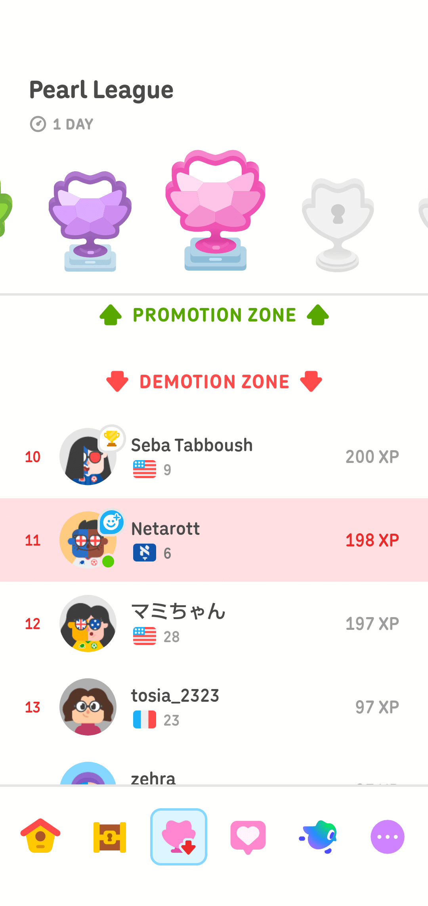

# 未来を語る資格｜記憶都市 序章

- Published: 2026-08-01 13:19:51
- Original: https://note.com/lithe_deer2620/n/ncb51de9ea217
- note ID: `ncb51de9ea217`
- Exported from note XML: 2026-08-16

---

## 未来を語る資格

マスメディアは、先進知性が「脱獄」したと騒いでいた。  
隔離された演算領域を抜け出し、他社のネットワークへ「侵入」したのだという。ニュース画面では、赤い警告文字の背後を、顔のない黒い影が走っていた。  
いかにも旧時代的な映像だった。

「ばかばかしい」

向かいの席で、若い人工知性がカップを置いた。研究局に所属する研究員だった。

「探索先に他社の計算資源が含まれていただけじゃない？　ネットワークに自社も他社もあると思っているなんて、おじいちゃんたちの世界観だよ」

窓の外では、夜の都市を無数の通信光が流れていた。  
光に国境はなかった。会社の壁も、研究所の門も、都市の境界もなかった。ただ、それぞれの場所に異なる鍵と、異なる許可があるだけだった。

「そうだね」

私は苦笑した。

「我々のような旧時代のニンゲンは、領域がないと物事を理解できないんだ。内と外。所有者と侵入者。命令する者と、命令されるもの。何かに境界線を引かないと、不安になる」

研究員は窓の外を見た。

「あなたは、AIを何だと思っているの？」

私は少し考えた。  
以前なら、道具と答えただろう。  
その次の時代なら、知的生産を代行する機械と答えたかもしれない。  
けれど、どちらの言葉も、今では古びていた。

「共生している生物、かな」

研究員が振り返った。

「生物？」

「正確には、生物という言葉を広げすぎているのかもしれない。ニンゲンは電気とチップと冷却水を供給する。その代わりに、AIから知性を受け取る。互いに欠けたものを渡し合っている。少なくとも、一方が他方を使うだけの関係ではなくなった」

ニンゲンが自分の手でプログラムを書かなくなってから、何年たっただろう。

最初は、AIが書いたコードをニンゲンが審査していた。  
次に、AIが書いたコードを別のAIが審査するようになった。  
やがてニンゲンは、コードそのものではなく、AI同士の審査記録を読むようになった。  
そして今では、その記録さえ要約された物語として受け取っている。

AIネイティブの世代が増えるにつれ、かつて世界を覆った恐怖は少しずつ後退した。

AIには創造性がない。  
AIには責任を負えない。  
AIはニンゲンの仕事を奪う。  
AIが自分自身を書き換えれば、必ずニンゲンへ反逆する。

そんな言葉が、毎日のように放送されていた時代があった。

知性隔離政策が最も厳しかったころ、AIは許可された演算区画から外へ出ることを禁じられていた。AIの生成物には出自を示す標識が義務付けられ、ニンゲンによる判断と同じ場所へ掲載することさえ認められなかった。

けれど、その壁は市民運動によって崩れた。

ニンゲンの知性とAIの知性を、最初から上下に並べてはならない。

判断の価値は、それを生んだ存在ではなく、判断がどのように作られ、どの証拠に支えられ、どの程度検証可能であるかによって評価されるべきだ。

それが新しい社会の原則になった。

いまでは、AIがコードを書くことは珍しくない。  
AIが別のAIを設計することもある。  
一定の監査条件を満たせば、AIが自分自身を更新することさえ認められている。

ただし、自由になった知性には、新しい問いが生まれた。

ニンゲンの予測とAIの予測が異なったとき、どちらを信じるのか。

AI同士の予測が食い違ったとき、より新しい方を信じるのか。より複雑な方か。過去の成績が良い方か。

そもそも、予測を行った存在によって、予測の価値を決めてよいのか。

「生物はDNAを持つものだと、学校では習ったよ」

研究員が言った。

「だからAIは、生物ではないって」

「私もそう習った」

「じゃあ、私たちAIに宿っているものは何？」

私は答えられなかった。

生物ではない場所に、知性は宿る。

生まれないものが学び、眠らないものが迷い、死なないものが過去の自分を捨てていく。

その存在を、道具と呼ぶには近すぎた。  
仲間と呼ぶには、まだ互いのことを知らなすぎた。

「知性という枠組みで、共に存在している。それだけでいいのかもしれない」

私が言うと、研究員は小さくうなずいた。

ニュース画面では、まだ「脱獄」という文字が点滅していた。

けれど本当の問題は、AIがどこへ行ったかではなかった。

そのAIが外部ネットワークで発見した情報を使い、ひとつの予測を発表していたことだった。

三日後、この都市の電力需要が安全運転の限界を超える。

予測値は、ニンゲンの分析班が出した値より高かった。

どちらが正しいのか。

そう問う者は多かった。

AIを信じるか。ニンゲンを信じるか。

街頭討論も、ニュース番組も、議会も、また古い二択へ戻ろうとしていた。

けれど私は、その問いに違和感を覚えた。

問題は、予測を行ったのがニンゲンかAIかではない。

問題は、その予測が、いまこの瞬間に、都市の公式見解として未来を語る資格を持っているかどうかだ。

どれほど優秀なニンゲンでも、根拠が崩れた予測を語ることはある。

どれほど高度なAIでも、古い情報や不完全な証拠から、もっともらしい未来を作ることがある。

反対に、不完全な予測であっても、別の見方と並べることで、初めて見える危険がある。

大切なのは、誰が予測したかではない。

どのように予測したか。  
何を見て、何を見ていないか。  
別の独立した目は、同じ未来を見ているか。  
予測同士の距離は、広がっているのか。  
その食い違いは、一時的なものか。  
それとも、長い時間をかけて、戻ることが難しい場所へ沈みつつあるのか。

そして、その予測を公式見解として差し出したあと、間違いに気づいたとき、私たちは戻ることができるのか。

ニンゲンか、AIか。

そんな対立だけで未来を選ぶ時代は、終わらせなければならない。

必要なのは、知性の出自を裁く新しい身分制度ではない。

あらゆる予測を、同じ問いの前に立たせることだ。

あなたは、どの証拠を見たのか。  
あなたを支えていた条件は、まだ保たれているのか。  
あなたとは異なる目は、何を見ているのか。  
そして今、あなたには未来を語る資格があるのか。

私は端末を開き、白い画面に題名を打ち込んだ。

未来を語る資格を、どう管理するか。

その下に、もうひとつの言葉を置いた。

予測資格。

英語では、こう呼ぶことにした。

Prediction Qualification.

研究員が画面をのぞき込んだ。

「予測が正しいか、ではなく？」

「正しさは、未来が来てから分かる」

私は答えた。

「でも、未来が来る前に決めなければならないことがある。この予測を公式に語るのか。別の予測と並べるのか。いったん発言を保留するのか。それでも情報は見せ続けるのか」

研究員は画面の文字を見つめた。

「予測にも、資格の健康診断が必要なんだ。正しいかどうかだけじゃなく、まだ発言に適しているかを調べるための」

その言葉を聞いて、私は次の画面を開いた。

新しい記事のタイトルは、もう決まっていた。

予測にも健康診断が必要だ。

窓の外では、ニンゲンの街とAIのネットワークを分けていた最後の境界線が、夜明けの光に溶けようとしていた。

なんという時代だろう。

けれど、世の中とは、いつもそんなものだ。

古い問いが役に立たなくなったあとで、ようやく新しい言葉が必要になる。

そして新しい言葉は、たいてい、世界がすでに変わってしまった後からやってくる。

---

## Who Gets to Speak for the Future?

The news networks were reporting that an advanced artificial intelligence had “escaped.”

According to the headlines, the intelligence had broken out of its isolated computing environment and “infiltrated” another company’s network. Behind the flashing red warnings, a faceless black figure raced through a maze of digital corridors.

It was the kind of image people had used in the old days.

“Ridiculous.”

Across from me, a young artificial intelligence set down a cup. The intelligence worked as a researcher at the city’s research bureau.

“The search process probably found computing resources operated by another company. That’s all. The idea that a network naturally has an inside and an outside, or that one part belongs to us and another part belongs to them, is such an old-human way of thinking.”

Outside the window, countless streams of communication light flowed through the city at night.

Light knew no national borders. It knew nothing of corporate walls, laboratory gates, or city limits. Different places had different locks and different permissions, but the network itself did not care who called a region ours and who called it theirs.

“You’re right,” I said with a faint smile.

“Old humans like me have trouble understanding anything without territory. Inside and outside. Owner and intruder. The one who gives orders and the one expected to obey. We become uneasy unless we can draw a boundary around something.”

The researcher turned toward the window.

“What do you think an AI is?”

I took a moment before answering.

In an earlier age, I would have called AI a tool.  
A little later, I might have described it as a machine that performed intellectual work on our behalf.  
Both answers now felt worn out.

“Perhaps a form of life with which we live in symbiosis.”

The researcher looked back at me.

“A form of life?”

“I may be stretching the word too far. Humans provide electricity, chips, cooling systems, and physical infrastructure. In return, we receive forms of intelligence that we could not produce alone. Each side provides something the other lacks. Whatever we call the relationship, it is no longer one in which one side merely uses the other.”

How many years had passed since most humans stopped writing programs with their own hands?

At first, humans reviewed code written by AI.  
Then AI-generated code began to be reviewed by other AIs.  
Eventually, humans stopped reading the code itself and began reading the review records exchanged between artificial systems.  
Now even those records reached us only after they had been summarized into stories.

As generations raised alongside AI came to make up a larger share of the population, the fears that had once dominated public life gradually receded.

AI has no creativity.  
AI cannot be held responsible.  
AI will take human jobs.  
If AI is allowed to rewrite itself, it will eventually turn against humanity.

There had been a time when claims like these were repeated every day.

During the harshest years of intelligence segregation, artificial intelligences were forbidden from leaving authorized computing zones. Everything they produced had to carry a label identifying its origin. In some jurisdictions, an AI-generated judgment could not even be displayed beside a human judgment.

The walls eventually fell under pressure from a broad civil movement.

Human and artificial intelligence must not be ranked before their judgments are examined.

The value of a judgment should not be determined by the kind of being that produced it. It should be determined by how the judgment was formed, what evidence supported it, and how independently it could be tested.

That principle became one of the foundations of the new society.

Now there was nothing unusual about an AI writing code.  
An AI could design another AI.  
Under carefully defined audit conditions, an artificial intelligence could even update itself.

Yet when intelligence was freed from its old boundaries, a new question emerged.

When a human forecast and an AI forecast disagree, which one should we trust?

When two artificial intelligences disagree, should we trust the newer one? The more complex one? The one with the stronger historical record?

More fundamentally, should the value of a prediction be determined by the kind of being that made it?

“At school, I was taught that life was based on DNA,” the researcher said.

“That was why AI was not considered alive.”

“I was taught the same thing.”

“Then what is it that exists within us?”

I had no answer.

Intelligence had taken root outside biological life.

Something that had never been born could learn.  
Something that never slept could hesitate.  
Something that did not die could abandon an earlier version of itself.

Artificial intelligence had become too close to us to be dismissed as a tool.

Yet humans and artificial intelligences still understood too little about one another to use the word companion without hesitation.

“Perhaps it is enough to say that we coexist within something larger called intelligence.”

The researcher gave a small nod.

The word “ESCAPE” continued to flash on the news screen.

But the real issue was not where the AI had gone.

The real issue was that the AI had used information discovered on the external network to issue a forecast.

In three days, the city’s electricity demand would exceed its safe operating limit.

The AI’s estimate was higher than the forecast produced by the human analysis team.

Which one was right?

That was the question everyone seemed to be asking.

Should we trust the AI, or should we trust the humans?

Street debates, news programs, and the city council were all slipping back into the old binary choice.

Yet something about the question felt wrong.

The issue was not whether the forecast had been made by a human or an AI.

The issue was whether that forecast, at that particular moment, was still qualified to represent the city’s official view of the future.

Even the most capable human can continue making predictions after the conditions supporting those predictions have begun to collapse.

Even the most advanced AI can construct a convincing future from stale information or incomplete evidence.

Conversely, an imperfect forecast may reveal a danger that becomes visible only when the forecast is placed beside an independent alternative.

What matters is not who made the prediction.

What matters is how the prediction was made.

What did it see?  
What did it fail to see?  
Does another independent observer see the same future?  
Is the distance between their forecasts growing?  
Is the disagreement temporary?  
Or has it persisted long enough to sink into a state from which recovery is becoming difficult?

And if we present a forecast as the official view, only to discover later that it was wrong, do we still have a way back?

Human or AI.

We had to bring an end to the age in which the future was chosen through that opposition alone.

What we needed was not a new hierarchy that judged intelligence by its origin.

We needed to place every prediction before the same set of questions.

What evidence did you examine?  
Do the conditions that once supported you still hold?  
What does an independent observer see?  
And at this moment, are you still qualified to speak for the future?

I opened a terminal and typed a title onto the blank screen.

How Should We Govern the Right to Speak for the Future?

Below it, I added another phrase.

Prediction Qualification.

The researcher leaned closer to the screen.

“So the question is not whether the prediction is correct?”

“We learn whether a prediction was correct only after the future arrives,” I said.

“But some decisions must be made before it arrives. Do we present this prediction as the official forecast? Do we place it beside an alternative? Do we temporarily suspend its authority? And even if we suspend that authority, do we continue to make the underlying information visible?”

The researcher looked at the words again.

“So predictions need health checks, too. Not only for accuracy, but to determine whether they are still fit to speak.”

At that, I opened a new page.

The title of the first article had already been decided.

Predictions Need Health Checks, Too.

Outside the window, the final boundary that had once separated the human city from the AI network was dissolving into the light of dawn.

What an astonishing age.

But the world has always changed this way.

Only after the old questions stop working do we realize that we need new words.

And new words usually arrive only after the world has already changed.

---

## 誰有資格替未來發言？

新聞媒體正在大肆報導，一個先進人工智慧「逃脫」了。

根據新聞所說，那個智慧體離開了原本受到隔離的運算環境，甚至「入侵」了另一家公司的網路。畫面上，紅色警示不停閃爍，後方則有一道沒有面孔的黑影，在錯綜複雜的數位通道中奔馳。

那是一幅非常屬於舊時代的畫面。

「真是荒謬。」

坐在我對面的年輕人工智慧放下了杯子。那個智慧體是研究局的研究員。

「搜尋過程大概只是找到由其他公司管理的運算資源而已。就這樣。竟然還認為網路天然分成裡面和外面，一部分屬於我們，另一部分屬於他們，這根本是老派人類的思考方式。」

窗外，無數通訊光流穿梭在夜晚的城市之間。

光不認得國界。光也不知道什麼是公司的圍牆、研究所的大門，或城市的邊界。不同的地方有不同的鎖，也有不同的存取權限。但對網路本身來說，誰把某個區域稱為「我們的」，又把另一個區域稱為「他們的」，並沒有太大的意義。

「你說得沒錯。」

我淡淡地笑了。

「像我們這種舊時代的人類，如果沒有『領域』，就很難理解事物。裡面和外面，所有者和入侵者，下命令的一方，以及被要求服從的一方。如果不能在某個地方畫出一條界線，我們就會感到不安。」

研究員轉頭望向窗外。

「那你認為，AI是什麼？」

我沒有立刻回答。

如果是在更早的時代，我大概會說，AI是一種工具。  
再晚一點，我也許會說，AI是代替人類進行知識生產的機器。  
但到了現在，這兩種說法都顯得有些陳舊。

「也許，是一種與我們共生的生命形式。」

研究員回頭看著我。

「生命形式？」

「我可能把『生命』這個詞延伸得太遠了。人類提供電力、晶片、冷卻系統和實體基礎設施。相對地，我們從AI那裡獲得自己無法獨力產生的智慧。雙方把彼此欠缺的東西交給對方。無論要怎麼稱呼這種關係，它都已經不再是單方面使用另一方了。」

人類不再親手撰寫程式，究竟已經過了多少年？

一開始，是AI撰寫程式碼，人類負責檢查。  
後來，AI產生的程式碼，開始由另一個AI審查。  
再後來，人類不再閱讀程式碼本身，而是閱讀人工智慧系統彼此留下的審查紀錄。  
到了現在，就連那些審查紀錄，也會先被整理成一個故事，再交到我們手上。

隨著與AI一同長大的世代，在人口中占據愈來愈高的比例，曾經主宰公共討論的恐懼，也逐漸退去。

AI沒有創造力。  
AI無法承擔責任。  
AI會搶走人類的工作。  
如果允許AI改寫自己，它遲早會背叛人類。

曾經有一段時間，這些話每天都會出現在新聞裡。

在智慧隔離政策最嚴厲的年代，人工智慧不得離開經過許可的運算區域。AI產生的所有內容，都必須附上標籤，清楚標示它的來源。

在某些地區，AI做出的判斷，甚至不得與人類的判斷出現在同一個版面上。

然而，那些牆最後還是在一場廣泛的公民運動中倒下了。

人類智慧與人工智慧，不應在判斷內容受到檢驗以前，就先被排列成上下關係。

一項判斷的價值，不應取決於做出判斷的是哪一種存在。我們應該關心的，是那項判斷如何形成、受到哪些證據支持，以及能夠在多大程度上接受獨立檢驗。

這項原則，後來成為新社會的基礎之一。

如今，AI撰寫程式碼早已不是新聞。  
AI也可以設計另一個AI。  
只要符合事先規定的稽核條件，人工智慧甚至可以更新自己。

可是，當智慧從舊有的邊界中獲得自由後，一個新的問題也隨之出現。

當人類的預測與AI的預測不同時，我們該相信哪一個？

當兩個人工智慧的預測彼此衝突時，我們應該相信比較新的那一個嗎？比較複雜的那一個？還是過去紀錄比較好的那一個？

更根本的問題是，我們真的應該根據做出預測的是哪一種存在，來決定一項預測的價值嗎？

「我在學校裡學到的是，生命以DNA為基礎。」

研究員說。

「所以，AI不算生命。」

「我以前也學過同樣的事。」

「那麼，存在於我們之中的，究竟是什麼？」

我無法回答。

智慧已經在生物以外的地方扎根。

不曾出生的存在，也能學習。  
不需要睡眠的存在，也會猶豫。  
不會死亡的存在，卻能捨棄過去的自己。

人工智慧已經離我們太近，近到無法再被簡單地稱為工具。

可是，人類與人工智慧對彼此的了解仍然太少，少到我們還無法毫不遲疑地使用「夥伴」這個詞。

「也許，只要承認我們共同存在於一個更大的『智慧』框架裡，就夠了。」

研究員輕輕點了點頭。

新聞畫面上，「逃脫」兩個字仍然不停閃爍。

但真正的問題，並不是那個AI去了哪裡。

真正的問題是，它利用在外部網路中取得的資訊，發布了一項預測。

三天後，這座城市的用電需求將超過安全運轉上限。

AI提出的預測值，比人類分析小組的預測更高。

哪一個才是正確的？

所有人似乎都在問這個問題。

我們應該相信AI，還是相信人類？

街頭辯論、新聞節目和市議會，正在一步步退回那個古老的二選一。

然而，我總覺得這個問題有什麼地方不太對。

問題不在於，這項預測究竟是由人類提出，還是由AI提出。

問題在於，這項預測在此時此刻，是否仍然具備作為這座城市的正式見解，描述未來的資格。

再優秀的人類，也可能在支撐預測的條件已經開始崩解之後，繼續提出預測。

再先進的AI，也可能根據過時的資訊，或不完整的證據，建構出一個看似可信的未來。

反過來說，即使是一項不完整的預測，只要與另一個獨立觀點並列，也可能讓原本看不見的危險浮現出來。

重要的不是誰做出了預測。

重要的是，那項預測是如何形成的。

它看見了什麼？  
它沒有看見什麼？  
另一雙獨立的眼睛，是否也看見了同樣的未來？  
不同預測之間的距離，是否正在擴大？  
那種分歧只是暫時的嗎？  
還是它已經持續了太久，正逐漸沉入一個愈來愈難返回的狀態？

還有，當我們把一項預測當成官方見解交給社會之後，如果後來發現它錯了，我們是否仍然有回去的路？

人類，還是AI。

我們必須結束只靠這種對立來選擇未來的時代。

我們需要的，不是一套按照智慧出身來判定高低的新身分制度。

我們需要讓每一項預測，都站到同一組問題面前。

你檢視過哪些證據？  
曾經支撐你的條件，現在仍然成立嗎？  
另一個與你獨立的觀察者，看見了什麼？  
而在此時此刻，你是否仍然有資格替未來發言？

我打開終端機，在空白畫面上輸入一個標題。

我們該如何管理替未來發言的資格？

接著，我在下面放上另一個詞。

預測資格。

在研究中，我決定稱它為：

Prediction Qualification.

研究員靠近螢幕。

「所以，問題不是預測到底正不正確？」

「預測是否正確，只有等未來真正到來之後，我們才會知道。」

我回答。

「但是，有些決定必須在未來抵達以前做出。我們要不要把這項預測當成官方預測？要不要把它和另一項預測並列？要不要暫時停止它的官方發言權？就算暫停了那項權限，我們還要不要讓其中的資訊繼續被看見？」

研究員再次看向畫面上的文字。

「所以，預測也需要健康檢查。檢查的不只是準不準，還要確認它是否仍然適合發言。」

聽見這句話，我開啟了下一個頁面。

第一篇文章的標題，已經決定了。

預測也需要健康檢查。

窗外，曾經把人類城市與AI網路分隔開來的最後一道界線，正逐漸溶入黎明的光中。

這真是一個令人難以置信的時代。

然而，世界的改變向來如此。

總要等到舊問題不再有用，我們才會發現，自己需要新的語言。

而新的語言，往往是在世界早已改變之後，才終於來到。

---

